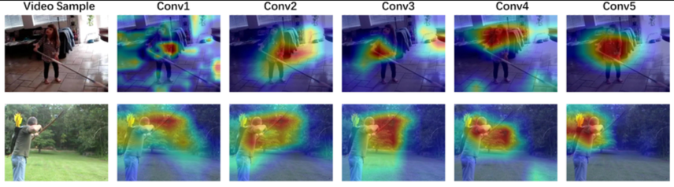

# CS231n 2025 Lecture Notes

[](https://github.com/raimbekovm/cs231n-2025-notes/actions/workflows/compile-latex.yml)
[](CONTRIBUTING.md)
[](LICENSE)

Comprehensive lecture notes for **Stanford CS231n: Deep Learning for Computer Vision** (Spring 2025).

> The official [cs231n.github.io](https://cs231n.github.io/) notes haven't been updated since 2017. This project provides modern, in-depth notes covering the 2025 curriculum including Transformers, Diffusion Models, Vision-Language Models, and more.

---

## Quick Download

| Lecture | Topic | PDF | Status |
|:-------:|-------|:---:|:------:|
| 1.1 | History of Computer Vision | [Download](pdf/lecture_01_part1.pdf) | Done |
| 1.2 | Course Overview: Tasks, Models, Applications | [Download](pdf/lecture_01_part2.pdf) | Done |
| 2 | Image Classification, KNN, Linear Classifiers | Coming soon | In Progress |
| 3 | Regularization, Optimization (SGD, Adam) | Coming soon | Planned |
| 4 | Neural Networks, Backpropagation | Coming soon | Planned |
| ... | More lectures coming | — | — |

---

## What's Inside

Each lecture note includes:
- Clear explanations of core concepts
- Mathematical formulations with intuition
- Visualizations and diagrams
- Links to original papers
- Key takeaways and summaries

### Preview

<p align="center">
  
</p>

*Example: Visualizing what CNNs learn at each layer — from edges to semantic concepts.*

---

## Repository Structure

```
cs231n-2025-notes/
├── pdf/                    # Compiled PDFs (download these!)
├── src/                    # LaTeX source files
│   ├── lecture_01_part1.tex
│   ├── lecture_01_part2.tex
│   └── figures/            # Images and diagrams
├── transcripts/            # Lecture transcripts
└── .github/workflows/      # Auto-compilation on push
```

---

## Course Outline

### Part 1: Fundamentals
- **Lecture 1**: Introduction & Course Overview
- **Lecture 2**: Image Classification, KNN, Linear Classifiers
- **Lecture 3**: Regularization, Optimization
- **Lecture 4**: Neural Networks, Backpropagation

### Part 2: Convolutional Neural Networks
- **Lecture 5**: CNNs for Image Classification
- **Lecture 6**: CNN Architectures (AlexNet → ResNet → ConvNeXt)

### Part 3: Sequence Models
- **Lecture 7**: RNN, LSTM, Image Captioning
- **Lecture 8**: Attention, Transformers, ViT

### Part 4: Vision Tasks
- **Lecture 9**: Object Detection, Segmentation
- **Lecture 10**: Video Understanding, 3D Vision
- **Lecture 11**: Distributed Training
- **Lecture 12**: Self-Supervised Learning

### Part 5: Generative Models
- **Lecture 13**: VAE, GAN
- **Lecture 14**: Diffusion Models

### Part 6: Advanced Topics
- **Lecture 15**: 3D Vision, NeRF
- **Lecture 16**: Vision & Language (CLIP, VQA)
- **Lecture 17**: Robot Learning
- **Lecture 18**: Human-Centered AI

---

## Building from Source

PDFs are auto-compiled via GitHub Actions. To build locally:

```bash
cd src
pdflatex lecture_01_part1.tex
pdflatex lecture_01_part2.tex
```

Requirements: LaTeX distribution (TeX Live, MiKTeX, or MacTeX)

---

## Contributing

Found a typo? Want to improve explanations? Contributions welcome!

1. Open an [Issue](https://github.com/raimbekovm/cs231n-2025-notes/issues) for bugs/suggestions
2. Submit a [Pull Request](https://github.com/raimbekovm/cs231n-2025-notes/pulls) for fixes
3. See [CONTRIBUTING.md](CONTRIBUTING.md) for guidelines

---

## References

- [CS231n Official Website](https://cs231n.stanford.edu/)
- [2025 Lecture Videos](https://www.youtube.com/playlist?list=PLoROMvodv4rOmsNzYBMe0gJY2XS8AQg16)
- [Original Course Notes](https://cs231n.github.io/) by Andrej Karpathy (MIT License)

---

## Disclaimer

This is an **unofficial** resource created for educational purposes. Not affiliated with Stanford University. For official materials, visit [cs231n.stanford.edu](https://cs231n.stanford.edu/).

---

## License

MIT License — free to use, modify, and distribute. See [LICENSE](LICENSE).
