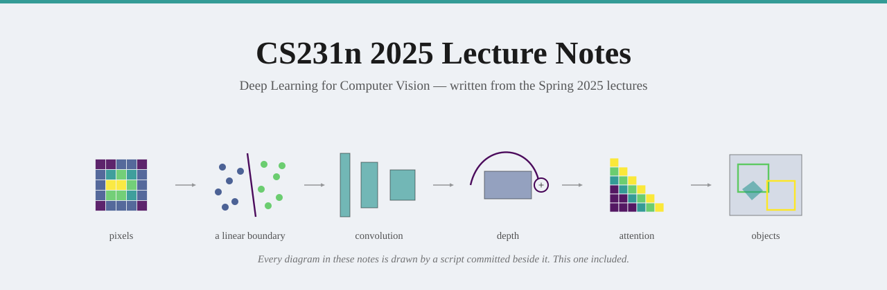

<p align="center">
  
</p>

<p align="center">
  <a href="https://github.com/raimbekovm/cs231n-2025-notes/actions/workflows/publish.yml"></a>
  <a href="https://raimbekovm.github.io/cs231n-2025-notes/"></a>
  <a href="https://raimbekovm.github.io/cs231n-2025-notes/CS231n-2025-Lecture-Notes.pdf"></a>
  <a href="CONTRIBUTING.md"></a>
</p>

<h3 align="center"><a href="https://raimbekovm.github.io/cs231n-2025-notes/">Read the notes →</a></h3>

---

## The short version

Stanford's [CS231n](https://cs231n.stanford.edu/) is the course a lot of people
learned computer vision from. Its [official notes](https://cs231n.github.io/)
are excellent — and they stopped being updated in **2017**.

Everything that reshaped the field since then is missing from them: Vision
Transformers, contrastive pretraining, latent diffusion, segmentation foundation
models, vision-language models. **These notes follow the Spring 2025 lectures and
cover that material.**

They are written to be _read_, not skimmed with the video open in another tab.

---

## Start here

Not sure where to jump in? Pick the row that sounds like you.

| If you…                  | Start at                                                                                                                         | Why                                                     |
| :----------------------- | :------------------------------------------------------------------------------------------------------------------------------- | :------------------------------------------------------ |
| are new to the field     | [Lecture 1 — Introduction](https://raimbekovm.github.io/cs231n-2025-notes/lectures/01-introduction.html)                         | Why vision is hard, and what actually changed in 2012   |
| know some ML, no vision  | [Lecture 5 — Convolutional Networks](https://raimbekovm.github.io/cs231n-2025-notes/lectures/05-convolutional-networks.html)     | Locality and translation, built into the layer itself   |
| came for transformers    | [Lecture 8 — Attention and Transformers](https://raimbekovm.github.io/cs231n-2025-notes/lectures/08-attention-transformers.html) | Derived from one bottleneck, not presented as a diagram |
| want to build something  | [Lecture 9 — Detection and Segmentation](https://raimbekovm.github.io/cs231n-2025-notes/lectures/09-detection-segmentation.html) | R-CNN → YOLO → DETR, and what each one removed          |
| prefer paper over screen | [The full PDF](https://raimbekovm.github.io/cs231n-2025-notes/CS231n-2025-Lecture-Notes.pdf)                                     | Same content, one file, built fresh on every push       |

---

## The lectures

**Fundamentals** — how you get from pixels to a network that trains.

| #   | Chapter                                      |                                                                                                           |
| :-- | :------------------------------------------- | :-------------------------------------------------------------------------------------------------------- |
| 1   | Introduction                                 | [Read →](https://raimbekovm.github.io/cs231n-2025-notes/lectures/01-introduction.html)                    |
| 2   | Image Classification with Linear Classifiers | [Read →](https://raimbekovm.github.io/cs231n-2025-notes/lectures/02-image-classification.html)            |
| 3   | Regularization and Optimization              | [Read →](https://raimbekovm.github.io/cs231n-2025-notes/lectures/03-regularization-optimization.html)     |
| 4   | Neural Networks and Backpropagation          | [Read →](https://raimbekovm.github.io/cs231n-2025-notes/lectures/04-neural-networks-backpropagation.html) |
| 5   | Convolutional Networks                       | [Read →](https://raimbekovm.github.io/cs231n-2025-notes/lectures/05-convolutional-networks.html)          |
| 6   | CNN Architectures                            | [Read →](https://raimbekovm.github.io/cs231n-2025-notes/lectures/06-cnn-architectures.html)               |
| 7   | Recurrent Neural Networks                    | [Read →](https://raimbekovm.github.io/cs231n-2025-notes/lectures/07-recurrent-neural-networks.html)       |
| 8   | Attention and Transformers                   | [Read →](https://raimbekovm.github.io/cs231n-2025-notes/lectures/08-attention-transformers.html)          |

**Vision Tasks** — what changes when the answer is no longer a single label.

| #   | Chapter                           |                                                                                                  |
| :-- | :-------------------------------- | :----------------------------------------------------------------------------------------------- |
| 9   | Object Detection and Segmentation | [Read →](https://raimbekovm.github.io/cs231n-2025-notes/lectures/09-detection-segmentation.html) |

**Still to come** — video understanding, distributed training, self-supervised
learning, generative models, 3D vision, vision-language models, robot learning,
and human-centered AI. The remaining lectures are being added one at a time; the
table above is the current state.

---

## What makes these different

What every page gives you, without exception:

**📖 Prose, not bullet points.** Each chapter is an argument you can read straight
through. Ideas that stand in relation to each other get a paragraph that says how
they connect, rather than three bullets that leave you to guess.

**✏️ The maths is actually there.** Numbered, cross-referenced, and every
load-bearing result derived rather than asserted. Every symbol is defined the
first time it appears.

**📐 The diagrams are drawn here, not borrowed.** Most ship with the generator
that produced them — a script committed beside the figures, which prints every
number the surrounding prose quotes. So a claim in the text can be checked
against the code that computed it rather than against someone's memory.

**🔗 Links go to the paper.** Always to the arXiv page, the proceedings entry or
the DOI. Never to a blog post summarising it.

**🧾 And where a figure _isn't_ ours, it says so.** Photographs and historical
images can't be redrawn, so [`figures/SOURCES.md`](figures/SOURCES.md) carries a
row per figure — including the ones whose origin nobody has traced, marked
`unidentified` rather than quietly claimed.

And because it is a book rather than a pile of pages: full-text search,
cross-references that resolve, a light and a dark theme, and an **Edit this page**
link at the bottom of every chapter.

---

## How a chapter gets made

Roughly, and in case you want to do something similar:

```
lecture video ──► transcript, one sentence per line, timecoded
slide deck ─────► a one-line map of every page
                        │
                        ▼
              an outline that says which
              minutes and slides carry
              which section
                        │
                        ▼
    prose, section by section ──► maths ──► papers checked
                        │              against the primary source
                        ▼
      diagrams authored as a Python script that
      prints every number the prose quotes
                        │
                        ▼
    quarto render ──► link check ──► anchor check ──► CI ──► published
```

The transcripts and slides stay on disk and are never committed — they are
Stanford's material. What ships is the writing and the figures.

---

## Repository layout

```
cs231n-2025-notes/
├── index.qmd              # site landing page
├── lectures/              # one .qmd per lecture — the source of truth
├── figures/               # one directory per lecture
│   ├── SOURCES.md         #   per-figure provenance, row by row
│   └── */make_diagrams.py #   the script that draws that chapter's figures
├── tools/                 # transcript fetching, link and anchor checks
├── filters/               # Quarto Lua filters (SEO, lazy images, PDF images)
├── _quarto.yml            # site and PDF configuration
├── theme.scss             #   light theme
├── theme-dark.scss        #   dark theme
└── .github/workflows/     # renders and publishes on push to main
```

Site and PDF are both generated from the same `.qmd` sources by
[Quarto](https://quarto.org/) and published to `gh-pages` by CI. Nothing built is
ever committed to `main`.

---

## Build it yourself

Install [Quarto](https://quarto.org/docs/get-started/), then:

```bash
quarto preview           # live-reloading site at localhost:4321
quarto render            # full build into _site/ (site + PDF)
quarto render --to html  # site only — no LaTeX needed
```

Only the PDF needs a LaTeX installation. To redraw a chapter's figures:

```bash
python3 figures/09-detection-segmentation/make_diagrams.py
```

---

## Found a mistake?

**Please tell me.** Corrections are genuinely welcome, and a typo fix takes about
thirty seconds: every page has an **Edit this page** link at the bottom that opens
a pull request straight from your browser.

For anything larger — a section that does not follow, an explanation that is
wrong, a figure that misleads — open an
[issue](https://github.com/raimbekovm/cs231n-2025-notes/issues) first.
[CONTRIBUTING.md](CONTRIBUTING.md) has the style guide.

---

## Sources and licence

This is an **unofficial** resource, not affiliated with Stanford University. For
official materials, see [cs231n.stanford.edu](https://cs231n.stanford.edu/).

- [CS231n course website](https://cs231n.stanford.edu/)
- [2025 lecture videos](https://www.youtube.com/playlist?list=PLoROMvodv4rOmsNzYBMe0gJY2XS8AQg16)
- [The original notes](https://cs231n.github.io/) by Andrej Karpathy

The notes are released under the [MIT licence](LICENSE) — that covers the writing
and the diagrams made for this project. Figures from research papers and lecture
slides remain their authors'. Per-figure provenance is recorded honestly in
[figures/SOURCES.md](figures/SOURCES.md), **including the figures whose source has
not been traced**. [NOTICE.md](NOTICE.md) has the full picture.
