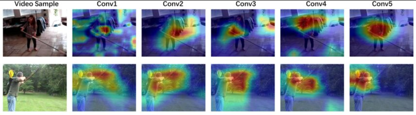

# CS231n 2025 Lecture Notes

[](https://github.com/raimbekovm/cs231n-2025-notes/actions/workflows/publish.yml)
[](https://raimbekovm.github.io/cs231n-2025-notes/)
[](CONTRIBUTING.md)

Comprehensive lecture notes for **Stanford CS231n: Deep Learning for Computer
Vision**, Spring 2025.

### **[Read the notes →](https://raimbekovm.github.io/cs231n-2025-notes/)**

The official [cs231n.github.io](https://cs231n.github.io/) notes haven't been
updated since 2017. Everything that reshaped computer vision since then is
missing from them: Vision Transformers, contrastive pretraining, latent
diffusion, segmentation foundation models, vision-language models. These notes
follow the 2025 lectures and cover that material.

---

## Lectures

| #   | Topic                                          | Read                                                                                       | Status      |
| :-- | :--------------------------------------------- | :----------------------------------------------------------------------------------------- | :---------- |
| 1.1 | History of Computer Vision                     | [Online](https://raimbekovm.github.io/cs231n-2025-notes/lectures/01-history.html)          | Complete    |
| 1.2 | Course Overview: Tasks, Models, Applications   | [Online](https://raimbekovm.github.io/cs231n-2025-notes/lectures/01b-course-overview.html) | Complete    |
| 2   | Image Classification, k-NN, Linear Classifiers | —                                                                                          | In progress |
| 3   | Regularization and Optimization                | —                                                                                          | Planned     |
| 4   | Neural Networks and Backpropagation            | —                                                                                          | Planned     |

The whole set is also available as a
[single PDF](https://raimbekovm.github.io/cs231n-2025-notes/CS231n-2025-Lecture-Notes.pdf).

<p align="center">
  
</p>

<p align="center"><em>What a CNN learns at each layer — from edges to semantic concepts.</em></p>

---

## What's inside

Each lecture is written from the recordings and slides rather than summarised
from the 2017 notes, so it follows what the lecturers actually emphasised in 2025. Every page includes:

- Mathematical formulations alongside the intuition behind them
- Diagrams and figures, with links to the original papers
- **Key Takeaways** at the end of each major section
- **Deep Dive** boxes for material that goes past what the lecture covered

---

## Repository layout

```
cs231n-2025-notes/
├── index.qmd              # site landing page
├── lectures/              # one .qmd per lecture — the source of truth
├── figures/               # images, one directory per lecture
│                          #   diagram_*.svg ship with their TikZ source
├── _quarto.yml            # site and PDF configuration
├── theme.scss             #   light theme
├── theme-dark.scss        #   dark theme
└── .github/workflows/     # renders and publishes on push to main
```

The site and the PDF are both generated from the same `.qmd` sources by
[Quarto](https://quarto.org/) and published to the `gh-pages` branch by CI.
Nothing built is committed to `main`.

---

## Building locally

Install [Quarto](https://quarto.org/docs/get-started/), then:

```bash
quarto preview          # live-reloading site at localhost:4321
quarto render           # full build into _site/ (site + PDF)
quarto render --to html # site only, no LaTeX needed
```

Only the PDF output requires a LaTeX installation.

---

## Contributing

Corrections are genuinely welcome. Every page has an **Edit this page** link at
the bottom that opens a pull request straight from the browser — a typo fix
takes about thirty seconds.

For anything larger, open an
[issue](https://github.com/raimbekovm/cs231n-2025-notes/issues) first. See
[CONTRIBUTING.md](CONTRIBUTING.md) for the style guide.

---

## References

- [CS231n course website](https://cs231n.stanford.edu/)
- [2025 lecture videos](https://www.youtube.com/playlist?list=PLoROMvodv4rOmsNzYBMe0gJY2XS8AQg16)
- [Original course notes](https://cs231n.github.io/) by Andrej Karpathy

---

## Disclaimer and licence

This is an **unofficial** resource, not affiliated with Stanford University. For
official materials see [cs231n.stanford.edu](https://cs231n.stanford.edu/).

The notes are released under the [MIT licence](LICENSE). That covers the writing
and the diagrams made for this project; figures reproduced from research papers
and lecture slides remain the property of their original authors and are credited
in their captions. See [NOTICE.md](NOTICE.md) for the full picture.
