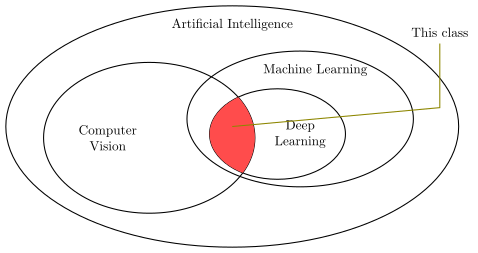
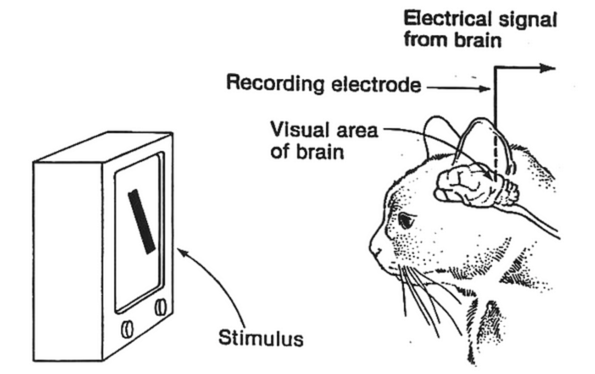
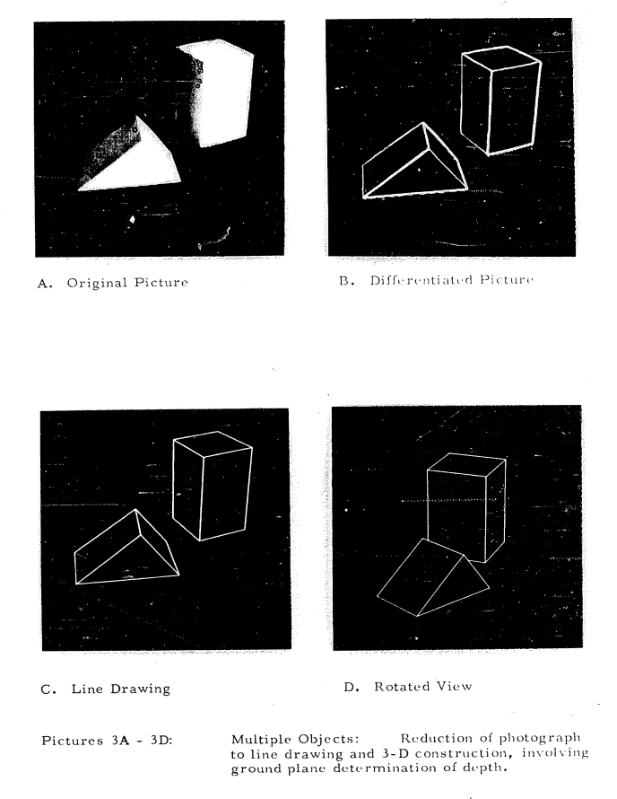
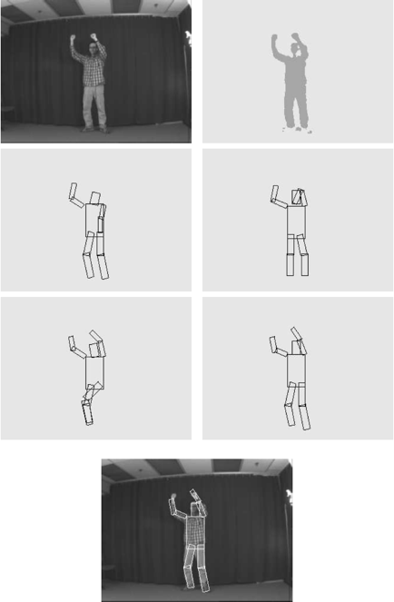
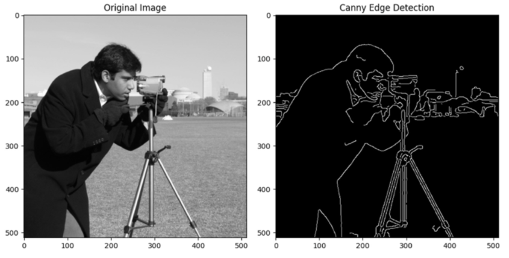
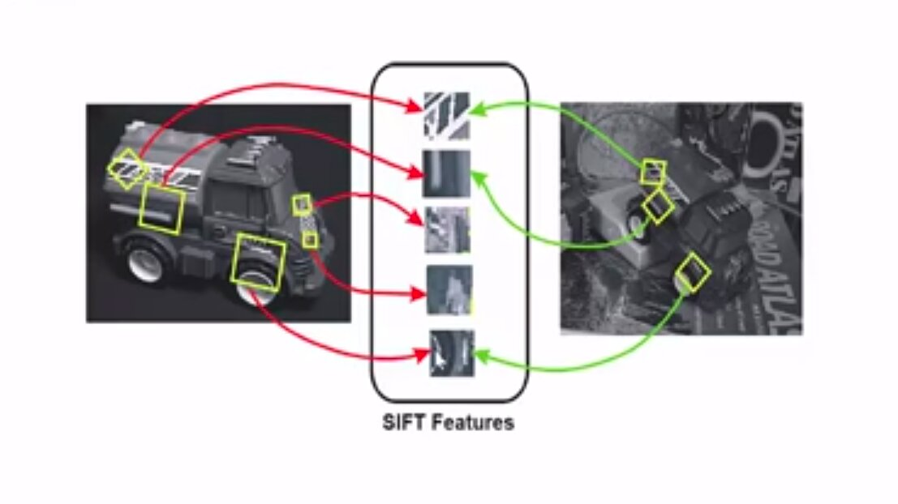

*Based on the lecture by Fei-Fei Li — [CS231n](https://cs231n.stanford.edu/),
Stanford University, Spring 2025.*

# Introduction {#sec-introduction}

Artificial Intelligence has evolved into one of the most interdisciplinary fields in modern science. What began as a branch of computer science now intersects with mathematics, neuroscience, psychology, physics, biology, and countless application domains---from medicine and law to education and business.

This course, CS231n, focuses on a specific and powerful intersection: **computer vision** and **deep learning**. While we cannot cover the entirety of either field in a single quarter, we will explore their core overlap---the algorithms and techniques that enable machines to understand visual information.

## What You Will Learn

By the end of this course, you will be able to:

- Formalize computer vision problems as machine learning tasks

- Understand and implement core deep learning architectures (CNNs, RNNs, Transformers)

- Train and evaluate models for image classification, object detection, and segmentation

- Explore advanced topics: generative models, vision-language models, 3D vision

- Gain perspective on where the field is headed and its broader implications

## Course Scope

@fig-course-scope illustrates how this course fits within the broader AI landscape. Machine learning, and particularly deep learning, provides the mathematical toolkit. Computer vision defines the problems we aim to solve. This course lives at their intersection.

{#fig-course-scope width="90%"}

::: {.callout-tip title="Key Takeaways"}

- AI is highly interdisciplinary---skills from this course apply across many domains

- CS231n focuses on the intersection of computer vision and deep learning

- Deep learning provides algorithms; computer vision provides problems

:::

# Computer Vision in the AI Landscape {#sec-cv-in-ai}

If we think of AI as a broad field encompassing all efforts to create intelligent machines, computer vision is one of its most fundamental subfields. But vision is more than just a component of AI---it may be a *cornerstone* of intelligence itself.

## Why Vision Matters

Consider this: more than 50% of the human cerebral cortex is involved in visual processing[^01-history-1]. Humans are profoundly visual creatures. We navigate the world, recognize faces, read emotions, and make countless decisions based on what we see.

The argument can be made that understanding visual intelligence is inseparable from understanding intelligence as a whole. As Fei-Fei Li puts it: "*Unlocking the mystery of visual intelligence is unlocking the mystery of intelligence.*" If we want to build truly intelligent machines, they must be able to see and interpret the world.

## Connections to Other Fields

Computer vision does not exist in isolation. It connects deeply with:

- **Natural Language Processing**: Image captioning, visual question answering

- **Robotics**: Perception for navigation, manipulation, and interaction

- **Speech Recognition**: Multimodal understanding (lip reading, audio-visual fusion)

- **Neuroscience**: Inspiration from biological visual systems

- **Cognitive Science**: Understanding how humans perceive and interpret scenes

The techniques you learn in this course---convolutional networks, attention mechanisms, generative models---have applications far beyond vision. They form the foundation of modern AI.

# A Brief History of Vision {#sec-history-vision}

The history of vision did not begin with cameras or computers. It began approximately 540 million years ago, during one of the most dramatic periods in evolutionary history.

## The Cambrian Explosion {#sec-cambrian}

Fossil records reveal a mysterious period known as the **Cambrian explosion**---a span of roughly 10 million years during which the diversity of animal species increased dramatically. Before this period, life on Earth was relatively simple: organisms floated passively in ancient oceans, with no predators, no prey, and little need for complex behavior.

What triggered this explosion of diversity? Scientists have proposed many theories---changes in ocean chemistry, shifts in climate, increases in atmospheric oxygen. But one of the most compelling explanations centers on the evolution of **vision**.

## The First Eyes

The earliest eyes were remarkably simple---not the sophisticated lenses and retinas we possess today, but basic photosensitive cells. Trilobites, among the first animals to develop eyes, had simple structures that could detect light and darkness.

But even this primitive ability to sense light transformed life on Earth. Suddenly, animals could perceive their environment in a fundamentally new way:

- **Predators** could see prey and hunt actively

- **Prey** could see predators and flee

- **Navigation** became possible---toward light, away from danger

Without senses, life is passive---mere metabolism. With vision, organisms became active participants in their environment. Evolutionary pressures intensified. Species that could see better survived longer and reproduced more successfully.

## Vision and the Evolution of Intelligence

The development of visual systems drove the evolution of nervous systems. Processing visual information requires neural circuits---first simple, then increasingly complex. Over 540 million years, these circuits grew into the sophisticated brains we see today.

::: {.callout-warning title="Note"}

Almost all animals on Earth today rely on vision as one of their primary senses. The evolution of eyes was not just an anatomical development---it was the catalyst for the evolution of intelligence itself.

:::

This perspective motivates why computer vision is such a fundamental problem in AI. If biological vision drove the evolution of natural intelligence, perhaps understanding visual processing is key to building artificial intelligence.

::: {.callout-tip title="Key Takeaways"}

- The Cambrian explosion ($\sim$540 million years ago) saw rapid diversification of species

- The evolution of eyes may have triggered this explosion

- Vision transformed passive organisms into active agents

- Visual processing drove the evolution of nervous systems and intelligence

:::

# From Biological Eyes to Cameras {#sec-cameras}

Humans have long been fascinated not only by seeing, but by building machines that can capture images. The desire to replicate vision mechanically predates computers by centuries.

## Early Optical Devices

The principles of image formation were understood in antiquity. Ancient Greek and Chinese scholars documented how light passing through a small hole projects an inverted image onto a surface---the principle behind the **camera obscura** (Latin for "dark room"), illustrated in @fig-camera-obscura.

{#fig-camera-obscura width="70%"}

Leonardo da Vinci studied the camera obscura extensively in the 15th and 16th centuries, exploring its potential for art and understanding vision. Artists used these devices to trace accurate perspectives long before photography existed.

## The Invention of Photography

The camera obscura could project images, but it could not preserve them. The breakthrough came in the 19th century with the development of **photography**---chemical processes that could fix an image permanently.

Key milestones include:

- **1826**: Joseph Nicéphore Niépce captures the first permanent photograph

- **1839**: Louis Daguerre introduces the daguerreotype process

- **1888**: George Eastman introduces the Kodak camera, making photography accessible

## Cameras Are Not Enough

Modern life is saturated with cameras. Smartphones, security systems, satellites, medical devices---we capture billions of images every day. But cameras alone do not provide vision.

A camera is merely an apparatus for recording light. An eye, too, is just an optical sensor. True vision---the ability to understand, interpret, and act on visual information---requires something more: **intelligence**.

::: {.callout-note title="Deep Dive: The Gap Between Sensing and Understanding"}

Consider what happens when you look at a photograph:

- Your retina receives photons and converts them to neural signals

- Your visual cortex processes edges, colors, textures, shapes

- Higher brain regions recognize objects, faces, scenes

- You understand the context, the story, the meaning

A camera performs only the first step. The remaining steps---perception, recognition, understanding---are what computer vision aims to replicate.

:::

This is the central challenge of computer vision: not capturing images (cameras do that well), but *understanding* them. How do we go from pixels to meaning? From raw data to intelligent interpretation?

The rest of this lecture---and this course---explores how researchers have approached this challenge, from early attempts in the 1960s to the deep learning revolution of today.

::: {.callout-tip title="Key Takeaways"}

- The camera obscura demonstrates basic principles of image formation

- Photography (19th century) enabled permanent image capture

- Cameras capture light; they do not provide understanding

- Computer vision aims to bridge the gap between sensing and intelligence

:::

# A Brief History of Computer Vision {#sec-history-cv}

The field of computer vision---teaching machines to interpret images---is relatively young. Its history is intertwined with neuroscience, artificial intelligence, and the gradual recognition that "seeing" is far more complex than anyone initially imagined.

## Neuroscience Foundations: Hubel and Wiesel (1959)

In the late 1950s, neurophysiologists David Hubel and Torsten Wiesel conducted [groundbreaking experiments](https://www.semanticscholar.org/paper/6b4fe4aa4d66fecc7b2869569002714d91d0b3f7) on the visual cortex of cats (see @fig-hubel-wiesel). By inserting electrodes into the brains of anesthetized animals and presenting visual stimuli, they discovered two fundamental principles.

{#fig-hubel-wiesel width="65%"}

**First**, neurons in the primary visual cortex have **receptive fields**---each neuron responds to stimuli in a specific, localized region of the visual field. A single neuron does not "see" the entire image; it processes only a small, confined patch of space. In the primary visual cortex (located at the back of the head, not near the eyes), these neurons respond to simple patterns like oriented edges.

**Second**, visual processing is **hierarchical**. Neurons in early layers respond to simple features. These signals feed into deeper layers, where neurons respond to increasingly complex patterns---corners, shapes, and eventually objects.

::: {.callout-warning title="Note"}

Hubel and Wiesel received the Nobel Prize in Physiology or Medicine in 1981 for their discoveries concerning information processing in the visual system.

:::

These findings---local receptive fields and hierarchical feature extraction---would become the foundational principles of convolutional neural networks decades later.

## The Birth of Computer Vision (1960s)

The formal study of computer vision began in the early 1960s:

- **1963**: Larry Roberts at MIT wrote what is often considered the first PhD thesis in computer vision, focusing on extracting 3D information from 2D images of simple geometric shapes (see @fig-roberts-blocks).

- **1966**: Seymour Papert at MIT initiated the famous "Summer Vision Project," proposing to hire undergraduates to "solve" computer vision over a single summer.[^01-history-2]

{#fig-roberts-blocks width="60%"}

Of course, vision was not solved that summer---nor the next, nor the decade after. Just like the rest of AI history, researchers were overly optimistic about what could be achieved in a short period. The field has since blossomed into a major computer science discipline, with annual conferences now attracting over 10,000 attendees.

## The David Marr Era (1970s)

British neuroscientist David Marr proposed an influential framework for understanding vision as an information-processing problem. His approach decomposed vision into levels (see @fig-marr-stages):

::: {#fig-marr-stages}
| **Input Image**       | **Primal Sketch**                                | **2$\frac{1}{2}$-D Sketch**                | **3-D Model**                                  |
|:----------------------|:-------------------------------------------------|:-------------------------------------------|:-----------------------------------------------|
| Perceived intensities | Edges, blobs, bars, contours, curves, boundaries | Surface orientation, depth discontinuities | Hierarchical structure of surfaces and volumes |

Marr’s stages of visual representation: from raw pixels through intermediate representations to 3D understanding.
:::

Marr emphasized that recovering 3D information from 2D images is fundamentally an **ill-posed problem**.[^01-history-3] Nature solved this partly through binocular vision (two eyes for triangulation), but the problem remains challenging even for modern algorithms.

## Early Approaches (1970s-1980s)

During this period, researchers at Stanford and elsewhere developed early approaches to object recognition:

- **Generalized cylinders**: Work by Rodney Brooks and Tom Binford at Stanford represented objects as compositions of cylindrical parts.[^01-history-4]

- **Pictorial structures**: Representing objects (especially human bodies) as collections of parts with spatial relationships (see @fig-pictorial-structures).

- **Edge detection**: Algorithms to extract boundaries and contours from images (see @fig-edge-detection).

{#fig-pictorial-structures width="55%"}

{#fig-edge-detection width="75%"}

Despite these efforts, progress felt limited---extracting edges and sketches didn't seem to capture real visual understanding. Around this time, AI entered its "winter"---a period of reduced funding and enthusiasm as many AI promises failed to deliver.

## Cognitive Insights: How Humans See

Even during the AI winter, research continued. Cognitive scientists provided crucial insights about human visual processing:

**Context matters.** Psychologist Irving Biederman showed that humans detect objects differently depending on the surrounding scene. A bicycle is recognized differently in a coherent street scene versus a scrambled image---even when the bicycle pixels are identical.

**Vision is fast.** Simon Thorpe measured that humans can categorize complex natural images ("contains an animal" vs. "no animal") within approximately 150 milliseconds.[^01-history-5] While this seems slow compared to modern GPUs, it's remarkably fast for biological neurons---only a few "hops" of neural processing.

**Specialized regions exist.** Neuroscientists at MIT discovered brain areas specialized for faces, places, and body parts, suggesting that certain visual categories require dedicated processing.

These findings pointed researchers toward studying natural images and object recognition, rather than just simple geometric shapes.

## Features and Datasets (1990s-2000s)

As the field matured, researchers developed hand-crafted feature descriptors that could reliably identify corresponding points across images.

### SIFT: Scale-Invariant Feature Transform (1999)

David Lowe introduced [SIFT](https://www.semanticscholar.org/paper/f9f836d28f52ad260213d32224a6d227f8e8849a), which detects **keypoints**---distinctive locations in an image---and computes a descriptor for each based on local gradient orientations (see @fig-sift). The key insight: these descriptors remain stable across changes in scale, rotation, and viewpoint.

{#fig-sift width="70%"}

SIFT enabled applications like panorama stitching, object recognition, and 3D reconstruction. It dominated computer vision for nearly a decade before deep learning.

### Viola-Jones: Real-Time Face Detection (2001)

[Paul Viola and Michael Jones](https://www.semanticscholar.org/paper/dc6ea0e30e46163b706f2f8bdc9c67ca87f83d63) achieved a breakthrough in face detection with a system fast enough for real-time use (see @fig-viola-jones). Their approach combined three key ideas:

1.  **Haar-like features**: Simple rectangular patterns (black/white regions) that capture local contrast---for example, the eyes are darker than the cheeks below them

2.  **Integral images**: A data structure enabling extremely fast feature computation

3.  **Cascade classifier**: A sequence of increasingly complex classifiers that quickly reject obvious non-faces, spending more computation only on promising regions

{#fig-viola-jones width="70%"}

Within five years of publication, this algorithm appeared in consumer digital cameras for automatic face focusing---one of the first widespread applications of computer vision.

### Benchmark Datasets

The early 2000s brought a crucial development: the internet. Combined with digital cameras, data started to proliferate. Benchmark datasets emerged:

- **Caltech-101** (2003): 101 object categories

- **PASCAL VOC** (2005-2012): Object detection challenges

These datasets, though small by modern standards, established the paradigm of training and evaluating on standardized benchmarks.

::: {.callout-tip title="Key Takeaways"}

- Hubel & Wiesel (1959): receptive fields and hierarchical processing

- Early CV (1960s) vastly underestimated the difficulty of vision

- David Marr: vision as computational information processing

- Cognitive science: human vision is fast, context-dependent, specialized

- Hand-crafted features and benchmark datasets drove progress (1990s-2000s)

:::

# A Brief History of Deep Learning {#sec-history-dl}

While computer vision researchers were developing hand-crafted features, a parallel thread of research was progressing: neural networks. This approach would eventually revolutionize not just vision but all of AI.

## Perceptrons and Early Setbacks (1950s-1960s)

In 1958, Frank Rosenblatt at Cornell introduced the [**Perceptron**](https://www.semanticscholar.org/paper/5d11aad09f65431b5d3cb1d85328743c9e53ba96)---a machine that could learn to classify inputs by adjusting connection weights (see @fig-perceptron-1958). The Mark I Perceptron was a physical device with 400 photocells (the "retina"), randomly wired to association units, which fed into response units.

{#fig-perceptron-1958 width="85%"}

The perceptron could learn simple classification tasks---given labeled examples, it would automatically adjust weights to improve accuracy. This sparked enormous excitement about machine learning.

However, in 1969, Marvin Minsky and Seymour Papert published *Perceptrons*, a rigorous mathematical analysis showing fundamental limitations (see @fig-minsky-papert). They proved that single-layer perceptrons cannot learn certain simple functions---most famously, XOR (exclusive or).

{#fig-minsky-papert width="80%"}

This critique contributed to the first "AI winter"---a period of reduced funding and enthusiasm for neural network research.

## Neocognitron: A Hand-Designed CNN (1980)

Despite setbacks, work continued. Kunihiko Fukushima in Japan created the [**Neocognitron**](https://www.semanticscholar.org/paper/69e68bfaadf2dccff800158749f5a50fe82d173b)---a neural network directly inspired by Hubel and Wiesel's findings (see @fig-neocognitron-lenet (a)). It alternated between two types of layers:

- **S-cells** (simple cells): Detect local features like edges---analogous to convolution

- **C-cells** (complex cells): Pool information from S-cells, providing tolerance to small shifts---analogous to pooling

{#fig-neocognitron-lenet width="90%"}

The Neocognitron could recognize digits and letters, but it was an engineering feat: every parameter was hand-designed. Fukushima had to meticulously tune hundreds of parameters to make it work. The architecture was remarkably similar to modern CNNs---what was missing was an automatic way to learn the parameters.

## The Backpropagation Breakthrough (1986)

The real breakthrough came with [**backpropagation**](https://www.semanticscholar.org/paper/052b1d8ce63b07fec3de9dbb583772d860b7c769)---a learning rule that eliminated the need for hand-tuning (see @fig-backprop). In 1986, Rumelhart, Hinton, and Williams showed how to:

1.  Define an error function comparing network output to correct answers

2.  Propagate error information backward through the network

3.  Automatically adjust parameters using calculus (chain rule)

{#fig-backprop width="45%"}

This was a watershed moment---networks could now learn their own parameters. The XOR problem that had haunted neural networks for nearly two decades was finally solved, not by human engineering, but by letting the network learn.

## LeNet: CNNs in Practice (1989-1998)

Yann LeCun, working at Bell Labs, combined backpropagation with convolutional architectures to create [**LeNet**](https://www.semanticscholar.org/paper/162d958ff885f1462aeda91cd72582323fd6a1f4) (see @fig-lenet). The architecture alternated convolutional layers (feature extraction) with subsampling layers (dimensionality reduction), followed by fully connected layers for classification.

{#fig-lenet width="95%"}

LeNet was trained to recognize handwritten digits and was actually deployed in US postal offices and banks to read checks---one of the first real-world applications of deep learning.

LeNet proved that neural networks could achieve practical results on real tasks.

## The Stall: Why Deep Learning Didn't Take Off (1990s-2000s)

Despite LeNet's success on digits, neural networks didn't scale to natural images:

- When tested on photos of cats, dogs, chairs, and flowers---the kind used by neuroscientists---they simply didn't work

- Other methods like SVMs often performed better on benchmarks

- Training was unstable; gradients would vanish or explode

- Most critically: **there wasn't enough data**

::: {.callout-note title="Deep Dive: Why Data Matters"}

Neural networks are high-capacity models with millions of parameters. Without enough data, they memorize training examples instead of learning generalizable patterns (overfitting). This is a mathematical problem, not just an inconvenience. Data was underappreciated---most researchers focused on architectures while ignoring that data is a "first-class citizen" in machine learning.

:::

A small community---including Geoffrey Hinton, Yann LeCun, and Yoshua Bengio---continued working on neural networks through this difficult period.

::: {.callout-tip title="Key Takeaways"}

- Perceptrons (1958) introduced learnable artificial neurons

- Neocognitron (1980): CNN architecture, but hand-designed parameters

- Backpropagation (1986): automatic learning of parameters

- LeNet (1989): practical CNN for digit recognition

- Neural networks stalled in 1990s-2000s due to lack of data

:::

# The 2012 Moment: ImageNet and AlexNet {#sec-2012-moment}

The histories of computer vision and deep learning converged dramatically in 2012, in what many consider the birth of the modern AI era.

## ImageNet: Data at Scale

Recognizing that lack of data was holding back the field, Fei-Fei Li and her students set out to create an unprecedented dataset. They hypothesized that the field was underappreciating the importance of data.

[**ImageNet**](https://www.semanticscholar.org/paper/d2c733e34d48784a37d717fe43d9e93277a8c53e), released in 2009, contained (see @fig-imagenet):

- **15 million** images (cleaned from over 1 billion)

- **22,000** object categories (roughly the number humans learn in early life)

- Human-verified labels via Amazon Mechanical Turk

{#fig-imagenet width="85%"}

The **ImageNet Large Scale Visual Recognition Challenge (ILSVRC)** used a curated subset: 1 million+ images across 1,000 classes. Researchers competed to build algorithms that could correctly classify images.

## AlexNet: The Breakthrough

In 2012, Geoffrey Hinton and his students (Alex Krizhevsky, Ilya Sutskever) entered the challenge with a deep convolutional neural network called [**AlexNet**](https://papers.nips.cc/paper/4824-imagenet-classification-with-deep-convolutional-neural-networks) (see @fig-alexnet):

| **Year**              |      **Top-5 Error Rate**      |
|:----------------------|:------------------------------:|
| 2010 (first year)     |   $\sim$28%   |
| 2011                  |   $\sim$26%   |
| **2012 (AlexNet)**    | **$\sim$15%** |
| Human performance[^01-history-6] |   $\sim$5%    |

AlexNet reduced the error rate by **almost half**---an enormous improvement when annual progress was typically measured in single percentage points.

{#fig-alexnet width="95%"}

## What Made It Work?

Remarkably, AlexNet's architecture wasn't radically different from Fukushima's Neocognitron designed 32 years earlier. The differences were:

1.  **Backpropagation**: A principled, mathematically rigorous learning rule---no more hand-tuning parameters

2.  **Data**: ImageNet provided 1.2 million labeled training images, orders of magnitude more than previous datasets

3.  **Compute**: GPUs (originally for video games) proved ideal for the parallel matrix operations in neural networks

Many consider 2012 and AlexNet the historical moment of the **birth (or rebirth) of modern AI** and the **deep learning revolution**.

## The Deep Learning Explosion

After 2012, progress accelerated dramatically. The ImageNet error rate dropped below human performance ($\sim$5%) by 2015. The number of papers at computer vision conferences exploded.

Deep learning transformed every computer vision task:

- Object detection and segmentation

- Image captioning and visual question answering

- Style transfer and image generation

- Video classification and activity recognition

- Medical imaging, scientific discovery, sustainability

## The Three Converging Forces

The 2012 moment illustrates a pattern that continues to drive AI:

1.  **Data**: Large, labeled datasets enable learning rich representations

2.  **Compute**: GPUs provide necessary computational power (NVIDIA's FLOPS per dollar has skyrocketed since 2020)

3.  **Algorithms**: Architectural innovations unlock new capabilities

We are now "totally out of AI winter"---in what might be called an **AI global warming** period, with no signs of slowing down.

::: {.callout-tip title="Key Takeaways"}

- ImageNet (2009): 15M images, 22K categories---data at unprecedented scale

- AlexNet (2012): reduced ImageNet error by $\sim$50%, using backpropagation + data + GPUs

- Three converging forces: data, compute, algorithms

- 2012 marks the birth of the modern deep learning era

- We are in an "AI global warming" period of rapid progress

:::

# Post-2012: The AI Explosion {#sec-post-2012}

The years following AlexNet's victory saw an explosion of activity in deep learning research. What began as a breakthrough in image classification quickly spread to every corner of computer vision---and beyond.

## Advances in Visual Recognition

Deep learning quickly transformed every major computer vision task:

- **Object detection**: Locating and classifying multiple objects in images

- **Semantic segmentation**: Labeling every pixel with its object class

- **Instance segmentation**: Distinguishing individual object instances

- **Image captioning**: Generating natural language descriptions of images

- **Visual question answering**: Answering questions about image content

Applications spread rapidly: medical imaging (radiology, pathology), scientific discovery (the first black hole photograph used CV techniques), autonomous vehicles, sustainability monitoring, and countless others.

## The Hardware Revolution

The deep learning explosion drove---and was driven by---dramatic improvements in hardware. NVIDIA's GPUs, originally designed for video games, became the engines of AI research.

Before 2020, GPU performance improved steadily. After deep learning took hold, FLOPS per dollar skyrocketed. Custom AI accelerators (TPUs, specialized chips) pushed performance even further.

## Generative AI

Beyond recognition, deep learning enabled **generation**:

- **Style transfer**: Reimagining images in different artistic styles

- **Face generation**: Creating photorealistic faces of people who don't exist

- **Text-to-image**: DALL-E, Midjourney, Stable Diffusion---generating images from text prompts

- **Diffusion models**: State-of-the-art generative techniques

## The Current Landscape

Conference attendance exploded (CVPR now attracts 10,000+ attendees). AI startups proliferated. Enterprise adoption accelerated across industries.

The impact of deep learning has been recognized at the highest levels:

- **Turing Award 2018**: Geoffrey Hinton, Yoshua Bengio, and Yann LeCun received computing's most prestigious honor for "conceptual and engineering breakthroughs that have made deep neural networks a critical component of computing."

- **Nobel Prize in Physics 2024**: Geoffrey Hinton and John Hopfield were recognized for foundational contributions to machine learning with artificial neural networks.

::: {.callout-warning title="Note"}

With great power comes great responsibility. AI systems can perpetuate human biases present in training data. Face recognition systems have shown demographic disparities. AI increasingly affects employment, financial decisions, and healthcare. These human-centered concerns are as important as technical advances.

:::

::: {.callout-tip title="Key Takeaways"}

- Post-2012, deep learning transformed all areas of computer vision

- Hardware (GPUs) and software (algorithms) advanced in a virtuous cycle

- Generative AI emerged: style transfer, image generation, diffusion models

- We are in an "AI global warming" period---rapid progress, no slowdown in sight

- Human-centered concerns (bias, ethics, societal impact) are critical

:::

# References {#references-01-history .unnumbered}

- Rosenblatt, F. (1958). The perceptron: A probabilistic model for information storage and organization in the brain. *Psychological Review*, 65(6), 386-408.

- Hubel, D. H., & Wiesel, T. N. (1962). Receptive fields, binocular interaction and functional architecture in the cat's visual cortex. *The Journal of Physiology*, 160(1), 106-154.

- Roberts, L. G. (1963). *Machine Perception of Three-Dimensional Solids*. PhD thesis, MIT.

- Minsky, M., & Papert, S. (1969). *Perceptrons: An Introduction to Computational Geometry*. MIT Press.

- Fischler, M. A., & Elschlager, R. A. (1973). The representation and matching of pictorial structures. *IEEE Transactions on Computers*, 22(1), 67-92.

- Fukushima, K. (1980). Neocognitron: A self-organizing neural network model for a mechanism of pattern recognition unaffected by shift in position. *Biological Cybernetics*, 36(4), 193-202.

- Marr, D. (1982). *Vision: A Computational Investigation*. MIT Press.

- Canny, J. (1986). A computational approach to edge detection. *IEEE Transactions on Pattern Analysis and Machine Intelligence*, 8(6), 679-698.

- Rumelhart, D. E., Hinton, G. E., & Williams, R. J. (1986). Learning representations by back-propagating errors. *Nature*, 323(6088), 533-536.

- LeCun, Y., et al. (1989). Backpropagation applied to handwritten zip code recognition. *Neural Computation*, 1(4), 541-551.

- Thorpe, S., Fize, D., & Marlot, C. (1996). Speed of processing in the human visual system. *Nature*, 381(6582), 520-522.

- LeCun, Y., et al. (1998). Gradient-based learning applied to document recognition. *Proceedings of the IEEE*, 86(11), 2278-2324.

- Lowe, D. G. (1999). Object recognition from local scale-invariant features. *ICCV*, 1150-1157.

- Viola, P., & Jones, M. (2001). Rapid object detection using a boosted cascade of simple features. *CVPR*, 511-518.

- Felzenszwalb, P. F., & Huttenlocher, D. P. (2005). Pictorial structures for object recognition. *International Journal of Computer Vision*, 61(1), 55-79.

- Deng, J., et al. (2009). ImageNet: A large-scale hierarchical image database. *CVPR*.

- Krizhevsky, A., Sutskever, I., & Hinton, G. E. (2012). ImageNet classification with deep convolutional neural networks. *NeurIPS*.

- Russakovsky, O., et al. (2015). ImageNet Large Scale Visual Recognition Challenge. *International Journal of Computer Vision*, 115(3), 211-252.

[^01-history-1]: This estimate varies by study, but visual processing undeniably dominates cortical function.

[^01-history-2]: The project memo (MIT AI Memo 100, 1966) is often cited as an example of early AI optimism.

[^01-history-3]: In Hadamard's sense: a problem is "well-posed" if a solution exists, is unique, and depends continuously on the input. 3D reconstruction from a single 2D image violates uniqueness---infinitely many 3D scenes can produce the same 2D projection.

[^01-history-4]: Brooks later became one of the most influential roboticists, founding iRobot (creators of the Roomba vacuum cleaner).

[^01-history-5]: Thorpe, Fize & Marlot (1996), "Speed of processing in the human visual system," *Nature*.

[^01-history-6]: Russakovsky et al. (2015), "ImageNet Large Scale Visual Recognition Challenge," *IJCV*.
