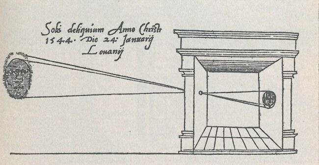
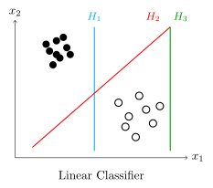

*Based on the lecture by Fei-Fei Li and Ehsan Adeli — [CS231n](https://cs231n.stanford.edu/),
Stanford University, Spring 2025.*

## Vision as the hard part of intelligence {#sec-why-vision}

Artificial intelligence is usually introduced as a single field with a single goal, and computer vision as one application among many that sit downstream of it. The ordering is convenient and slightly misleading. For most of the history of life, vision is what made intelligence necessary in the first place, and in the history of this particular field it is the problem on which our best learning methods were first shown to work at all.

The course sits at a specific intersection, and it is worth being precise about which one. Machine learning supplies the mathematics: the idea that a system's behaviour can be fitted to data rather than specified by hand. Within machine learning, the last decade or so belongs to deep learning, a family of methods built around neural networks, which we will define properly once we have the machinery to do so. Computer vision supplies the problems — what is in this image, where is it, what is it doing, and what is about to happen. Neither field is covered here in its entirety, and neither could be in ten weeks. What is covered is the overlap, which is also where both fields have moved fastest.

{#fig-scope width="88%"}

That overlap has turned out to be unusually portable. The convolutional networks, attention mechanisms and generative models developed to solve vision problems now underpin systems that never touch an image, and the techniques travel in the other direction too. A student who leaves this course with a working understanding of how these models are built and trained is not confined to vision, which is the main reason it is worth learning them properly rather than as recipes.

The claim that vision is central rather than peripheral has an anatomical version. The primate visual system is not a module but a substantial fraction of the cortex, and the most-cited mapping of it identifies thirty-two distinct cortical areas that are visual or visual-association in function, connected by several hundred pathways arranged in a rough hierarchy ([Felleman and Van Essen, 1991](https://doi.org/10.1093/cercor/1.1.1)). Whatever else the brain is doing, a large part of it is looking. This is the sense in which understanding visual intelligence is not a subproblem of understanding intelligence: it is most of the territory.

## Eyes before brains {#sec-evolution}

The history of vision is considerably older than the history of anything that could be called a brain. For roughly three billion years, life on Earth was aquatic, sparse and passive. Animals drifted, absorbed what came to them, and did not do much else. Then, over a window of perhaps ten million years — an eyeblink on the evolutionary clock — the fossil record shows an abrupt proliferation of animal body plans that palaeontologists call the Cambrian explosion, dated to around 540 million years ago.

Several explanations have been offered for what triggered it, from ocean chemistry to climate. The one that matters here is the hypothesis that the trigger was the eye. The first light-sensitive structures were not lenses and retinas but something closer to a pinhole: a patch of photosensitive cells that could register the direction light was coming from. That is a modest piece of biological engineering with an immodest consequence. An animal that cannot sense at a distance is confined to metabolism; it takes what arrives and it is taken in turn. An animal that can see becomes a participant in its environment. It can pursue, and it can be pursued.

The evolutionary pressure this creates is the point. Once one animal can see, every other animal is in an arms race — to detect, to hide, to move faster, to predict. Vision does not merely benefit from a nervous system; it is one of the forces that made an elaborate nervous system worth paying for. The five hundred million years that follow are, on this reading, not the evolution of vision alongside intelligence but the evolution of vision as intelligence.

Humans sit at an extreme of that lineage. We are overwhelmingly visual animals, and the elaborate cortical machinery described in @sec-why-vision is what that specialisation looks like from the inside.

Building machines that see is a much more recent ambition, though not as recent as one might assume. The optical principle arrived long before the technology: thinkers in ancient China and Greece described the projection of an image through a small aperture, and by the sixteenth century the camera obscura was well enough understood for Leonardo to sketch it. Photography made the image permanent, and the intervening two centuries have made cameras so cheap and so numerous that most of the images now produced on Earth are never seen by a human being at all.

{#fig-camera-obscura width="70%"}

None of which solves the problem. A camera is an apparatus for capturing light, in the same way that an eye is an apparatus for capturing light, and neither one sees. Evolution needed hundreds of millions of years of nervous system on top of the pinhole before anything was recognised. The gap between capturing an image and understanding it is the entire subject of this course, and the first thirty years of trying to close it are instructive mostly for the ways they failed.

## What neuroscience handed over {#sec-hubel-wiesel}

The most consequential experiment in the prehistory of computer vision was not a computing experiment. In the late 1950s, David Hubel and Torsten Wiesel set out to characterise how the mammalian visual pathway represents what falls on the retina. They recorded from single neurons in the primary visual cortex of anaesthetised cats while presenting visual stimuli, looking for the pattern that would make a given cell fire ([Hubel and Wiesel, 1959](https://doi.org/10.1113/jphysiol.1959.sp006308)).

The result that mattered was partly an accident of apparatus. The stimuli were slides, and the cells were largely uninterested in them; what reliably provoked a response was the edge of the slide sweeping across the projector as it was changed. Neurons in the primary visual cortex were not responding to objects, or to complex patterns, or to anything a person would name. They were responding to oriented bars of light at particular positions, and each one had a preferred orientation it responded to far more strongly than any other.

Two properties of that population turned out to be foundational. The cells Hubel and Wiesel called *simple* respond to an edge at a specific orientation in a specific location, and stop responding when the stimulus is moved or rotated away from that preference. The cells they called *complex* respond to the same oriented structure but tolerate some displacement, firing across a range of positions rather than a single one. Between them, these two populations do something a designer would recognise: they detect a local feature, and then they build a slightly more forgiving version of the same detection that no longer depends on exactly where the feature fell.

The architectural claim implicit in this is that visual representation is hierarchical and that it starts small. The cortex does not attempt to match an incoming image against a stored template of a cat. It extracts oriented edges, combines them into configurations that tolerate small changes in position, and repeats — with each stage responding to something more specific and less tied to the retinal coordinates it came from than the stage below.

Every convolutional network in this course is a restatement of that idea. The convolution operator is a bank of local feature detectors applied at every position; pooling is the tolerance to displacement that distinguishes complex cells from simple ones; depth is the hierarchy. When we come to look at what the early layers of a trained network have learned, they will turn out to be oriented edge detectors, **which nobody put there**. It took thirty years and a great deal of intervening failure for the field to arrive at an architecture that took Hubel and Wiesel seriously, and the failure is worth understanding before the success.

## Thirty years of geometry {#sec-early-cv}

Computer vision as an academic field is conventionally dated to the early 1960s, and to a doctoral thesis. Larry Roberts, working at MIT, asked whether a program could take a photograph of a scene built from wooden blocks and recover the three-dimensional shapes that produced it ([Roberts, 1963](https://dspace.mit.edu/handle/1721.1/6125)). The pipeline extracted intensity discontinuities, selected feature points, and fitted polyhedra to them. It worked, on blocks, under controlled lighting, which is a considerably narrower claim than it sounds like but was a genuine result at the time.

{#fig-roberts width="85%"}

The ambition of the period is captured better by what happened three years later, when a summer project was set up at MIT with the intention of using a handful of undergraduates over a single vacation to construct a substantial part of a vision system. Vision was not solved that summer. The episode is usually told as a joke about optimism, and it is one, but the more useful reading is that the problem's difficulty was *invisible from the outside*. Nothing about looking at a photograph tells you that recovering its contents is hard, because your own visual system does it without reporting any effort. Sixty years later the annual computer vision conferences draw over ten thousand people, and the summer project has become a field.

The intellectual centre of the following decade was David Marr, whose account of vision proposed that the problem be decomposed into stages of increasingly abstract representation. An input image is first reduced to a *primal sketch* — zero crossings, blobs, bars, edges and their groupings, which is very nearly the vocabulary Hubel and Wiesel had found in the cortex. The primal sketch is then elaborated into a **2½-D sketch**, which assigns local surface orientation and marks discontinuities in depth: enough to say that the ball is in front and the ground is behind, but still tied to the viewer's position. Only at the final stage does the system arrive at a full three-dimensional model, organised hierarchically in terms of surfaces and volumetric primitives and independent of where the observer happens to be standing.

Marr's framework was principled, neurally motivated, and it set the direction for a generation. It also placed the hardest thing in vision at the end of the pipeline as the definition of success. Recovering the complete three-dimensional structure of a scene is the *holy grail* on this account, and everything before it is preparation.

The recognition work of the period inherited that geometric commitment. If objects are three-dimensional shapes, then an object category should be describable as an arrangement of simpler shapes, and recognition becomes the problem of fitting that arrangement to an image. Generalized cylinders, developed at Stanford by Brooks and Binford, modelled objects as assemblies of tubular primitives; pictorial structures, from Fischler and Elschlager, modelled them as parts connected by spring-like constraints on their relative positions. Both ideas are genuinely good — the second one, in particular, keeps reappearing in the literature for the next forty years — and neither one scaled beyond the handful of categories it was demonstrated on.

By the 1980s, with images becoming digital, a great deal of effort went into the front end of the pipeline instead. Edge detection was formalised and made robust, most durably by Canny, whose detector is still in use. But it is worth being blunt about how this looked from outside the field: after two decades of work, the visible output of computer vision was a picture with its outlines traced. The disappointment was reasonable, the funding reflected it, and the field entered the period known as the **AI winter** alongside expert systems and robotics, all of which had promised more than they delivered.

## Why vision is ill-posed {#sec-ill-posed}

The reason the geometric programme stalled is not that its practitioners were insufficiently clever. It is that the problem they had defined as the goal is, in the strict sense, *ill-posed* — the data do not determine the answer.

Consider what a camera or an eye actually does. A point $(X, Y, Z)$ in the world, expressed in coordinates centred on the sensor, lands on the image plane at

$$
(u, v) = \left( f\,\frac{X}{Z},\ f\,\frac{Y}{Z} \right)
$$ {#eq-projection}

where $f$ is the focal length and $(u, v)$ are image coordinates. The projection @eq-projection throws away one number per point, and it throws it away in a specific and unrecoverable way: for any $t > 0$, the point $(tX, tY, tZ)$ maps to exactly the same $(u, v)$. Every point along a ray through the optical centre produces an identical measurement. **A single image is consistent with infinitely many three-dimensional scenes**, and no amount of processing applied to that image can distinguish between them, because the information was destroyed at the sensor rather than lost somewhere downstream.

{#fig-projection width="92%"}

@fig-projection is the whole difficulty in one picture. This is the fundamental problem nature had to solve, and it solved it partly by refusing to solve it exactly. Two eyes give two projections from slightly different centres, and depth can be triangulated from the disparity between them — but only once the correspondence problem is settled, that is, only once you know which point in the left image is the same world point as which point in the right. Correspondence is itself hard, and stereo does not recover geometry to anything like the precision the Marr pipeline assumes as its goal. Human three-dimensional perception is approximate, and it is approximate in ways that are easy to demonstrate. We know roughly what shape things are, which turns out to be sufficient for catching, grasping and not walking into walls.

There is a second difference, more philosophical than mathematical, that is worth carrying through the course. Language does not exist in nature; it is generated by brains, it is one-dimensional, and it is sequential. That structure is precisely what makes it tractable to model as a probability distribution over the next symbol, which is the whole basis of the current generation of language models. Vision is not generated. There is a physical world, obeying the laws of physics and optics and material science, and an image is a measurement of it. The consequence is that visual problems do not decompose the way linguistic ones do, and methods that transfer between the two — as attention has — do so on the strength of their generality rather than because the domains are alike.

The lesson the field eventually took from all this is that reconstructing the world in full is the wrong target. Most useful visual tasks do not require it. Knowing that there is a pedestrian ahead is worth more than a precise depth map of the pedestrian, and it is a far better-posed question.

## What the human system tells us about the target {#sec-psychophysics}

While computer vision was working through geometry, cognitive science and neuroscience were producing results that suggested a different set of problems worth attacking, and gave some indication of what a solution would have to look like.

The first is that recognition is *contextual*. Biederman showed that identifying a cued object in a briefly presented photograph is measurably harder when the scene has been jumbled, even though the target object itself is unchanged and the subject knows both what to look for and where it will appear ([Biederman, 1972](https://doi.org/10.1126/science.177.4043.77)). From the sensor's point of view nothing has changed — the same photons land in the same place — so whatever is degraded must belong to the interpretation rather than the measurement. Objects are not recognised in isolation; the scene they sit in is part of the evidence.

The second is that recognition is *fast*. Rapid serial visual presentation experiments flash a sequence of unrelated images at around ten per second and ask the subject to detect a target that was never described to them in advance — not its appearance, not its position, not which frame it will occur in. Subjects do this reliably at a hundred milliseconds per frame. Thorpe and colleagues pinned the timing down directly by recording EEG while subjects decided whether a previously unseen photograph contained an animal, and found a differential signal in the brain roughly 150 ms after the image appeared ([Thorpe, Fize and Marlot, 1996](https://doi.org/10.1038/381520a0)).

That number is worth sitting with, because its significance is easy to miss. Compared with a modern processor 150 ms is enormous. Compared with the hardware actually doing the work it is almost nothing: neurons are slow, and 150 ms buys only a small number of successive processing stages. Whatever the visual system is doing to categorise a novel natural image, **it is doing it in a few steps, largely in one direction, without time for extended iterative refinement**. A pipeline that reconstructs three-dimensional structure before it will commit to naming anything is not a plausible model of that.

The third result is that the system is specialised. Work in the 1990s identified cortical regions responding selectively to particular categories — faces, places, body parts — which says that the mature visual system is not a uniform mechanism applied to everything but has developed dedicated machinery for the categories that matter.

Taken together these findings redirected the field's attention. If human vision is fast, context-sensitive and organised around categories, then the problem to work on is not sketching the outline of a wooden block. It is **recognising objects in natural scenes**, at the scale and variety at which they actually occur, and that reframing is what the following two decades of computer vision are largely about.

## Features, benchmarks, and the turn to learning {#sec-features-data}

Through the 1990s — nominally still the AI winter, though the research did not stop — computer vision reorganised itself around problems it could actually make progress on. Rather than reconstructing scenes, the field asked how an image could be partitioned into coherent regions, treating segmentation as a graph problem and separating foreground from background by cutting the graph where the affinities are weakest. Rather than matching whole objects, it asked what could be computed at a point in an image that would survive the object being moved, rotated, rescaled or relit. The answer, in the form of local descriptors of which SIFT is the best known, made it possible to match parts of one image to parts of another with some robustness, and matching turned out to support a great deal.

The result that convinced people outside the field arrived in 2001, when Viola and Jones demonstrated face detection that ran in real time on the hardware of the day. It matters here for two reasons beyond the application. It was one of the first genuinely successful uses of machine learning in vision — the detector's cascade of weak classifiers was *trained*, not designed — and within a few years it was shipping inside consumer digital cameras as autofocus that found faces. The gap between a research result and a product in a shop had become short.

The other thing that changed in this period was that the field acquired data. Digital cameras and the internet arrived together, and images stopped being scarce. Caltech 101 and the PASCAL Visual Object Classes challenge assembled labelled collections in the thousands to tens of thousands of images and, more importantly, established the practice of evaluating competing methods on a common held-out set. A benchmark converts a matter of opinion into a number, and once the number exists, progress on it can be demanded.

This is where the story pauses, because the thing that resolved it was not developing inside computer vision at all.

## The neural network thread {#sec-neural-nets}

Running in parallel with everything described so far, and largely ignored by it, was a line of work on learning systems built from simple interconnected units.

It begins with the perceptron, Rosenblatt's late-1950s model of a single artificial neuron that computes a weighted sum of its inputs and thresholds it. The perceptron could be trained, which was the striking part, and the enthusiasm it generated ran well ahead of what it could do. In 1969 Minsky and Papert established the limits precisely: a single-layer perceptron computes only linearly separable functions, and *XOR* — true when exactly one of two binary inputs is true — is not one of them. Their analysis was correct. The reception of it, which took the result as an indictment of neural networks generally rather than of one-layer networks specifically, set the area back by years.

Work continued regardless. In 1980 Fukushima described the **Neocognitron**, a computational model of the visual system built directly on Hubel and Wiesel's hierarchy: layers of simple cells performing what we would now call convolution, interleaved with layers of complex cells pooling their outputs, stacked five or six deep. Architecturally this is a convolutional network, and it is worth registering how early that is. What it lacked was any way to learn its parameters. Every one of its several hundred weights was set by hand, which is an engineering achievement and a dead end — the approach cannot be scaled by anyone, including its author.

The missing piece arrived in 1986, when Rumelhart, Hinton and Williams described **backpropagation** as a practical method for training networks with multiple layers. The idea is to define an objective measuring the discrepancy between what the network output and what it should have output, then propagate that error backwards through the network to obtain the gradient of the objective with respect to every parameter. Mechanically it is the chain rule of calculus applied systematically to a composition of functions, and we will derive it properly in a later lecture. Conceptually it replaced hand-tuning with optimisation, and that is what made networks of any depth trainable at all.

The two ideas were combined by LeCun and colleagues through the 1990s, culminating in a convolutional network of around seven layers trained by backpropagation to read handwritten digits. It worked, and it was deployed commercially to process cheques. Compared with a modern architecture the differences are matters of detail.

And then, for over a decade, the approach did not go much further. Networks that read digits did not generalise to photographs of cats, chairs and flowers. Deeper networks were attempted through the 2000s without becoming a mainstream research topic. **The reason was not architectural, and this is the point of the whole section.** These models have very high capacity — many parameters, and correspondingly many functions they can represent — and a high-capacity model fitted to a small dataset will reproduce that dataset without learning anything that transfers to new examples. The relationship between capacity, data and generalisation is a mathematical one, which we will treat properly when we get to overfitting and regularisation. In the 1990s it was largely invisible, because the field's attention was on architectures, and data was regarded as a practical inconvenience rather than a component of the method.

## 2012 {#sec-alexnet}

The response to that diagnosis was ImageNet: an attempt to build a dataset at a scale nobody had previously thought necessary. The collection eventually held roughly fourteen million images labelled across some twenty-two thousand categories, a number chosen with reference to the psychological literature on how many object categories a child acquires in early life. Building it required organising annotation on an industrial scale, and its authors' bet was explicit — that the constraint on visual recognition was not the model but the data.

The dataset alone would not have settled anything. What made it decisive was the competition built on top of it. The ImageNet Large Scale Visual Recognition Challenge distributed a curated subset of roughly 1.4 million images across 1,000 object classes and invited anyone to submit a system, evaluated on a held-out set by a single number, with no constraint whatsoever on method ([Russakovsky et al., 2015](https://doi.org/10.1007/s11263-015-0816-y)). In the first years the best systems produced top-5 error rates near 30%, and progress between one year and the next was incremental.

In 2012 an entry from Krizhevsky, Sutskever and Hinton, a convolutional network trained on GPUs with about 60 million parameters, recorded a top-5 error of 15.3% against 26.2% for the next-best submission ([Krizhevsky, Sutskever and Hinton, 2012](https://papers.nips.cc/paper_files/paper/2012/hash/c399862d3b9d6b76c8436e924a68c45b-Abstract.html)). **The error rate was cut nearly in half in a single year**, by a method the rest of the field was not using.

{#fig-neocognitron-lenet width="90%"}

{#fig-ilsvrc width="100%"}

@fig-ilsvrc shows why the year is remembered. The gap between the two 2012 points matters more than the drop from 2011: both were produced under identical conditions on identical data, and the difference between them is the method.

The comparison that makes the result legible is with Fukushima's Neocognitron, thirty-two years earlier. The architectures are recognisably the same idea — convolution and pooling, stacked. Almost everything that separates them lies outside the architecture. Backpropagation supplied a principled way to fit the parameters instead of setting them by hand. ImageNet supplied enough data for a model of that capacity to generalise rather than memorise. Graphics hardware supplied enough arithmetic to train it in a feasible amount of time.

The honest summary of 2012 is therefore not that someone invented a better network. It is that **three independent curves — algorithms, data, and compute — reached the point where a thirty-year-old idea started working**, and the field noticed simultaneously. That is why the date is treated as the beginning of the modern era, and why the rest of this course spends comparatively little time on architecture as such and a great deal on training, data and optimisation.

## What followed, and what did not {#sec-after-2012}

The decade after 2012 is easiest to characterise by what stopped being difficult. Classifying an image into one of a thousand categories went from a research problem to a solved component, and attention moved to questions that assume it: locating every object in a scene rather than naming the dominant one, assigning a category to every pixel rather than to the image, and doing either of these on video, where the temporal dimension carries most of the information about what is actually happening. Each of these is a lecture later in the course.

Some of what followed was less predictable. Networks were trained to produce a sentence describing a photograph, which requires a representation shared between vision and language rather than either separately. Others were trained to describe the *relationships* between the objects they found — that a person is riding a horse rather than merely that both are present — which is a step from perception towards something more like understanding. Style transfer showed that the intermediate representations of a network trained for classification implicitly separate content from appearance, which nobody had asked it to do. Generative models progressed from producing recognisable faces to producing plausible images from a text description.

The compute curve underneath all of this is worth looking at directly, because it explains the pace.

{#fig-compute width="100%"}

The two curves are connected. The GPU marked in @fig-compute is the one AlexNet was trained on, a pair of them, in 2012; by 2020 the same money bought more than seven times the arithmetic. Once deep learning became the thing these chips were bought for, the hardware began to be designed for the workload, with dedicated units for the matrix operations that dominate training. The relationship runs in both directions: better hardware made larger models trainable, and the demand for larger models redirected hardware design.

By the end of the decade the field's standing had changed outside it as well. The 2018 Turing Award went jointly to Bengio, Hinton and LeCun for the work on deep learning, and in 2024 Hinton shared the Nobel Prize in Physics with Hopfield for the foundational discoveries enabling machine learning with neural networks. It is unusual for a computing result to be recognised by a physics committee, and the fact that it was says something about how far outside its origins the technique has travelled.

None of which means vision is solved, and the failures are not evenly distributed. Because these systems are fitted to data, and the data is a record of human activity, they reproduce the patterns in that record including the ones we would not endorse. Face analysis systems have been shown to perform unequally across demographic groups, and the same techniques are deployed in settings — hiring, lending — where an error is not an inconvenience but a decision about someone's life. This is not a separate ethical appendix to the technical material; it is a direct consequence of the fact that the model's behaviour comes from the data and that nobody wrote down what it learned.

The same properties that make this technology risky also make it useful, and medical imaging is the clearest case: radiology and pathology are deeply visual disciplines where a system that reliably attends to the whole image extends what a clinician can do.

The last thing worth saying about the state of the art is how much of ordinary human vision remains out of reach. We do not have systems that read a scene the way a person does — that see the joke in a photograph, or infer what someone is about to do from their posture, or notice that a situation is unusual without having been told what unusual means. **Recognition is largely solved; understanding is not**, and the gap between them is most of what makes the field still worth working in.

## The shape of this course {#sec-course-arc}

What follows is organised as a sequence of increasing capability, and it is worth seeing the whole arc now so that each piece arrives as an answer to a difficulty raised by the one before it.

Everything starts from **image classification**: given an image, produce a label. The task is deliberately impoverished, and it is the right place to begin because it isolates the difficulty. Whatever makes vision hard is already present in deciding whether a photograph contains a cat, and none of it is hidden behind the complexity of a richer output.

The simplest thing that could work is a *linear classifier*. If an image is flattened into a vector $x \in \mathbb{R}^d$ — for a $32\times32$ colour image, $d = 3072$ — then a score for each of $C$ candidate classes can be computed as

$$
f(x, W) = Wx + b
$$ {#eq-linear-classifier}

with a weight matrix $W \in \mathbb{R}^{C \times d}$ and a bias vector $b \in \mathbb{R}^{C}$. The predicted class is the one with the highest score. Geometrically, each row of $W$ defines a hyperplane in $\mathbb{R}^d$, and the classifier carves the input space into regions with flat boundaries, as in @fig-linear-classifier.

{#fig-linear-classifier width="80%"}

This immediately raises the two questions the next several lectures answer: how do we measure how wrong a particular $W$ is, which is the subject of *loss functions*, and how do we search for a better one, which is *optimisation*. Alongside them sits the tension introduced in @sec-neural-nets — a model flexible enough to fit the training data can fit it too well, and *regularisation* is how that is controlled.

Flat decision boundaries are not enough, because the classes we care about are not linearly separable in pixel space. Stacking layers of linear maps separated by non-linear functions produces a *neural network*, which can represent far richer decision boundaries, and backpropagation makes such a network trainable. Applying the same idea with weights shared across spatial positions gives the **convolutional neural network**, and the reason to share weights is the observation from @sec-hubel-wiesel: a feature worth detecting in one part of an image is worth detecting everywhere.

With classification established, the course widens the definition of the task. *Semantic segmentation* asks for a label at every pixel — grass here, cat there, sky above — without distinguishing one cat from another. *Object detection* asks for the location as well as the identity, drawing a box around each instance. *Instance segmentation* combines them, producing a separate pixel mask for each individual object, and is the most demanding of the three.

{#fig-four-tasks width="100%"}

@fig-four-tasks makes the progression concrete. Each task asks more of the same input, and each requires the representation to preserve something the previous one could discard — position, extent, and finally the identity of individual objects. Video adds time, which introduces both the tasks of recognising actions rather than objects and the problem of combining modalities, since what is happening in a video is often carried as much by its audio as by its frames. Running alongside these is the question of *visualisation and interpretability*: what has a trained network actually learned, and what in an image is it responding to when it makes a decision.

The models then broaden in the same way. Recurrent networks handle sequential data; attention mechanisms and **transformers** replace recurrence with a mechanism that relates every element of a sequence to every other, and have since become the dominant architecture in vision as well as language. As models and datasets grow, training stops fitting on one device, and distributed training becomes a topic in its own right — splitting the data across workers that each hold a copy of the model, or splitting the model itself across devices, and paying the coordination costs that either choice implies.

The final part of the course leaves supervised recognition behind. *Self-supervised learning* derives a training signal from the structure of unlabelled data itself, which is what makes it possible to use the enormous quantity of images that nobody has annotated. *Generative models* invert the problem: rather than mapping an image to a label, they produce images, whether by recombining the content of one image with the appearance of another, or — in the case of *diffusion models*, which learn to reverse a gradual noising process — by generating a novel image from a text description. *Vision–language models* place images and text in a shared representation space, so that either can be used to retrieve or generate the other. *3D vision* returns to the problem of @sec-ill-posed with modern tools, and *embodied intelligence* connects perception to action, which is where vision started in @sec-evolution and is arguably where it belongs.

The through-line is that each of these is a different answer to the same question: what representation of an image supports the thing we want to do with it. Keeping that question in view is more useful than memorising any particular architecture, because the architectures will change and the question will not.

## References {#references-01-introduction .unnumbered}

Works referred to above, in the order they arise. Where no link is given, the citation is complete enough to locate the paper directly.

- L. G. Roberts, *Machine Perception of Three-Dimensional Solids*, PhD thesis, MIT, 1963. [MIT DSpace](https://dspace.mit.edu/handle/1721.1/6125)
- D. H. Hubel and T. N. Wiesel, "Receptive fields of single neurones in the cat's striate cortex", *Journal of Physiology* 148:574–591, 1959. [doi:10.1113/jphysiol.1959.sp006308](https://doi.org/10.1113/jphysiol.1959.sp006308)
- D. J. Felleman and D. C. Van Essen, "Distributed hierarchical processing in the primate cerebral cortex", *Cerebral Cortex* 1(1):1–47, 1991. [doi:10.1093/cercor/1.1.1](https://doi.org/10.1093/cercor/1.1.1)
- I. Biederman, "Perceiving real-world scenes", *Science* 177(4043):77–80, 1972. [doi:10.1126/science.177.4043.77](https://doi.org/10.1126/science.177.4043.77)
- S. Thorpe, D. Fize and C. Marlot, "Speed of processing in the human visual system", *Nature* 381:520–522, 1996. [doi:10.1038/381520a0](https://doi.org/10.1038/381520a0)
- D. Marr, *Vision: A Computational Investigation into the Human Representation and Processing of Visual Information*, W. H. Freeman, 1982.
- J. Canny, "A computational approach to edge detection", *IEEE Transactions on Pattern Analysis and Machine Intelligence* 8(6):679–698, 1986.
- J. Shi and J. Malik, "Normalized cuts and image segmentation", *IEEE Transactions on Pattern Analysis and Machine Intelligence* 22(8):888–905, 2000.
- D. G. Lowe, "Distinctive image features from scale-invariant keypoints", *International Journal of Computer Vision* 60(2):91–110, 2004.
- P. Viola and M. Jones, "Rapid object detection using a boosted cascade of simple features", *CVPR*, 2001.
- F. Rosenblatt, "The perceptron: a probabilistic model for information storage and organization in the brain", *Psychological Review* 65(6):386–408, 1958.
- M. Minsky and S. Papert, *Perceptrons: An Introduction to Computational Geometry*, MIT Press, 1969.
- K. Fukushima, "Neocognitron: a self-organizing neural network model for a mechanism of pattern recognition unaffected by shift in position", *Biological Cybernetics* 36:193–202, 1980.
- D. E. Rumelhart, G. E. Hinton and R. J. Williams, "Learning representations by back-propagating errors", *Nature* 323:533–536, 1986. [doi:10.1038/323533a0](https://doi.org/10.1038/323533a0)
- Y. LeCun, L. Bottou, Y. Bengio and P. Haffner, "Gradient-based learning applied to document recognition", *Proceedings of the IEEE* 86(11):2278–2324, 1998.
- J. Deng, W. Dong, R. Socher, L.-J. Li, K. Li and L. Fei-Fei, "ImageNet: a large-scale hierarchical image database", *CVPR*, 2009.
- A. Krizhevsky, I. Sutskever and G. E. Hinton, "ImageNet classification with deep convolutional neural networks", *NeurIPS*, 2012. [Proceedings](https://papers.nips.cc/paper_files/paper/2012/hash/c399862d3b9d6b76c8436e924a68c45b-Abstract.html)
- O. Russakovsky et al., "ImageNet Large Scale Visual Recognition Challenge", *International Journal of Computer Vision* 115:211–252, 2015. [doi:10.1007/s11263-015-0816-y](https://doi.org/10.1007/s11263-015-0816-y)
