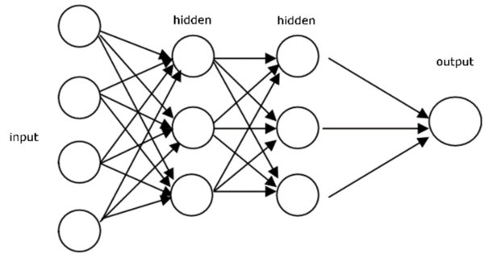
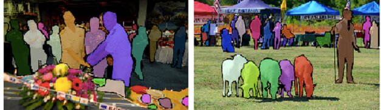
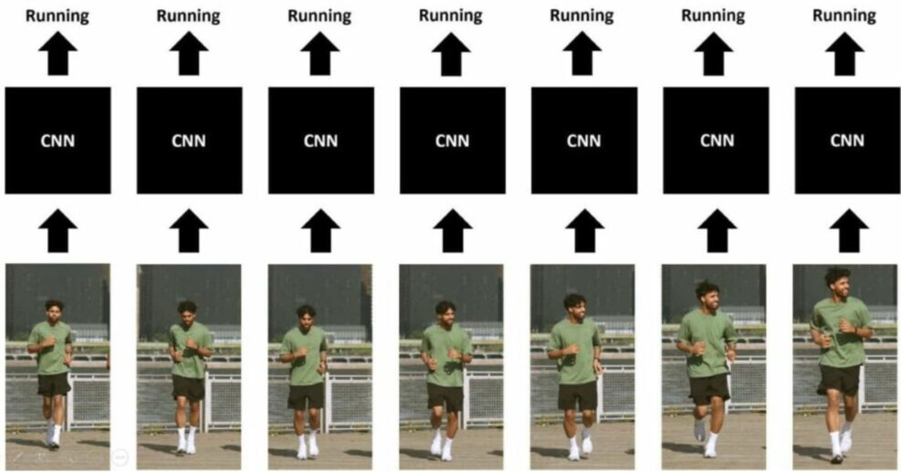

*Based on the lecture by Ehsan Adeli — [CS231n](https://cs231n.stanford.edu/),
Stanford University, Spring 2025.*

## What is Computer Vision? {#sec-what-is-cv}

At its core, computer vision is about enabling machines to interpret and understand visual information. The most fundamental task in this space is **image classification**: given an image, the model outputs a label describing its content.

### Image Classification: The Foundation

Image classification may seem deceptively simple---show the model a photo of a cat, and it should output "cat." Yet this apparently trivial task forms the foundation for much more complex applications, from self-driving cars to medical diagnosis.

How do we approach this problem mathematically? The simplest method is **linear classification**. We represent each image as a vector $\mathbf{x} \in \mathbb{R}^d$ (e.g., by flattening all pixel values), and learn a weight matrix $\mathbf{W}$ and bias $\mathbf{b}$ such that: $$f(\mathbf{x}) = \mathbf{W}\mathbf{x} + \mathbf{b}$$ The output $f(\mathbf{x})$ gives scores for each class---the highest score determines our prediction. Geometrically, each row of $\mathbf{W}$ defines a **hyperplane** in feature space that separates one class from the others.

{#fig-linear-classifier width="90%"}

@fig-linear-classifier illustrates this concept in 2D: each hyperplane represents a different linear classifier. Notice that $H_1$ and $H_2$ both perfectly separate the two classes, but which is "better"? This question leads us to the concepts of **loss functions** and **optimization**.

### Loss Functions and Optimization

To train a classifier, we need to quantify how "wrong" its predictions are. A **loss function** measures this error---it outputs a high value when predictions are poor and a low value when they're accurate. We will explore specific loss functions (cross-entropy, hinge loss) in detail in future lectures.

Training minimizes this loss over the dataset using **optimization algorithms** like **gradient descent**. The key idea: compute how each weight contributes to the error, then adjust weights in the direction that reduces it. The **learning rate** controls how large each adjustment step is---too large and we overshoot, too small and training is slow.

### Regularization: Controlling Complexity

With enough parameters, a model can memorize the training data perfectly---but this **overfitting** hurts generalization to new data. **Regularization** adds a penalty that discourages overly complex models by keeping weights small. We will cover specific regularization techniques (L1, L2, dropout) in future lectures.

{#fig-regularization width="90%"}

@fig-regularization visualizes this trade-off: $f_2$ achieves zero training error but is clearly overfitting, while $f_1$ makes small errors on training data but will generalize better.

### From Linear Models to Neural Networks

Linear classifiers have a fundamental limitation: they can only learn linear decision boundaries. Many real-world problems require more complex separations---imagine trying to classify images of cats vs. dogs with a single hyperplane in pixel space!

This is where **neural networks** come in. By stacking multiple layers with nonlinear **activation functions**, neural networks can learn arbitrarily complex decision boundaries.

{#fig-neural-network width="70%"}

Each layer applies a linear transformation followed by a nonlinear **activation function** (like ReLU). This composition of simple functions enables learning complex patterns that linear models cannot capture. Training uses **backpropagation**[^01b-course-overview-1]---applying the chain rule to compute gradients through all layers---combined with optimization algorithms we'll study in detail later.

Neural networks are the foundation of modern computer vision, powering everything from Google Photos to autonomous vehicles. In this course, we will go deep into how they work, how to train them, and how to debug and improve them.

### From Classification to Understanding

While classification assigns a single label to an entire image, real-world computer vision requires much richer understanding. Consider an autonomous vehicle: knowing an image "contains a pedestrian" is not enough---we need to know *where* they are, *how fast* they're moving, and *which direction*. This leads us to more sophisticated tasks:

- *Where* are the objects in the image? $\rightarrow$ **Object Detection**

- *What* are the precise boundaries? $\rightarrow$ **Segmentation**

- *How many* instances are present? $\rightarrow$ **Instance Segmentation**

## Tasks Beyond Classification {#sec-tasks-beyond}

Having established image classification as the foundation, we now explore tasks that require deeper spatial understanding. Each task builds on the previous, adding new dimensions of visual reasoning.

### Semantic Segmentation

In **semantic segmentation**, we don't just label the image as a whole---we assign a class label to *every single pixel*. The output is a dense prediction map where each pixel belongs to a category: sky, grass, cat, tree, road, etc.

{#fig-semantic-segmentation width="75%"}

Key characteristics of semantic segmentation:

- **Dense prediction**: Every pixel receives a label

- **No instance distinction**: All pixels of the same class share one label---in @fig-semantic-segmentation, both cows are labeled with the same "Cow" color

- **Applications**: Autonomous driving (road vs. sidewalk), medical imaging (tumor vs. healthy tissue), agricultural monitoring

### Object Detection

**Object detection** goes beyond classification by answering *where* objects are located. The model outputs:

1.  **Bounding boxes**: Rectangular regions containing objects

2.  **Class labels**: What each detected object is

3.  **Confidence scores**: How certain the model is about each detection

{#fig-object-detection width="75%"}

@fig-object-detection shows a typical indoor scene where the detector identifies over ten different objects simultaneously. This ability to localize multiple objects of various classes makes object detection fundamental to:

- **Autonomous vehicles**: Detecting pedestrians, vehicles, traffic signs

- **Smart home devices**: Understanding room layouts and object positions

- **Retail**: Checkout-free stores, inventory management

- **Robotics**: Object manipulation, navigation

### Instance Segmentation

**Instance segmentation**[^01b-course-overview-2] combines the best of both worlds---it provides pixel-level precision like semantic segmentation while distinguishing individual object instances like detection.

{#fig-instance-segmentation width="85%"}

@fig-instance-segmentation demonstrates this on crowded scenes: unlike semantic segmentation where all people would share the same color, here each individual person gets their own distinct colored mask---purple, yellow, green, pink, and so on. This allows downstream applications to count objects, track individuals across frames, or select specific instances for editing.

::: {.callout-warning title="Note"}

Instance segmentation is the most granular of these tasks---it combines detection (what and where) with segmentation (precise boundaries) and adds instance awareness (which specific object). This is crucial for applications like autonomous driving (distinguishing between nearby pedestrians) or video editing (selecting individual people in a crowd).

:::

### Task Hierarchy

These tasks form a natural hierarchy of increasing complexity:

| **Task**              | **What?** | **Where?** | **Which instance?** |
|:----------------------|:---------:|:----------:|:-------------------:|
| Classification        |           |            |                     |
| Object Detection      |           |   (box)    |                     |
| Semantic Segmentation |           |  (pixel)   |                     |
| Instance Segmentation |           |  (pixel)   |                     |

Each task requires progressively deeper spatial understanding and presents unique modeling challenges that we will explore throughout this course.

::: {.callout-tip title="Key Takeaways"}

- **Image classification**: One label for the entire image---the foundation of CV

- **Semantic segmentation**: Per-pixel classification, no instance distinction

- **Object detection**: Bounding boxes + labels for each object

- **Instance segmentation**: Pixel-precise masks for each individual object

- These tasks form a hierarchy of increasing spatial granularity

:::

## Temporal Tasks {#sec-temporal-tasks}

So far we've focused on static images---single snapshots frozen in time. But the visual world is dynamic: people walk, cars drive, expressions change. When we move to **video**, we add a temporal dimension that fundamentally changes the problem. Understanding "what's in this frame" becomes "what's *happening* over time." This opens up new tasks and new challenges.

### Video Classification

In **video classification**, the goal is to understand what action is happening across a sequence of frames. Is someone running? Jumping? Dancing? Unlike image classification where we have a single static input, video presents a temporal sequence that must be processed and aggregated.

{#fig-video-classification-frames width="95%"}

The simplest approach (shown in @fig-video-classification-frames) processes each frame independently through a CNN. However, this ignores temporal relationships between frames. More sophisticated approaches include:

- **Late fusion**: Aggregate CNN features from multiple frames before final classification

- **3D convolutions**: Extend 2D filters to operate across space *and* time

- **Two-stream networks**[^01b-course-overview-3]: Separate pathways for appearance (RGB) and motion (optical flow)

- **Recurrent models**: Use RNNs/LSTMs to maintain temporal state across frames

### Multimodal Video Understanding

Real-world videos contain multiple modalities---not just visual information, but also **audio** and **speech**. To truly understand a scene, we often need to combine all of these signals.

{#fig-multimodal-video width="85%"}

Consider the example in @fig-multimodal-video: from visual information alone, we see a child running toward an adult. The audio adds a doorbell sound. Speech recognition captures "mummy is here!" Only by **fusing** all modalities can we understand the full story---a child welcoming their mother home.

::: {.callout-note title="Deep Dive: Fusion Strategies"}

How do we combine information from multiple modalities? Three main approaches:

- **Early fusion**: Concatenate raw inputs or low-level features before processing. Simple but may not capture modality-specific patterns well.

- **Late fusion**: Process each modality independently through separate networks, then combine final predictions (e.g., by averaging). Preserves modality-specific learning but misses cross-modal interactions.

- **Attention-based fusion**: Learn to dynamically weight modalities based on context. Modern approaches like Transformers excel here, allowing the model to decide when audio matters more than vision and vice versa.

:::

::: {.callout-tip title="Key Takeaways"}

- **Video classification**: Extends image classification to temporal sequences; requires aggregating information across frames

- **Temporal modeling**: Options include late fusion, 3D convolutions, two-stream networks, and recurrent models

- **Multimodal learning**: Combining vision, audio, and speech for richer understanding

- **Fusion strategies**: Early, late, or attention-based---each with trade-offs

:::

## Deep Learning Architectures {#sec-models}

We've explored *what* computer vision systems need to do (classification, detection, segmentation, temporal understanding). Now we turn to *how*---the neural network architectures that make these tasks possible. While basic neural networks (MLPs) can theoretically approximate any function, specialized architectures dramatically improve efficiency and performance by building in useful **inductive biases**.

### Convolutional Neural Networks (CNNs)

**Convolutional Neural Networks** are the workhorse of computer vision. Instead of treating an image as a flat vector of pixels, CNNs exploit spatial structure through a series of operations that progressively transform raw pixels into abstract representations.

{#fig-cnn-detailed width="95%"}

The key operations in a CNN:

- **Convolutions**: Small learnable filters (kernels) of size $k \times k$ slide across the image. Each filter computes a dot product at every position, producing a *feature map* that highlights where that pattern occurs. Mathematically: $(I * K)_{ij} = \sum_m \sum_n I_{i+m, j+n} \cdot K_{mn}$

- **ReLU Activation**: After each convolution, a nonlinearity (typically ReLU: $\max(0, x)$) is applied element-wise. Without nonlinearities, stacking layers would just produce another linear function!

- **Pooling**: Downsamples feature maps (e.g., $2\times2$ max pooling takes the maximum value in each $2\times2$ region), reducing spatial dimensions by half while retaining the strongest activations.

- **Flatten & Fully Connected**: After multiple conv-pool stages, the 3D feature maps are flattened into a 1D vector and passed through fully connected layers for classification.

- **Softmax Output**: Converts raw scores into probabilities: $\text{softmax}(z_i) = \frac{e^{z_i}}{\sum_j e^{z_j}}$

A key property of CNNs is **hierarchical feature learning**---earlier layers detect simple patterns, while deeper layers combine them into complex concepts.

{#fig-cnn-activations width="95%"}

@fig-cnn-activations demonstrates this hierarchy in action:

- **Conv1--Conv2**: Detect edges, colors, simple textures. Activations are distributed broadly.

- **Conv3**: Combine low-level features into parts---eyes, wheels, fur patterns.

- **Conv4--Conv5**: Respond to high-level, semantic concepts. Notice how activations concentrate on the person performing each action.

This visualization also serves as a debugging tool: if a model focuses on the wrong regions (e.g., background instead of the object), we know something is wrong with the training data or process.

### Recurrent Neural Networks (RNNs)

For **sequential data**---like video frames or text---we need models that can handle variable-length inputs and maintain memory across time steps. **Recurrent Neural Networks** process sequences one element at a time, passing hidden state from step to step.

{#fig-rnn-basic width="70%"}

The key innovation of RNNs is the **recurrent connection**: at each time step $t$, the hidden state $h_t$ depends not only on the current input $x_t$ but also on the previous hidden state $h_{t-1}$: $$h_t = f(W_{xh} x_t + W_{hh} h_{t-1} + b_h)$$

This creates a "memory" that allows information from earlier in the sequence to influence later predictions. However, vanilla RNNs struggle with long sequences due to **vanishing gradients**---the signal weakens exponentially as it propagates through many time steps.

[**LSTM**](https://www.bioinf.jku.at/publications/older/2604.pdf)[^01b-course-overview-4] (Long Short-Term Memory) cells solve this with a gating mechanism:

- **Forget gate** ($f$): Decides what to discard from the cell state

- **Input gate** ($i$): Decides what new information to store

- **Output gate** ($o$): Decides what to output from the cell state

These gates use sigmoid activations to produce values between 0 and 1, acting as "soft switches" that learn when to remember, update, or expose information.

### Transformers and Attention

More recently, [**Transformers**](https://arxiv.org/abs/1706.03762)[^01b-course-overview-5] have revolutionized not just NLP but also computer vision. The key innovation is the **attention mechanism**, which allows every element to directly attend to every other element.

The core computation is **scaled dot-product attention**: $$\text{Attention}(Q, K, V) = \text{softmax}\left(\frac{QK^T}{\sqrt{d_k}}\right) V$$ where:

- **Queries** ($Q$): "What am I looking for?"

- **Keys** ($K$): "What do I contain?"

- **Values** ($V$): "What information do I provide?"

- $d_k$: Dimension of keys (scaling prevents large dot products from saturating softmax)

The softmax produces attention weights that sum to 1, effectively computing a weighted average of values based on query-key similarity.

Unlike RNNs, Transformers process all positions in parallel, making them much faster to train on modern hardware. [**Vision Transformers (ViT)**](https://arxiv.org/abs/2010.11929)[^01b-course-overview-6] apply this architecture to images by:

1.  Splitting the image into fixed-size patches (e.g., $16 \times 16$ pixels)

2.  Flattening each patch and projecting it to an embedding

3.  Adding positional encodings (since attention is permutation-invariant)

4.  Processing through standard Transformer encoder layers

{#fig-vit-attention width="95%"}

@fig-vit-attention reveals what ViT "sees": attention concentrates on the main object in each image while ignoring backgrounds. This emergent localization arises purely from classification training---no bounding box labels needed!

::: {.callout-warning title="Note"}

Why do Transformers work so well? The attention mechanism allows **global context** from the first layer---any patch can attend to any other patch. In contrast, CNNs build global understanding slowly through stacked local convolutions. This global view helps Transformers capture long-range dependencies but requires more data to train effectively.

:::

::: {.callout-tip title="Key Takeaways"}

- **CNNs**: Exploit spatial structure via local convolutions and pooling; learn hierarchical features from edges to objects

- **RNNs**: Process sequences with memory; LSTM gates (forget, input, output) control information flow to handle long-term dependencies

- **Transformers**: Attention-based models that process all positions in parallel; Vision Transformers treat image patches as tokens

- **Trade-offs**: CNNs have strong inductive bias (locality); Transformers are more flexible but need more data

:::

## Large-Scale Distributed Training {#sec-distributed-training}

Modern deep learning has an insatiable appetite for computation. State-of-the-art models like GPT-4 and Gemini contain hundreds of billions of parameters and require training on massive datasets. A single GPU---even the most powerful---would take years to train such models. The solution is **distributed training**: spreading the workload across many devices working in parallel.

Two fundamental strategies exist for distributing deep learning workloads, each with distinct trade-offs.

### Data Parallelism

In **data parallelism**, we replicate the entire model on each worker (GPU), but partition the training data across workers. Each worker processes a different mini-batch, computes gradients locally, and then all workers synchronize their gradients before updating the shared model.

{#fig-parallelism width="85%"}

The data parallelism workflow:

1.  **Distribute**: Split the batch into $N$ mini-batches, one per GPU

2.  **Forward**: Each GPU computes predictions on its mini-batch using its local model copy

3.  **Backward**: Each GPU computes gradients locally

4.  **AllReduce**: Aggregate (average) gradients across all GPUs

5.  **Update**: Each GPU applies the same gradient update, keeping models synchronized

The key operation is **AllReduce**---a collective communication primitive that efficiently computes the sum (or average) of gradients across all workers. Modern implementations use ring-based algorithms that scale efficiently to hundreds of GPUs.

::: {.callout-warning title="Note"}

**Scaling batch size:** With $N$ GPUs, the effective batch size is $N \times \text{batch\_per\_GPU}$. Larger batches can accelerate training but may require:

- **Learning rate scaling**: Linear scaling rule---if batch doubles, double the learning rate

- **Warmup**: Gradually increase learning rate at start to avoid divergence

- **LARS/LAMB optimizers**: Layer-wise adaptive learning rates for very large batches

:::

### Model Parallelism

When a model is too large to fit in a single GPU's memory, we turn to **model parallelism**: the model itself is partitioned across devices. As shown in @fig-parallelism (right), all workers receive the same data, but each worker holds only a portion of the model.

Two main variants exist:

**Pipeline Parallelism**: Split the model by layers. GPU 1 holds layers 1--10, GPU 2 holds layers 11--20, etc. Data flows through GPUs sequentially like an assembly line. The challenge is **pipeline bubbles**---GPUs sit idle while waiting for activations from previous stages.

**Tensor Parallelism**: Split individual layers across GPUs. For example, a large matrix multiplication $\mathbf{Y} = \mathbf{X}\mathbf{W}$ can be split by partitioning $\mathbf{W}$ column-wise across GPUs, computing partial results in parallel, then combining them. This requires fast inter-GPU communication (NVLink).

::: {.callout-note title="Deep Dive: Hybrid Parallelism at Scale"}

Training models like GPT-3 (175B parameters) or PaLM (540B parameters) requires combining multiple parallelism strategies:

- **Within a node** (8 GPUs): Tensor parallelism via fast NVLink

- **Across nodes**: Pipeline parallelism to minimize communication

- **Across the cluster**: Data parallelism with gradient compression

Additionally, techniques like **gradient checkpointing** (recompute activations instead of storing them), **mixed-precision training** (FP16/BF16), and **ZeRO optimizer** (partition optimizer states) further reduce memory requirements.

:::

::: {.callout-tip title="Key Takeaways"}

- **Data parallelism**: Same model on all GPUs, different data; gradients synchronized via AllReduce

- **Model parallelism**: Model split across GPUs; necessary when model doesn't fit in single GPU memory

- **Pipeline parallelism**: Split by layers; suffers from pipeline bubbles

- **Tensor parallelism**: Split individual operations; requires fast interconnect

- **At scale**: Combine all strategies in a hierarchy tailored to hardware topology

:::

## Self-Supervised Learning {#sec-self-supervised}

Supervised learning has driven remarkable progress in computer vision, but it has a critical bottleneck: **labeled data**. Creating datasets like ImageNet required millions of human annotations---expensive, time-consuming, and often noisy. Meanwhile, the internet contains billions of unlabeled images. Can we learn useful representations from this vast unlabeled data?

**Self-supervised learning** answers yes by creating **pretext tasks**---artificial supervised problems where labels come from the data itself, requiring no human annotation.

### The Key Insight

The core idea is simple but powerful: design tasks that force the model to learn useful representations in order to solve them. If a model can predict how an image was rotated, it must understand object orientation. If it can colorize grayscale images, it must understand object semantics (grass is green, sky is blue).

Classic pretext tasks include:

- **Rotation prediction**: Rotate image by 0°, 90°, 180°, or 270°; predict which

- **Jigsaw puzzles**: Shuffle image patches; predict correct arrangement

- **Colorization**: Given grayscale, predict colors

- **Inpainting**: Mask a region; predict missing content

However, these hand-crafted tasks have limitations---they may teach representations that don't transfer well to downstream tasks. Modern approaches take a different path: **contrastive learning**.

### Contrastive Learning

The breakthrough idea of **contrastive learning** is to learn representations by comparing examples: similar things should have similar representations, dissimilar things should have dissimilar representations.

![The **SimCLR** framework for contrastive learning. An image undergoes random data augmentation twice, producing two views $x_i$ and $x_j$. Both pass through the same encoder $f(\cdot)$ yielding representations $h_i, h_j$, then a projection head $g(\cdot)$ produces embeddings $z_i, z_j$. Training maximizes similarity between $z_i$ and $z_j$ (positive pair) while minimizing similarity to embeddings from other images (negative pairs). SimCLR showed that with strong enough augmentations and large enough batches, simple contrastive learning rivals supervised pre-training. The key insight: aggressive augmentation (blur, color distortion, cropping) forces the model to learn semantic rather than superficial features. *Source: a third-party diagram of the framework of Chen et al., "A Simple Framework for Contrastive Learning of Visual Representations", 2020; not that paper's own figure.*](../figures/01b-course-overview/simclr.png){#fig-simclr width="95%"}

The SimCLR framework (@fig-simclr) works as follows:

1.  **Augmentation**: Apply random transformations (crop, flip, color jitter, blur) to create two "views" of the same image

2.  **Encoding**: Pass both views through a shared encoder (e.g., ResNet) to get representations

3.  **Projection**: A small MLP "projection head" maps representations to a lower-dimensional space where contrastive loss is computed

4.  **Contrastive loss**: The **NT-Xent** (Normalized Temperature-scaled Cross Entropy) loss pulls positive pairs together and pushes negative pairs apart:

$$\mathcal{L}_{i,j} = -\log \frac{\exp(\text{sim}(z_i, z_j)/\tau)}{\sum_{k \neq i} \exp(\text{sim}(z_i, z_k)/\tau)}$$ where $\text{sim}(u,v) = u^\top v / (\|u\| \|v\|)$ is cosine similarity and $\tau$ is a temperature parameter.

The magic: after pre-training, we discard the projection head and use the encoder for downstream tasks. The representations learned by contrasting augmented views transfer remarkably well to classification, detection, and segmentation---often matching or exceeding supervised pre-training!

### Masked Image Modeling

Inspired by BERT's success in NLP (predicting masked words), [**Masked Autoencoders (MAE)**](https://arxiv.org/abs/2111.06377)[^01b-course-overview-7] apply the same idea to images: mask random patches and train the model to reconstruct them.

{#fig-mae width="90%"}

The MAE approach (@fig-mae) has elegant properties:

- **High masking ratio**: Unlike BERT (15% masking), MAE masks 75% of patches. Images have more redundancy than text, so harder tasks are needed.

- **Asymmetric encoder-decoder**: The encoder only processes visible patches (fast!), while a lightweight decoder reconstructs all patches.

- **Pixel reconstruction**: The target is simply the original pixel values---no discrete tokens needed.

Why does this work? To reconstruct masked regions, the model must understand:

- Object structure (a dog's head predicts a body nearby)

- Texture patterns (grass continues as grass)

- Semantic context (indoor scenes have consistent furniture)

::: {.callout-note title="Deep Dive: Foundation Models"}

Self-supervised learning is the key ingredient behind **foundation models**---large models pre-trained on massive data that transfer to many tasks:

- **CLIP**: Contrastive learning between images and text captions; enables zero-shot classification

- **DINO/DINOv2**: Self-distillation with no labels; emergent segmentation properties

- [**SAM**](https://arxiv.org/abs/2304.02643): Segment Anything Model; trained on 1B masks, generalizes to any object

- **GPT-4V, Gemini**: Multimodal models combining vision and language

The recipe: massive unlabeled data + self-supervised objectives + scale = emergent capabilities.

:::

::: {.callout-tip title="Key Takeaways"}

- **Self-supervised learning**: Learn from unlabeled data via pretext tasks

- **Contrastive learning**: Pull augmented views together, push different images apart; SimCLR uses NT-Xent loss

- **Masked image modeling**: Mask patches, reconstruct pixels; MAE uses 75% masking with asymmetric encoder-decoder

- **Foundation models**: Self-supervised pre-training at scale enables transfer to diverse downstream tasks

- **Key insight**: Good pretext tasks force learning of semantic representations

:::

## Generative Models {#sec-generative}

So far we've focused on **discriminative** models---given an input, predict a label or bounding box. But what if we want to go the other direction: *generate* new images from scratch? This is the domain of **generative models**, which learn the underlying distribution of images and can sample new examples from it.

Generative models have exploded in capability and popularity, powering applications from artistic style transfer to text-to-image systems like DALL-E and Midjourney. Let's explore the key architectures.

### Neural Style Transfer

One of the earliest and most visually striking applications of deep learning for image generation is [**neural style transfer**](https://arxiv.org/abs/1508.06576): taking the *content* of one image and rendering it in the *style* of another.

![Neural style transfer. **Top-left**: Style image (Van Gogh's "Starry Night"). **Bottom-left**: Content image (a German riverside town). **Right**: Result---the photograph rendered with Van Gogh's distinctive swirling brushstrokes, color palette, and texture while preserving the original scene's structure. *Source: the example of Figure 2C of Gatys, Ecker & Bethge, "A Neural Algorithm of Artistic Style", 2015; content photograph of the Tübingen Neckarfront by Andreas Praefcke; "The Starry Night" (Van Gogh, 1889) is public domain.*](../figures/01b-course-overview/style_transfer.jpg){#fig-style-transfer width="85%"}

The key insight[^01b-course-overview-8] is that CNNs trained for classification *already* encode both content and style:

- **Content** is captured by *activations* in deeper layers---what objects are where

- **Style** is captured by *correlations* between activations (Gram matrices)---textures, brushstrokes, color relationships

The algorithm optimizes a generated image to minimize: $$\mathcal{L}_{\text{total}} = \alpha \mathcal{L}_{\text{content}} + \beta \mathcal{L}_{\text{style}}$$ where $\mathcal{L}_{\text{content}}$ measures how different the generated image's activations are from the content image, and $\mathcal{L}_{\text{style}}$ measures how different the Gram matrices are from the style image. The hyperparameters $\alpha$ and $\beta$ control the balance.

### Generative Adversarial Networks (GANs)

[**GANs**](https://arxiv.org/abs/1406.2661)[^01b-course-overview-9] introduced a revolutionary idea: train two networks that compete against each other. This adversarial game drives both networks to improve, ultimately producing a generator capable of creating remarkably realistic images.

{#fig-gan width="85%"}

The two players in this game:

- **Generator** $G$: Takes random noise $z \sim p(z)$ and produces an image $G(z)$. Its goal is to generate images indistinguishable from real ones.

- **Discriminator** $D$: Takes an image and outputs the probability it's real. Its goal is to correctly classify real vs. fake images.

The training objective is a minimax game: $$\min_G \max_D \; \mathbb{E}_{x \sim p_{\text{data}}}[\log D(x)] + \mathbb{E}_{z \sim p(z)}[\log(1 - D(G(z)))]$$

At equilibrium, the generator produces images so realistic that the discriminator outputs 0.5 (random guessing) for all inputs. In practice, training GANs is notoriously unstable---mode collapse (generator produces limited variety) and training divergence are common challenges.

::: {.callout-warning title="Note"}

GAN variants have addressed many limitations:

- **DCGAN**: Deep convolutional architecture with batch normalization

- [**StyleGAN**](https://arxiv.org/abs/1812.04948)[^01b-course-overview-10]: Produces photorealistic faces with controllable attributes

- **CycleGAN**: Unpaired image-to-image translation (e.g., horse $\leftrightarrow$ zebra)

- **Pix2Pix**: Paired image-to-image translation (e.g., sketch $\rightarrow$ photo)

:::

### Diffusion Models

The current state-of-the-art in image generation comes from [**diffusion models**](https://arxiv.org/abs/2006.11239)[^01b-course-overview-11], which take a fundamentally different approach: learn to *reverse* a gradual noising process.

{#fig-diffusion width="90%"}

The two processes:

- **Forward (diffusion)**: Add small amounts of Gaussian noise over $T$ timesteps: $$q(x_t | x_{t-1}) = \mathcal{N}(x_t; \sqrt{1-\beta_t} x_{t-1}, \beta_t \mathbf{I})$$ After enough steps, $x_T$ is approximately pure Gaussian noise.

- **Reverse (denoising)**: Learn a neural network $p_\theta$ to reverse each step: $$p_\theta(x_{t-1} | x_t) = \mathcal{N}(x_{t-1}; \mu_\theta(x_t, t), \sigma_t^2 \mathbf{I})$$ The network predicts the noise to subtract at each step.

Why do diffusion models work so well?

- **Stable training**: Unlike GANs, no adversarial dynamics---just regression to predict noise

- **Mode coverage**: The stochastic sampling process naturally covers the full distribution

- **Flexible conditioning**: Easy to add text, class labels, or other conditions

### Text-to-Image Generation

Combining diffusion models with large language models has enabled remarkable **text-to-image generation**---describe what you want, and the model creates it.

{#fig-stable-diffusion width="95%"}

Systems like **DALL-E**, **Midjourney**, and **Stable Diffusion** work by:

1.  **Text encoding**: A language model (e.g., CLIP text encoder) converts the prompt into embeddings

2.  **Conditional diffusion**: The denoising network receives text embeddings as conditioning, guiding generation toward the description

3.  **Classifier-free guidance**: Amplify the effect of conditioning by contrasting conditional and unconditional predictions

Beyond generation from scratch, these models enable powerful **image editing**:

- **Inpainting**: Mask a region and regenerate it based on a prompt

- **Image-to-image**: Transform an existing image according to text instructions

- **ControlNet**: Add spatial conditioning (edges, poses, depth maps) for precise control

::: {.callout-note title="Deep Dive: The Latent Diffusion Revolution"}

A key innovation in [Stable Diffusion](https://arxiv.org/abs/2112.10752)[^01b-course-overview-12] is performing diffusion in a **latent space** rather than pixel space:

1.  An autoencoder compresses images to a lower-dimensional latent representation

2.  Diffusion happens in this compact space (much faster!)

3.  The decoder reconstructs the final image from the denoised latent

This reduces computation by $\sim 50\times$ while maintaining quality, making high-resolution generation practical on consumer GPUs.

:::

::: {.callout-tip title="Key Takeaways"}

- **Style transfer**: Separate content (deep activations) from style (Gram matrices); optimize to combine them

- **GANs**: Generator vs. discriminator in a minimax game; powerful but unstable training

- **Diffusion models**: Learn to reverse gradual noising; stable training, excellent mode coverage

- **Text-to-image**: Condition diffusion on text embeddings; DALL-E, Midjourney, Stable Diffusion

- **Latent diffusion**: Work in compressed space for efficiency; enables high-resolution generation

:::

## Vision-Language Models {#sec-vision-language}

We've seen models that understand images and models that understand text. But humans effortlessly connect these modalities---we can describe what we see, answer questions about images, and imagine scenes from descriptions. **Vision-language models** bridge this gap, learning joint representations of images and text that enable powerful cross-modal reasoning.

### CLIP: Connecting Images and Text

[**CLIP**](https://arxiv.org/abs/2103.00020) (Contrastive Language-Image Pre-training, OpenAI 2021) revolutionized vision-language learning with a simple but powerful idea: train on 400 million image-text pairs from the internet using contrastive learning.

![The CLIP framework. **(1) Contrastive pre-training**: An image encoder and text encoder are trained jointly. Matching image-text pairs (diagonal) should have high similarity; non-matching pairs should have low similarity. **(2) Zero-shot classifier**: Convert class labels to text prompts ("A photo of a {object}"). **(3) Inference**: Encode the image and all prompts; predict the class with highest image-text similarity. *Source: Figure 1 of Radford et al., "Learning Transferable Visual Models From Natural Language Supervision", 2021.*](../figures/01b-course-overview/clip_architecture.jpg){#fig-clip width="95%"}

The training process (@fig-clip, left):

1.  **Encode**: Pass images through an image encoder (ResNet or ViT) to get embeddings $I_1, I_2, \ldots, I_N$

2.  **Encode**: Pass corresponding captions through a text encoder (Transformer) to get embeddings $T_1, T_2, \ldots, T_N$

3.  **Contrastive loss**: Maximize similarity for matching pairs $(I_i, T_i)$, minimize for non-matching pairs $(I_i, T_j)$ where $i \neq j$

The loss is symmetric---both "image-to-text" and "text-to-image" directions are optimized: $$\mathcal{L} = \frac{1}{2}\left(\mathcal{L}_{I \rightarrow T} + \mathcal{L}_{T \rightarrow I}\right)$$

The magic of CLIP is **zero-shot transfer**: after pre-training, CLIP can classify images into *any* categories without additional training. Simply encode the class names as text ("A photo of a dog", "A photo of a cat", etc.) and pick the one most similar to the image embedding. This works remarkably well---CLIP matches supervised ImageNet models without seeing a single ImageNet training example!

### Visual Question Answering (VQA)

**Visual Question Answering** combines image understanding with language comprehension: given an image and a natural language question, the model must produce an answer.

{#fig-vqa width="95%"}

The key insight is that different questions require attending to different image regions. "What color is the car?" needs to focus on the car; "How many people are there?" needs to scan the whole scene. @fig-vqa shows how attention mechanisms solve this:

1.  **Image encoding**: CNN extracts spatial feature maps (preserving location information)

2.  **Question encoding**: RNN or Transformer encodes the question into a vector

3.  **Attention**: Question features query image features to produce attention weights over spatial locations

4.  **Fusion**: Attention-weighted image features are combined with question features

5.  **Answer prediction**: A classifier outputs the answer (often from a fixed vocabulary)

::: {.callout-warning title="Note"}

Modern VQA systems have evolved significantly:

- **Early models**: CNN + LSTM with simple fusion

- **Attention-based**: Learn to focus on relevant regions

- **Transformer-based**: ViLT, BLIP, Flamingo use unified architectures

- **LLM-based**: GPT-4V, LLaVA, Gemini treat VQA as part of general multimodal reasoning

:::

::: {.callout-note title="Deep Dive: From VQA to Multimodal LLMs"}

The latest frontier in vision-language models is **Multimodal Large Language Models**:

- **Architecture**: Vision encoder (often CLIP) + Large Language Model (GPT-4, LLaMA)

- **Training**: Align visual features with LLM's text embedding space, then instruction-tune

- **Capabilities**: Open-ended conversation about images, complex reasoning, following instructions

Models like GPT-4V, Gemini, and LLaVA represent a paradigm shift---instead of task-specific models, a single system handles VQA, captioning, OCR, reasoning, and more through natural language interaction.

:::

::: {.callout-tip title="Key Takeaways"}

- **CLIP**: Contrastive learning on image-text pairs; enables zero-shot classification via text prompts

- **VQA**: Answer questions about images; attention mechanisms focus on relevant regions

- **Key insight**: Joint embedding spaces allow seamless transfer between vision and language

- **Multimodal LLMs**: GPT-4V, Gemini combine vision encoders with LLMs for general-purpose visual reasoning

:::

## 3D Computer Vision {#sec-3d-vision}

The world we live in is three-dimensional, yet most computer vision has focused on 2D images. **3D computer vision** tackles the challenge of understanding and reconstructing the 3D structure of scenes and objects. This is crucial for robotics, autonomous driving, augmented reality, and manufacturing.

### 3D Representations

Before diving into tasks, we need to understand how 3D data is represented:

- **Point clouds**: Unordered sets of 3D points $(x, y, z)$, often with color/intensity. Common output from LiDAR and depth sensors.

- **Voxels**: 3D grids of binary or continuous values---the 3D analog of pixels. Simple but memory-intensive ($O(n^3)$).

- **Meshes**: Vertices connected by edges and faces. Efficient for surfaces but complex topology.

- **Implicit functions**: Neural networks that output occupancy or signed distance for any 3D point. Memory-efficient, continuous.

Each representation has trade-offs in memory, resolution, and ease of processing.

### 3D Reconstruction

Given 2D images, can we recover the 3D structure of a scene? This classic problem has been transformed by deep learning.

{#fig-voxel-reconstruction width="95%"}

@fig-voxel-reconstruction shows reconstruction of indoor scenes: from a single RGB image, the model outputs 3D meshes of furniture and objects. This requires learning strong priors about:

- **Shape**: What do chairs, desks, toilets look like in 3D?

- **Depth**: How far away are objects based on visual cues (size, occlusion, texture)?

- **Layout**: How do objects relate spatially in typical scenes?

Modern approaches use encoder-decoder architectures: a CNN encodes the image, then a 3D decoder (voxel grid, mesh deformation, or implicit function) outputs the reconstruction.

### Shape Completion

Real-world 3D scans are often incomplete---sensors only capture visible surfaces, leaving holes and missing parts. **Shape completion** fills in these gaps.

{#fig-shape-completion width="90%"}

The task requires learning what "makes sense"---if we see half a chair, we can infer where the legs should be. As shown in @fig-shape-completion, neural networks learn these shape priors from large 3D datasets:

- **Input**: Partial point cloud or voxel grid

- **Architecture**: 3D CNNs, PointNet variants, or Transformer-based models

- **Output**: Complete 3D shape

- **Training**: Supervise with complete ground truth shapes; use chamfer distance or IoU loss

Applications include robotics (grasping objects from partial views), AR/VR (completing scanned environments), and cultural heritage (restoring damaged artifacts).

### 3D Object Detection

For autonomous vehicles, understanding the 3D positions of other cars, pedestrians, and obstacles is literally a matter of life and death. **3D object detection** localizes objects with 3D bounding boxes specifying position, dimensions, and orientation.

{#fig-3d-detection width="90%"}

@fig-3d-detection shows what a LiDAR sensor "sees": thousands of 3D points forming a detailed map of the street. From this raw point cloud, detection algorithms must identify and localize all relevant objects. Key challenges:

- **Sparse and unstructured**: Unlike images with regular grids, point clouds are irregular and sparse, especially at distance

- **Varying density**: Objects close to the sensor have thousands of points; distant objects may have only a few

- **Real-time constraints**: Must process at 10+ Hz for safe driving decisions

- **Multi-sensor fusion**: Combining LiDAR (precise depth) with cameras (rich appearance) improves robustness

Popular architectures include:

- **PointPillars**: Convert point cloud to vertical columns ("pillars"), encode as pseudo-image, apply 2D detection

- **VoxelNet**: Discretize space into voxels, apply 3D convolutions

- **PointNet++**: Process points directly with hierarchical set abstraction layers

- **CenterPoint**: Detect object centers in bird's-eye view, then regress 3D box parameters

::: {.callout-note title="Deep Dive: Neural Radiance Fields (NeRF)"}

A breakthrough in 3D vision is [**NeRF**](https://arxiv.org/abs/2003.08934)---representing scenes as neural networks that map 3D coordinates to color and density: $$F_\theta: (x, y, z, \theta, \phi) \rightarrow (r, g, b, \sigma)$$ Given a sparse set of 2D images, NeRF learns a continuous 3D representation that can render photorealistic novel views. Extensions handle dynamic scenes, faster rendering, and generalization across scenes. This implicit representation sidesteps the limitations of explicit meshes or voxels.

:::

::: {.callout-tip title="Key Takeaways"}

- **3D representations**: Point clouds, voxels, meshes, implicit functions---each with trade-offs

- **3D reconstruction**: Infer 3D structure from 2D images using learned shape priors

- **Shape completion**: Fill in missing parts of partial 3D scans

- **3D object detection**: Localize objects with 3D bounding boxes; crucial for autonomous driving

- **NeRF**: Implicit neural representations enable photorealistic novel view synthesis

:::

## Embodied AI and Robotics {#sec-embodied-ai}

Vision doesn't exist in isolation---it evolved to guide action. **Embodied AI** brings computer vision into the physical world, powering robots and agents that must perceive their environment, plan actions, and execute them in real time.

### The Perception-Action Loop

Unlike passive image classification, embodied agents operate in a continuous loop with the environment.

{#fig-embodied-loop width="85%"}

The key stages:

- **Perception**: Process sensor data (RGB, depth, LiDAR) to understand the scene

- **Representation**: Build internal models---occupancy grids, semantic maps, object databases

- **Planning**: Decide what actions to take to achieve goals

- **Execution**: Send commands to actuators; handle feedback and errors

This loop runs continuously---the robot perceives, acts, observes the result, and adjusts. Computer vision is critical at every stage: recognizing objects to manipulate, estimating distances for navigation, detecting obstacles to avoid.

### Learning from Human Demonstrations

How do robots learn complex tasks like tidying a room? One powerful approach is **imitation learning**: learning by watching humans.

{#fig-robot-imitation width="85%"}

@fig-robot-imitation shows a modern approach: a human demonstrates tasks via teleoperation (VR controllers), and the robot learns to replicate them. Key methods include:

- **Behavioral cloning**: Directly learn a policy $\pi(a|s)$ mapping states to actions from demonstration data

- **Inverse reinforcement learning**: Infer the reward function the human is optimizing, then train a policy

- **Sim-to-real transfer**: Train in simulation with abundant data, then transfer to real robots

::: {.callout-tip title="Key Takeaways"}

- **Embodied AI**: Vision systems that perceive, plan, and act in the physical world

- **Perception-action loop**: Continuous cycle of sensing, reasoning, and executing

- **Imitation learning**: Learn from human demonstrations via teleoperation or observation

- **Key challenges**: Real-time processing, handling uncertainty, generalizing to new environments

:::

## Human-Centered AI {#sec-human-centered}

As AI systems become more powerful and pervasive, we must consider their impact on people and society. **Human-centered AI** focuses on building systems that are fair, beneficial, and aligned with human values.

### Bias in AI Systems

AI systems learn from data, and data reflects human history---including our biases. This creates serious problems:

- **Face recognition**: Studies have shown significantly higher error rates for certain demographic groups, particularly darker-skinned women

- **Hiring algorithms**: Systems trained on historical hiring data can perpetuate past discrimination

- **Criminal justice**: Risk assessment tools may encode racial biases present in arrest records

The root cause: training data is "an artifact of human activities on earth and in history" (Fei-Fei Li). When data is imbalanced or reflects historical inequities, models learn and amplify those patterns.

Mitigation strategies include:

- **Dataset auditing**: Analyze training data for demographic imbalances

- **Fairness constraints**: Add regularization terms that penalize disparate outcomes

- **Diverse evaluation**: Test on balanced benchmarks across demographic groups

### AI for Healthcare

One of the most promising applications of computer vision is **medical imaging**---using AI to assist diagnosis and improve patient outcomes.

{#fig-ai-medical width="85%"}

@fig-ai-medical shows AI analyzing chest X-rays---detecting potential lung abnormalities and highlighting them for radiologist review. Applications span:

- **Radiology**: Detecting tumors, fractures, and diseases in X-rays, CT, MRI

- **Pathology**: Analyzing tissue samples for cancer cells

- **Ophthalmology**: Screening for diabetic retinopathy from retinal images

- **Elderly care**: Monitoring activity patterns to detect falls or health changes

::: {.callout-warning title="Note"}

The instructors of this course (Fei-Fei Li, Ehsan Adeli) actively research AI for aging populations and patient care---using computer vision to deliver better healthcare to those who need it most.

:::

### The Path Forward

AI is neither purely good nor purely bad---it's a powerful tool whose impact depends on how we build and deploy it. Key considerations:

- **Transparency**: Can we explain why a model made a decision?

- **Accountability**: Who is responsible when AI systems fail?

- **Consent**: Do people know when AI is being used on them?

- **Inclusion**: Are affected communities involved in system design?

The field has been recognized with major awards: the **Turing Award 2018** (Hinton, Bengio, LeCun) for deep learning breakthroughs, and the **Nobel Prize in Physics 2024** (Hinton, Hopfield) for foundational neural network contributions. With recognition comes responsibility---to ensure these powerful tools benefit humanity broadly.

::: {.callout-tip title="Key Takeaways"}

- **AI bias**: Models learn biases present in training data; face recognition shows demographic disparities

- **Healthcare AI**: Medical imaging is a high-impact application---radiology, pathology, elderly care

- **Ethical considerations**: Transparency, accountability, fairness must be designed in from the start

- **Interdisciplinary**: AI challenges require input from law, ethics, medicine, and affected communities

:::

## Course Learning Objectives {#sec-learning-objectives}

This course covers a vast landscape of deep learning for computer vision. By the end, you will be able to:

1.  **Formalize computer vision applications into tasks**---given a real-world problem, identify the appropriate task formulation (classification, detection, segmentation, generation, etc.)

2.  **Develop and train vision models**---build neural networks from scratch that operate on images, videos, and other visual data

3.  **Understand where the field is and where it is headed**---grasp both foundational techniques and cutting-edge advances like diffusion models, vision-language models, and embodied AI

### Course Structure

The course is organized into four main topics:

| **Part** | **Topic**                   | **Content**                                                  |
|:--------:|:----------------------------|:-------------------------------------------------------------|
|    1     | Deep Learning Basics        | Linear classifiers, neural networks, optimization, CNNs      |
|    2     | Perceiving the Visual World | Detection, segmentation, video understanding, 3D vision      |
|    3     | Generative & Interactive AI | Self-supervised learning, generative models, vision-language |
|    4     | Human-Centered AI           | Bias, ethics, healthcare applications, societal impact       |

The first few weeks focus on fundamentals---linear classifiers, backpropagation, CNNs. These foundations are essential; everything else builds on them. Then we progress to the exciting frontiers: generative models, multimodal AI, and real-world applications.

### What's Next

The next lecture covers **image classification and linear classifiers**---the starting point for understanding how machines learn to see. We will formalize the classification problem, introduce loss functions, and lay the groundwork for neural networks.

::: {.callout-tip title="Key Takeaways"}

**Summary of Lecture 1, Part 2:**

- **Tasks**: Classification $\rightarrow$ detection $\rightarrow$ segmentation $\rightarrow$ video $\rightarrow$ 3D

- **Models**: CNNs (spatial), RNNs (temporal), Transformers (attention)

- **Training at scale**: Data parallelism, model parallelism

- **Learning without labels**: Self-supervised learning, contrastive methods, MAE

- **Generation**: Style transfer, GANs, diffusion models, text-to-image

- **Multimodal**: Vision-language models (CLIP, VQA)

- **3D & Embodied**: Reconstruction, detection, robotics

- **Human-centered**: Bias awareness, healthcare applications, ethical AI

:::

## References {#references-01b-course-overview .unnumbered}

- Rumelhart, D. E., Hinton, G. E., & Williams, R. J. (1986). Learning representations by back-propagating errors. *Nature*, 323(6088), 533--536.

- Hochreiter, S., & Schmidhuber, J. (1997). Long Short-Term Memory. *Neural Computation*, 9(8), 1735--1780.

- Simonyan, K., & Zisserman, A. (2014). Two-Stream Convolutional Networks for Action Recognition in Videos. *NeurIPS*.

- Goodfellow, I., et al. (2014). Generative Adversarial Nets. *NeurIPS*.

- Long, J., Shelhamer, E., & Darrell, T. (2015). Fully Convolutional Networks for Semantic Segmentation. *CVPR*.

- Gatys, L. A., Ecker, A. S., & Bethge, M. (2016). Image Style Transfer Using Convolutional Neural Networks. *CVPR*.

- Redmon, J., et al. (2016). You Only Look Once: Unified, Real-Time Object Detection. *CVPR*.

- He, K., et al. (2017). Mask R-CNN. *ICCV*.

- Vaswani, A., et al. (2017). Attention Is All You Need. *NeurIPS*.

- Karras, T., Laine, S., & Aila, T. (2019). A Style-Based Generator Architecture for Generative Adversarial Networks. *CVPR*.

- Chen, T., et al. (2020). A Simple Framework for Contrastive Learning of Visual Representations. *ICML*.

- Ho, J., Jain, A., & Abbeel, P. (2020). Denoising Diffusion Probabilistic Models. *NeurIPS*.

- Dosovitskiy, A., et al. (2021). An Image is Worth 16x16 Words: Transformers for Image Recognition at Scale. *ICLR*.

- Radford, A., et al. (2021). Learning Transferable Visual Models From Natural Language Supervision. *ICML*.

- He, K., et al. (2022). Masked Autoencoders Are Scalable Vision Learners. *CVPR*.

- Rombach, R., et al. (2022). High-Resolution Image Synthesis with Latent Diffusion Models. *CVPR*.

- Kirillov, A., et al. (2023). Segment Anything. *ICCV*.

[^01b-course-overview-1]: Backpropagation was popularized by Rumelhart, Hinton, and Williams in 1986, though the core ideas trace back to earlier work in control theory. It remains the foundation of all neural network training today.

[^01b-course-overview-2]: The [Mask R-CNN](https://arxiv.org/abs/1703.06870) architecture (2017) elegantly extended object detection by adding a parallel branch that predicts a binary mask for each detected object. This simple addition enabled pixel-precise instance boundaries.

[^01b-course-overview-3]: Inspired by neuroscience: the human visual system has separate "ventral" (what) and "dorsal" (where/how) pathways. Two-stream networks mimic this with parallel RGB and optical flow streams.

[^01b-course-overview-4]: LSTMs were invented in 1997 but only became practical with GPU acceleration in the 2010s. They dominated sequence modeling until Transformers arrived in 2017.

[^01b-course-overview-5]: The paper title "Attention Is All You Need" (2017) was provocative---it claimed attention alone could replace recurrence entirely. This turned out to be true, and the architecture now dominates NLP, vision, audio, and beyond.

[^01b-course-overview-6]: ViT's success surprised many---treating images as sequences of patches seemed "unnatural" compared to convolutions. Yet with enough data, ViT matches or exceeds CNNs, suggesting that inductive biases matter less at scale.

[^01b-course-overview-7]: MAE's 75% masking ratio was surprisingly high---earlier work used 15-50%. The insight: images have massive spatial redundancy (neighboring pixels are similar), so harder tasks are needed to learn useful representations.

[^01b-course-overview-8]: Neural style transfer was one of the first "artistic AI" applications to go viral. Apps like Prisma brought it to millions of smartphones, demonstrating the public appeal of creative AI tools.

[^01b-course-overview-9]: GANs were famously conceived during a bar conversation in 2014. Ian Goodfellow implemented the first version that same night---it worked on the first try. Yann LeCun called GANs "the most interesting idea in the last 10 years in machine learning."

[^01b-course-overview-10]: The website "thispersondoesnotexist.com" showcased StyleGAN's ability to generate photorealistic human faces, raising public awareness about AI-generated imagery and deepfakes.

[^01b-course-overview-11]: Diffusion models were initially dismissed as too slow (requiring hundreds of denoising steps). Techniques like DDIM and classifier-free guidance made them practical, and by 2022 they had overtaken GANs as the dominant generative paradigm.

[^01b-course-overview-12]: Stable Diffusion was released as open-source in August 2022, democratizing high-quality image generation. Within months, thousands of fine-tuned models and applications emerged from the community.
