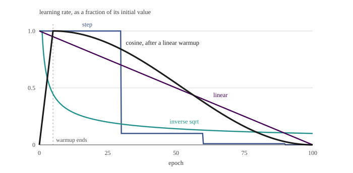

*Based on Lecture 3 of [CS231n](https://cs231n.stanford.edu/), Stanford University,
Spring 2025.*

## Two questions the loss leaves open {#sec-two-questions}

The objective built in the previous chapter, @eq-empirical-risk, turns a classifier into a number, but it does not single out a classifier. Take the car image from that chapter's worked example. With $\Delta=1$ the scores $1.3$, $4.9$ and $2.0$ put the correct class more than a margin ahead of both competitors, so $L_i=0$. Now double every entry of $W$. The scores become $2.6$, $9.8$ and $4.0$; the margins double along with them; and the loss is unchanged, since $\max(0,\,2.6-9.8+1)=0$ and $\max(0,\,4.0-9.8+1)=0$. Any scaling by a factor greater than one preserves a zero loss, so the objective is minimized not by one $W$ but by an unbounded family of them, and nothing written down so far prefers any member of that family over the others.

That is the first gap. The second is more elementary: @eq-empirical-risk says how to score a candidate $W$, and says nothing whatsoever about how to produce one. Both gaps have to be closed before a classifier can be trained, and each is answered by half of this chapter—the first by adding a term to the objective, the second by a procedure for descending it.

## Regularization {#sec-regularization}

The fix for the first gap is to stop asking the objective to measure only fit. Write it as a sum of two terms,

$$
L(W) = \frac{1}{N}\sum_{i=1}^{N} L_i\bigl(f(x_i,W),y_i\bigr) + \lambda R(W),
$$ {#eq-full-objective}

where the first term is the *data loss* of @eq-empirical-risk and the second is a *regularization* term that depends on the weights alone and never looks at the data. Because $R$ ignores the training examples, it cannot express any opinion about accuracy; it can only express a preference among the weight settings that the data leaves tied.

Stated that way, regularization sounds like a tiebreaker, which undersells it. Its more important effect is to make the model fit the training data *less* well on purpose. Consider fitting a curve to a handful of noisy points, as in @fig-overfitting. A high-degree polynomial can pass exactly through every one of them and drive the data loss to zero. A straight line cannot, and by the only measurement available at training time it is the worse model. But the wiggles that let the polynomial hit each point are reconstructions of the noise in those particular points, and there is no reason for the noise in a fresh sample to lie the same way. The straight line, wrong on the training set, is the one that transfers.

{#fig-overfitting width="88%"}

This is Occam's razor recast as an optimization problem: among competing hypotheses that explain the observations, prefer the simplest, and only reach for a more elaborate one when the simple hypothesis is shown to be wrong. The razor is a heuristic about the world rather than a theorem, and @eq-full-objective is a way of asserting it numerically.

The scalar $\lambda$ sets how loudly that assertion is made. At $\lambda=0$ the regularizer is switched off and @eq-full-objective collapses back to the data loss. As $\lambda$ grows, the optimizer becomes progressively more willing to accept a worse fit in exchange for a smaller penalty, until at very large $\lambda$ the weights are driven towards zero and the model stops fitting anything at all. Between those extremes lies a value that generalizes best, and it cannot be found by minimizing @eq-full-objective—raising $\lambda$ always makes the training objective's job harder, so training loss cannot vote on it. It is a hyperparameter, chosen the same way $k$ was chosen for nearest neighbors in @sec-hyperparameters: by measuring on held-out data.

Three choices of $R$ account for most of the classical use. The first, and by far the most common in vision, is $L_2$ regularization, also called weight decay:

$$
R(W) = \sum_{k}\sum_{l} W_{k,l}^{2}.
$$ {#eq-l2-reg}

The second replaces the square with an absolute value, giving $L_1$ regularization:

$$
R(W) = \sum_{k}\sum_{l} \lvert W_{k,l}\rvert,
$$ {#eq-l1-reg}

and the third, elastic net, is their weighted sum, $\sum_{k,l}\beta W_{k,l}^2 + \lvert W_{k,l}\rvert$, which trades one behaviour against the other. All three are penalties on the *size* of the weights, which is why they answer the question this section opened with: doubling $W$ leaves the data loss at zero but multiplies @eq-l2-reg by four, so the scaled copy is no longer tied with the original.

These are not the only regularizers, or even the ones that do the most work in a modern network. Dropout, batch normalization and stochastic depth all belong to the same family in intent—each makes training harder in order to make testing better—but they act on the layers of the model rather than on a penalty added to the loss, and they are taken up later in the course. What @eq-full-objective shares with them is the trade being made, not the mechanism.

Three separate motives are worth keeping distinct, because they justify regularization on different grounds. It expresses a preference over weights, when the shape of the problem gives a reason to prefer one kind of solution. It makes the model simpler, so that it depends on the training sample less and transfers better. And, for $L_2$ specifically, it improves the optimization itself: adding a quadratic term adds curvature to the objective, which is a property the second half of this chapter will show to be valuable in its own right.

## What $L_1$ and $L_2$ each prefer {#sec-l1-l2}

The two penalties are usually distinguished by asserting that $L_1$ produces sparse weights and $L_2$ produces small, spread-out ones. That is the right conclusion, but the standard example for it is more interesting than the slogan suggests.

Take an input $x = [1,1,1,1]$ and two candidate weight vectors, $w_1 = [1,0,0,0]$ and $w_2 = [0.25,0.25,0.25,0.25]$. Both give the same score, since $w_1^\top x = w_2^\top x = 1$, so the data loss cannot distinguish them at all and the regularizer decides alone. Under @eq-l2-reg the first costs $1^2 = 1$ and the second costs $4 \times 0.25^2 = 0.25$, four times less: $L_2$ prefers $w_2$, because squaring punishes a single large entry far more than it punishes several small ones summing to the same total. Spreading the weight out is exactly what it rewards, and there is a reading of that behaviour in terms of the model rather than the arithmetic—a classifier whose weight is concentrated on one input dimension is betting everything on one measurement, and $L_2$ pushes it to take account of all four.

Now ask the same question of @eq-l1-reg, and the answer is that there is no preference. The first vector costs $1$ and the second costs $4 \times 0.25 = 1$; they tie exactly. This is not an artefact of the numbers chosen. The $L_1$ penalty of any vector is unchanged by moving mass between coordinates, so it is indifferent to how spread out the weights are and cares only about their total magnitude.

Which raises the obvious objection: if $L_1$ does not prefer the sparse vector here, where does its reputation for sparsity come from? Not from comparing endpoints, but from what happens along the way. The penalties differ in their derivatives. The gradient of $w^2$ is $2w$, which shrinks as $w$ approaches zero, so under $L_2$ the pressure on a weight to get smaller weakens exactly as it becomes small—the last stretch to zero is pushed with almost no force, and weights settle at small non-zero values. The gradient of $\lvert w \rvert$ is $\operatorname{sign}(w)$, which has the same magnitude no matter how small $w$ is, so under $L_1$ a weight that is not earning its place is pushed towards zero with undiminished force until it arrives there. Sparsity is a consequence of the optimization dynamics, not of the penalty's value at the solution.

Both stories reduce to the same underlying trade, which is worth stating in the general form because it governs every regularizer in the chapter. The optimizer is minimizing a sum. If a change to the weights lowers the regularization term without meaningfully raising the data loss, it lowers the total, and the optimizer will make it. A weight that contributes nothing to accuracy is therefore not merely permitted to vanish—it is actively removed, because keeping it costs something and buys nothing.

## Optimization as search {#sec-optimization}

The second gap is the harder one. @eq-full-objective is now a complete statement of what a good $W$ would be, and completely silent on how to obtain one.

The standard picture is a landscape. Each setting of the weights is a location, the loss at that setting is the elevation, and training is the problem of walking downhill to the lowest point. The picture is worth keeping, provided one correction is made to it: the walker is blindfolded. A person standing on a real hillside can look across the valley and see where the bottom is, and no such information is available here. What is available is purely local—the elevation underfoot and the slope of the ground at that one spot. Every algorithm in the rest of this chapter is a rule for choosing a step from local information alone, and the differences between them are differences in how much local history they are willing to remember.

Before turning to slopes, it is worth seeing what happens without them. Random search is the crudest possible strategy: draw a thousand random weight matrices, evaluate @eq-full-objective on each, and keep whichever scored best. It is not a straw man—it needs no derivatives, works on any loss whatever, and is trivially parallel. On CIFAR-10 it reaches about $15.5\%$ test accuracy.

That number is the argument for everything that follows. Ten classes means random guessing is already right $10\%$ of the time, so a thousand samples of the weight space bought roughly five points over chance, while networks trained by the methods in this chapter exceed $99\%$. The weight space of even the linear classifier from @sec-linear-classifier has $10 \times 3072$ dimensions, and sampling it blindly is hopeless at any budget one might realistically spend. The loss surface has structure, and the only way to reach a good $W$ is to use it.

## Following the slope {#sec-gradients}

The structure worth using is the slope. In one dimension it is the derivative, defined as the limit of a ratio of differences,

$$
\frac{df}{dx} = \lim_{h \to 0}\frac{f(x+h) - f(x)}{h},
$$ {#eq-derivative}

which reports how much the function changes per unit of movement. In many dimensions the analogous object is the *gradient* $\nabla_W L$, the vector whose entries are the partial derivatives of $L$ with respect to each weight in turn. It has the same shape as $W$ itself, so a linear CIFAR-10 classifier has a gradient with $30{,}720$ entries, one per parameter.

Two facts about the gradient make it the right object. The slope of the loss along any direction $u$ is the dot product $u^\top \nabla_W L$, so a single gradient answers the question "what happens if I move this way?" for every direction at once. And that dot product is largest when $u$ points along $\nabla_W L$, which means the gradient points in the direction of steepest ascent and its negative points in the direction of steepest descent. The blindfolded walker's best move is $-\nabla_W L$.

There are two ways to get it. The first is to take @eq-derivative literally: pick a small $h$, perturb one weight by it, re-evaluate the loss, and divide the change by $h$. The deck's worked example makes the mechanics plain. With a particular $W$ the loss is $1.25347$. Adding $h = 0.0001$ to the first weight moves it to $1.25322$, so that partial derivative is $(1.25322 - 1.25347)/0.0001 = -2.5$: increasing this weight lowers the loss. Perturbing the second weight instead gives $1.25353$, a partial derivative of $+0.6$, so this weight should be decreased. Perturbing the third leaves the loss at $1.25347$ to five decimal places, and the partial derivative is recorded as $0$.

The procedure works and should not be used. It is approximate twice over—$h$ is finite rather than infinitesimal, and subtracting two nearly equal floating-point numbers discards most of the significant digits before the division amplifies what is left. Worse, it needs one full evaluation of the loss over the dataset per weight. Filling in all $30{,}720$ entries of that gradient means $30{,}721$ passes over the training set to take a single step, and this for the smallest model in the course.

The second way is to notice that none of this is necessary. The loss is not a black box to be probed; it is an expression that was written down, and $L$ as a function of $W$ is a composition of a matrix multiply, some exponentials and logarithms, and a sum. Composition of differentiable functions is what the chain rule is for. Differentiating @eq-full-objective with respect to $W$, holding the data $x_i$ and $y_i$ fixed, yields a formula that computes the whole gradient in closed form, at a cost comparable to evaluating the loss once. This *analytic gradient* is exact and fast.

Its one weakness is that it is derived and implemented by a person, and both steps admit mistakes that do not announce themselves—a wrong sign or a dropped factor produces a gradient that still points roughly downhill, so training still appears to work, just worse than it should. The standard defence is to use both methods: compute the analytic gradient in the code that trains the model, and compare it against the numerical gradient at a few randomly chosen coordinates before trusting it. This comparison is called a *gradient check*, and it is the reason the slow method is worth knowing.

## Gradient descent, and why it becomes stochastic {#sec-gradient-descent}

With a gradient in hand the algorithm is a single line, repeated:

$$
W \leftarrow W - \alpha \nabla_W L(W).
$$ {#eq-gradient-descent}

Evaluate the gradient at the current weights, move against it, repeat. The scalar $\alpha$ is the *step size* or *learning rate*, and of all the hyperparameters in deep learning it is the one that most often decides whether a training run works at all.

Two details of @eq-gradient-descent are easy to misread. The step size is fixed, but the distance travelled per iteration is not: the update is $\alpha$ times a gradient whose magnitude varies, so the same $\alpha$ produces long strides on a steep slope and short ones as the surface flattens out. Descent naturally decelerates near a minimum without anything being scheduled. And the loop as written never terminates. In practice it is run for a fixed number of iterations, or until the loss stops improving by more than some tolerance—there is no condition internal to @eq-gradient-descent that signals arrival.

The real obstacle is cost. The gradient in @eq-gradient-descent is the gradient of @eq-full-objective, which is an average over all $N$ training examples, so one step requires touching the entire dataset. On a dataset of a million images that makes each individual step of a procedure that needs many thousands of steps prohibitively expensive.

The resolution is to accept a worse gradient in exchange for far more steps. Sample a *minibatch* of $B$ examples at random and use it to estimate the average:

$$
\nabla_W L \approx \frac{1}{B}\sum_{i \in \mathcal{B}} \nabla_W L_i\bigl(f(x_i,W),y_i\bigr) + \lambda\,\nabla_W R(W).
$$ {#eq-sgd}

This is *stochastic gradient descent*, and the word stochastic refers to the sampling: each step uses a different random subset, so the estimate is noisy and the direction is only correct on average. Batch sizes of $32$, $64$, $128$ and $256$ are the usual choices. In implementations the batches are not drawn independently but by shuffling the dataset and cutting it into consecutive blocks, so that every example is used exactly once before any is reused; one such traversal is an *epoch*.

The trade is heavily in favour of the noisy estimate. A gradient computed on $256$ examples is a poor approximation to the true one, but it costs a few thousandth of the full computation, and taking a thousand approximate steps makes far more progress than taking one exact step. SGD in this form, or one of the refinements of it developed below, trains essentially every model in this course.

## Three ways SGD struggles {#sec-sgd-problems}

Plain SGD is enough to train the linear classifier of the previous chapter, and it is not enough for much beyond it. Three distinct failures account for most of the difficulty, and it is worth separating them, because a single modification fixes all three.

The first is *poor conditioning*. Suppose the loss falls steeply as one weight changes and only gently as another changes—the level sets are then long, narrow ellipses rather than circles, as in the left panel of @fig-sgd-problems. The negative gradient at almost every point in such a valley aims mostly across it rather than along it, because the steep direction dominates the gradient's magnitude. Descent therefore bounces from wall to wall, making rapid progress in the direction where there is nothing to gain and creeping along the direction that actually leads to the minimum. If the step size is large enough relative to the steepness, the oscillation grows instead of decaying and the run diverges. The quantity that measures this is the *condition number* of the loss, the ratio of the largest to the smallest eigenvalue of its matrix of second derivatives; a high condition number means a valley whose walls are much steeper than its floor is sloped, and such valleys are the normal case rather than a pathology.

{#fig-sgd-problems width="96%"}

The second failure is that a zero gradient does not mean a minimum. At a local minimum the gradient vanishes and @eq-gradient-descent stops moving, which is the intended behaviour if the local minimum is good and a trap if it is not. More troubling is the *saddle point*, sketched in the right panel of @fig-sgd-problems: a point where the surface curves upwards along some directions and downwards along others, so the gradient is zero while a large decrease lies just to one side. Descent stalls there, and near it—where the gradient is small but not exactly zero—it crawls, which in practice costs more time than the exact saddles do.

Intuition from two dimensions badly understates how much this matters. In one dimension a stationary point is a minimum or a maximum; in two, a saddle is already possible. In $n$ dimensions a stationary point is a minimum only if the surface curves upwards along *every* one of $n$ directions, and the chance of that happening falls sharply as $n$ grows. Empirically, in the high-dimensional losses that neural networks produce, the stationary points encountered during training are overwhelmingly saddles rather than local minima ([Dauphin et al., 2014](https://arxiv.org/abs/1406.2572)). The problem gets worse, not better, as models get larger.

The third failure is built into @eq-sgd. The gradient from a minibatch is an estimate, and estimates have error, so each step is aimed slightly wrong. The path to the minimum is not a smooth descent but a wandering one, and the wandering costs iterations. This one is a consequence of the very approximation that made SGD affordable, so it cannot be removed by computing more carefully—only by averaging.

## Momentum {#sec-momentum}

All three problems are complaints about a single quantity: the update depends only on the gradient at the current point, and throws away everything the walk has already learned. Momentum keeps some of it. Introduce a *velocity* $v$ with the same shape as $W$, and let each gradient nudge the velocity rather than the weights directly:

$$
v \leftarrow \rho v + \nabla_W L, \qquad W \leftarrow W - \alpha v.
$$ {#eq-momentum}

The coefficient $\rho$, typically $0.9$ or $0.99$, controls how much of the past survives each step. Setting $\rho = 0$ recovers plain SGD. The physical reading is a ball rolling downhill instead of a walker being teleported: the gradient supplies acceleration rather than displacement, and $\rho$ acts as friction. The mathematical reading is that $v$ is an exponentially weighted running mean of the gradients seen so far, with $1/(1-\rho)$ setting roughly how many recent steps it averages over—ten steps at $\rho = 0.9$, a hundred at $\rho = 0.99$.

Both readings explain the same three repairs. In a narrow valley the across-valley components of successive gradients point in opposite directions and cancel in the running mean, while the along-valley components point the same way every time and accumulate; the zigzag is damped and the useful direction is amplified. At a saddle or a flat region the gradient is nearly zero, but $v$ is not, so the accumulated velocity carries the iterate through instead of letting it stall. And minibatch noise is zero-mean by construction, so averaging over the last ten or hundred gradients suppresses it while leaving the signal they share.

None of this is free. A ball with momentum overshoots the bottom of a bowl and has to come back, so momentum can converge more slowly on an easy problem than plain SGD would. The bet is that overshooting a bad minimum in order to find a better one is worth the extra iterations, and empirically, for the loss surfaces neural networks produce, it usually is. It is not a law: there are models for which plain SGD wins, and choosing between them is done by trying both.

A refinement worth knowing is *Nesterov momentum*, which changes where the gradient is measured. Standard momentum evaluates the gradient at the current point and then adds it to the velocity, even though the velocity is about to move the iterate somewhere else. Nesterov's version looks ahead first, evaluating the gradient at $W + \rho v$—the point the velocity alone would reach—and mixing that into the update:

$$
v \leftarrow \rho v - \alpha \nabla_W L(W + \rho v), \qquad W \leftarrow W + v.
$$ {#eq-nesterov}

The correction is anticipatory: if the velocity is about to carry the iterate up the far wall of a valley, the look-ahead gradient already points back before the overshoot happens. Written this way the update needs the gradient at a point other than the current parameters, which most software is not organized to supply; a change of variables rearranges it into a form that only ever evaluates the gradient where the parameters already are, which is how it is implemented.

## Per-parameter learning rates {#sec-adaptive}

Momentum treats every weight identically: one $\alpha$, one $\rho$, applied elementwise to a vector whose entries may differ in scale by orders of magnitude. The second family of methods drops that assumption and gives each parameter its own effective step size, inferred from the gradients that parameter has received.

The original is AdaGrad ([Duchi et al., 2011](https://jmlr.org/papers/v12/duchi11a.html)), which accumulates the squared gradient elementwise and divides the step by its square root:

$$
g \leftarrow g + (\nabla_W L)^{2}, \qquad W \leftarrow W - \alpha\,\frac{\nabla_W L}{\sqrt{g} + \varepsilon}.
$$ {#eq-adagrad}

Every operation here is elementwise, and $\varepsilon$—typically $10^{-7}$—only prevents division by zero. The effect is a direct attack on poor conditioning. A weight along a steep direction receives large gradients, accumulates a large $g$, and is divided by a large number, so its steps shrink. A weight along a flat direction accumulates little and keeps taking full-size steps. Progress is damped where it was wasteful and accelerated where it was too slow, which is exactly the correction the narrow valley needed.

The flaw shows up over long runs. Since $g$ only ever grows, the denominator only ever grows, and the effective learning rate decays monotonically towards zero. On a convex problem that is a feature, since the schedule anneals automatically. On a neural network, where training may need to keep moving for a hundred thousand iterations, it means the optimizer quietly stops before the loss has finished falling.

RMSProp repairs it with one change: replace the running sum by a running *average*, so that old gradients are forgotten.

$$
g \leftarrow \delta g + (1-\delta)(\nabla_W L)^{2}, \qquad W \leftarrow W - \alpha\,\frac{\nabla_W L}{\sqrt{g} + \varepsilon}.
$$ {#eq-rmsprop}

The decay rate $\delta$, usually $0.9$ or $0.99$, plays the same role for squared gradients that $\rho$ plays for gradients in @eq-momentum. Because $g$ now tracks the recent magnitude rather than the cumulative one, it can fall as well as rise, and the effective learning rate no longer collapses. The nickname is leaky AdaGrad, and it is accurate: @eq-rmsprop is @eq-adagrad with the accumulator given a leak.

At this point two independent improvements are on the table. Momentum averages the gradients to decide *which way* to go; RMSProp averages their squares to decide *how far*. There is no reason not to do both, and Adam is the method that does ([Kingma and Ba, 2015](https://arxiv.org/abs/1412.6980)). It maintains a running mean of the gradient and a running mean of its square—the *first* and *second moments*—and combines them:

$$
m \leftarrow \beta_1 m + (1-\beta_1)\nabla_W L, \qquad
v \leftarrow \beta_2 v + (1-\beta_2)(\nabla_W L)^{2},
$$ {#eq-adam-moments}

$$
W \leftarrow W - \alpha\,\frac{m}{\sqrt{v} + \varepsilon}.
$$ {#eq-adam-naive}

Written this way the method is broken at the first step, and the reason is worth working through because it is the one part of Adam that looks arbitrary. Both accumulators start at zero, and the standard settings $\beta_1 = 0.9$, $\beta_2 = 0.999$ mean they fill up slowly. After one step with gradient $g$, the moments are $m = 0.1g$ and $v = 0.001g^2$, so the update in @eq-adam-naive is $\alpha \times 0.1g / (0.0316\,\lvert g\rvert) \approx 3.16\,\alpha$. The first step is more than three times the intended learning rate, in a direction determined by a single noisy minibatch, and it is large regardless of how small the gradient actually was—the two moments are both biased towards zero, but the second is under a square root, so the bias does not cancel.

Adam's fix is to divide out the known bias. At iteration $t$ the expected shrinkage of $m$ is a factor $1-\beta_1^{\,t}$ and that of $v$ is $1-\beta_2^{\,t}$, so scaling each accumulator up by its own factor removes it:

$$
\hat m = \frac{m}{1-\beta_1^{\,t}}, \qquad
\hat v = \frac{v}{1-\beta_2^{\,t}}, \qquad
W \leftarrow W - \alpha\,\frac{\hat m}{\sqrt{\hat v} + \varepsilon}.
$$ {#eq-adam}

At $t=1$ this gives $\hat m = g$ and $\hat v = g^2$, so the first step is exactly $\alpha$, as intended. As $t$ grows, $\beta^t \to 0$ and the correction fades to nothing, which is why it is described as a warm-up for the moment estimates rather than a permanent part of the method.

@eq-adam with $\beta_1 = 0.9$, $\beta_2 = 0.999$ and $\alpha$ of $10^{-3}$ or $5\times10^{-4}$ is a sound default for a model whose optimizer has not yet been tuned, and it is the reason Adam is the most widely used optimizer in deep learning. It is not universally best—the whole point of the previous paragraphs is that each ingredient addresses a specific failure, and a problem that does not have that failure gains nothing from the machinery that treats it.

## Why AdamW is not Adam plus $L_2$ {#sec-adamw}

One question remains from the first half of the chapter: where does $\lambda R(W)$ enter, once the optimizer is no longer plain gradient descent? The natural answer is that it does not need to enter anywhere special—it is part of the loss, so its gradient is part of $\nabla_W L$, and every method above uses $\nabla_W L$. That answer is correct, and its consequences are not the ones intended.

Follow the $L_2$ term through @eq-adam. Its contribution to the gradient is $2\lambda W$, proportional to the weight, which is precisely the uniform shrinkage that "weight decay" describes. But that contribution is then folded into $m$ and $v$ along with everything else, and the final update divides by $\sqrt{\hat v}$. A weight that has been receiving large gradients has a large $\hat v$ and therefore has its decay term divided down; a weight receiving small gradients has its decay term divided up. The regularization has stopped being uniform: how strongly a weight is pulled towards zero now depends on the recent gradient history of that weight, which is not what @eq-l2-reg asked for and not something anyone chose.

AdamW decouples the two ([Loshchilov and Hutter, 2019](https://arxiv.org/abs/1711.05101)). The moments are computed from the data loss alone, and the decay is applied to the weights directly, after the adaptive scaling and outside it:

$$
W \leftarrow W - \alpha\left(\frac{\hat m}{\sqrt{\hat v} + \varepsilon} + \lambda W\right).
$$ {#eq-adamw}

The optimizer's estimate of the loss landscape is now a function of the data alone, while the decay does exactly what its name says to every weight at the same rate. Practically the change is small; in results it is not, and AdamW rather than Adam is the default for large models today, including the LLaMA family. The general lesson outlives the specific fix: a regularizer and an optimizer are not independent modules, and a term added to the loss is not necessarily the term that reaches the weights.

## Learning rate schedules {#sec-lr-schedules}

Every optimizer above—SGD, momentum, RMSProp, Adam, AdamW—still takes $\alpha$ as an input, and none of them chooses it. Its effect is easy to see in the training curve, and @fig-lr-curves shows the four characteristic shapes. Too large, and the loss rises rather than falls: the iterate is bouncing out of the valley described in @sec-sgd-problems. Too small, and the loss falls steadily but so slowly that the budget runs out before training does. In between sits a rate high enough to make quick early progress but too high to settle, where the loss drops sharply and then plateaus well above where it could have gone. The one to want falls fast at first and keeps improving afterwards.

{#fig-lr-curves width="88%"}

The interesting observation is that the third and fourth curves are the same run seen at different times. A rate that is right for the first epoch, when the weights are random and any direction is an improvement, is too coarse for the last, when the iterate is near a minimum and needs to settle into it. Rather than compromise on one value, vary it: start high and reduce it as training proceeds. Every competitive training recipe in modern deep learning does this.

The simplest form is *step decay*—hold $\alpha$ fixed, then multiply it by a constant at a few chosen points. The schedule long used for ResNets on ImageNet multiplies by $0.1$ after epochs $30$, $60$ and $90$, and its signature is unmistakable in a loss curve, which drops abruptly at each cut as the finer step lets the optimizer descend where it had been stuck. Its drawback is that the cut points are three more hyperparameters.

Smooth schedules avoid that. *Cosine decay* sweeps the rate from its initial value down to zero along a half period of a cosine ([Loshchilov and Hutter, 2017](https://arxiv.org/abs/1608.03983)),

$$
\alpha_t = \tfrac{1}{2}\,\alpha_0\left(1 + \cos\frac{t\pi}{T}\right),
$$ {#eq-cosine-decay}

where $\alpha_0$ is the initial rate, $T$ the total number of epochs and $t$ the current one. *Linear decay* does the same with a straight line, $\alpha_t = \alpha_0(1 - t/T)$, and *inverse square root decay* uses $\alpha_t = \alpha_0/\sqrt{t}$, the schedule that trained the original Transformer. @fig-lr-schedules puts them on one axis. Cosine and linear both need only $\alpha_0$ and $T$, which is much of their appeal: they add one hyperparameter where step decay adds several, and $T$ is usually fixed by the compute budget anyway.

{#fig-lr-schedules width="92%"}

Decay handles the end of training; the beginning needs the opposite treatment. At initialization the weights are random and the first gradients can be large and badly aimed, so starting at full $\alpha$ risks the divergence in @fig-lr-curves before the run has done anything. *Linear warmup* ramps the rate from zero to $\alpha_0$ over the first few thousand iterations and only then hands over to the decay schedule. Warmup followed by cosine decay is one of the most widely used configurations in current practice.

Warmup matters most when the learning rate is large, and it becomes large for a reason worth stating. The *linear scaling rule* holds that multiplying the batch size by $N$ should be accompanied by multiplying the learning rate by $N$ ([Goyal et al., 2017](https://arxiv.org/abs/1706.02677)). The intuition is that a batch $N$ times larger gives a gradient estimate whose noise is correspondingly smaller, so a proportionally longer step can be trusted; the justification is empirical rather than derived, and it holds over a wide but not unlimited range. Training at large batch sizes therefore means training at large learning rates, which is exactly where the first few steps become dangerous—and warmup was developed for that regime.

## Second-order methods {#sec-second-order}

Everything in this chapter is *first-order*: it uses the gradient and nothing else. Geometrically, that means approximating the loss near the current point by a plane and stepping downhill along it. A plane has no bottom, which is why a step size is needed at all—the linear approximation says which way to go and is silent on how far, so $\alpha$ supplies an answer that the mathematics does not.

Keeping the next term of the Taylor expansion removes that gap. Around a point $W_0$,

$$
L(W) \approx L(W_0) + (W-W_0)^\top \nabla_W L + \tfrac{1}{2}(W-W_0)^\top H\,(W-W_0),
$$ {#eq-taylor}

where $H$ is the *Hessian*, the matrix of second partial derivatives $\partial^2 L / \partial W_i \partial W_j$. This approximation is a paraboloid, and a paraboloid does have a bottom. Setting the derivative to zero and solving gives the Newton update,

$$
W \leftarrow W_0 - H^{-1}\nabla_W L,
$$ {#eq-newton}

which jumps directly to the minimum of the local quadratic model. There is no learning rate in @eq-newton, and no schedule: the curvature that $H$ encodes already says how far to go in each direction, which is the information the whole of @sec-adaptive was trying to estimate from gradient histories.

The reason this is not how networks are trained is arithmetic. For $N$ parameters, $H$ has $N^2$ entries and inverting it costs $O(N^3)$. A modest network with a million parameters has a Hessian of $10^{12}$ entries, four terabytes in single precision, and modern models run to hundreds of millions or billions of parameters—for $10^8$ parameters the Hessian would hold $10^{16}$ numbers, tens of petabytes, before anything is done with them. The matrix cannot be formed, let alone inverted, and the compute that forming it would consume buys far more if spent on additional gradient steps over more data.

Quasi-Newton methods reduce the cost without eliminating it. BFGS maintains an approximation to the inverse Hessian using rank-one updates, at $O(N^2)$ per step instead of $O(N^3)$; L-BFGS keeps only a short window of past updates and never forms the matrix at all. Both work well when the objective is deterministic and can be evaluated on the full dataset, which makes them a reasonable choice for small problems—but they transfer poorly to the minibatch setting, where the objective changes from step to step and the curvature information they accumulate is contaminated by sampling noise.

Which leaves the practical summary. Adam or AdamW is the right first thing to try on a new problem, and it often works acceptably even at a constant learning rate. SGD with momentum can beat it, at the cost of considerably more tuning of both the rate and the schedule, because it has no adaptive term to absorb a badly scaled direction. And if the dataset is small enough that full-batch updates are affordable, second-order methods become worth considering—with every source of stochasticity switched off first.

## Where the linear model stops {#sec-beyond-linear}

The whole of this chapter has optimized $f(x,W) = Wx$, and optimized it as well as it can be optimized. That is worth stating plainly, because it isolates what comes next: no schedule, no adaptive rate and no amount of regularization can make a linear model represent something a linear model cannot represent.

The standard demonstration is two classes arranged in concentric rings—one colour in the middle, the other surrounding it. No straight line separates them, so no setting of $W$ classifies them correctly, and the optimizer converges perfectly well to a solution that is perfectly useless. But rewrite each point in polar coordinates, replacing $(x,y)$ by radius and angle, and the rings become two horizontal bands that a single line separates easily. The data were always separable; the representation was wrong.

That suggests learning the transformation rather than choosing it. A two-layer network does exactly this, composing two linear maps with a non-linearity between them:

$$
f(x, W_1, W_2) = W_2 \max(0, W_1 x).
$$ {#eq-two-layer}

The elementwise $\max(0,\cdot)$ is essential and not incidental. Without it the composition $W_2W_1x$ is a single linear map with a more complicated factorization, no more expressive than what we started with. With it, the first layer learns a representation and the second classifies in that representation, and both are fitted by the same gradient descent developed above. The name "neural network" is broad enough to be unhelpful here; models of this specific shape are more precisely called fully connected networks, or multi-layer perceptrons.

Only one thing is missing. Every optimizer in this chapter consumes $\nabla_W L$, and @eq-two-layer has two weight matrices with a non-linearity between them, so the closed-form differentiation of @sec-gradients no longer suffices. Computing gradients through arbitrary compositions of functions—efficiently, and without deriving each one by hand—is backpropagation, and it is the subject of the next chapter.

## References {#references-03-regularization-optimization .unnumbered}

- J. Duchi, E. Hazan and Y. Singer, “Adaptive Subgradient Methods for Online Learning and Stochastic Optimization,” *Journal of Machine Learning Research*, 12, 2011. [Paper](https://jmlr.org/papers/v12/duchi11a.html)
- T. Tieleman and G. Hinton, “Lecture 6.5 — RMSProp,” *Neural Networks for Machine Learning*, Coursera, 2012.
- I. Sutskever, J. Martens, G. Dahl and G. Hinton, “On the Importance of Initialization and Momentum in Deep Learning,” *ICML*, 2013. [Proceedings](https://proceedings.mlr.press/v28/sutskever13.html)
- Y. Dauphin et al., “Identifying and Attacking the Saddle Point Problem in High-Dimensional Non-Convex Optimization,” *NIPS*, 2014. [arXiv:1406.2572](https://arxiv.org/abs/1406.2572)
- D. Kingma and J. Ba, “Adam: A Method for Stochastic Optimization,” *ICLR*, 2015. [arXiv:1412.6980](https://arxiv.org/abs/1412.6980)
- I. Loshchilov and F. Hutter, “SGDR: Stochastic Gradient Descent with Warm Restarts,” *ICLR*, 2017. [arXiv:1608.03983](https://arxiv.org/abs/1608.03983)
- P. Goyal et al., “Accurate, Large Minibatch SGD: Training ImageNet in 1 Hour,” 2017. [arXiv:1706.02677](https://arxiv.org/abs/1706.02677)
- A. Vaswani et al., “Attention Is All You Need,” *NIPS*, 2017. [arXiv:1706.03762](https://arxiv.org/abs/1706.03762)
- I. Loshchilov and F. Hutter, “Decoupled Weight Decay Regularization,” *ICLR*, 2019. [arXiv:1711.05101](https://arxiv.org/abs/1711.05101)
