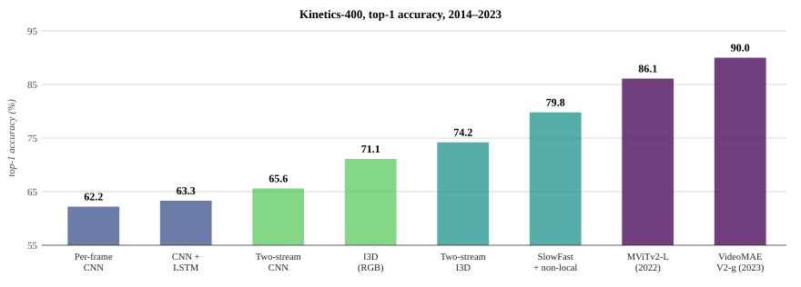

_Based on Lecture 10 of [CS231n](https://cs231n.stanford.edu/), Stanford University,
Spring 2025._

## The axis that was missing {#sec-video-axis}

Every input so far has been a $3 \times H \times W$ array. A video adds one index, and the tensor becomes $T \times 3 \times H \times W$ — a stack of $T$ frames, each an ordinary image. Nothing about that description is difficult. The difficulty is that the new axis is not like the other two, and treating it as though it were is the mistake most of this chapter is organised around avoiding.

Start with what changes in the task. Image classification asks what is in the picture, and the answer is a noun: a dog, a truck, a stethoscope. Video classification usually asks what is *happening*, and the answer is a verb — swimming, running, jumping, eating. That is not a cosmetic relabelling of the output vocabulary. A noun is a property of a single frame and can in principle be read off any one of them; a verb is a property of how frames relate, and there are pairs of actions that no single frame distinguishes. Opening a door and closing a door produce the same set of frames in opposite orders.

The loss does not change. A video classifier still emits $C$ scores and is still trained with the softmax cross-entropy of @sec-softmax against a single action label. The entire question is how to produce those scores — how to turn a $T \times 3 \times H \times W$ tensor into a feature vector — and every architecture in this chapter is an answer to it.

### Videos are big {#sec-videos-are-big}

Before any of those answers, an arithmetic problem that constrains all of them. Video is captured at around thirty frames per second, and at three bytes per pixel a minute of uncompressed standard-definition footage at $640 \times 480$ comes to roughly 1.5 GB. At $1920 \times 1080$ the same minute is about 10 GB. These are not numbers a training pipeline absorbs. A single ImageNet image is 150 KB; one minute of HD video is seventy thousand of them, and a dataset is measured in years of footage rather than minutes.

The memory problem is worse than the storage problem, because the input is the smallest thing on the GPU. A convolutional network holds activations for every layer of every example in the batch in order to backpropagate through them, so a tensor that is already too large to load comfortably becomes a multiple of itself once it is inside the network.

There is no clever compression that resolves this; the resolution is to give up on processing whole videos and shrink the input along both of its expensive axes at once. Temporally, sample a handful of frames per second rather than thirty — adjacent frames at 30 fps are nearly identical, so most of that data is redundant by construction. Spatially, downscale to something like $112 \times 112$. A clip of $T = 16$ frames at $112 \times 112$ covers 3.2 seconds at 5 fps and occupies 588 KB, which is four ImageNet images and entirely manageable.

That reduction defines the unit of work for the rest of the chapter. **The model is trained to classify short clips, not videos.** Training samples clips from long videos with a sliding window and treats each as an independent labelled example. At test time the model is run on several clips drawn from the video — ten is a common choice — and their predicted probabilities are averaged into one answer. The clip is what the architecture sees; the video is assembled from clips outside the network.

The consequence worth holding onto is that this arrangement builds in a horizon. Whatever an architecture does with time, it does within a few seconds, and everything longer is handled by averaging, which is to say by an operation with no notion of order at all. @sec-long-term is about the attempts to push that horizon out.

### Which frames {#sec-sampling}

Sampling introduces a question that has no clean answer: which frames. The default is uniform or random sampling — take one frame every so often and hope the informative moments are among them. For a one-hour video of which four seconds matter, that is a poor bet, and the failure is silent, because the model still produces a confident average over the frames it happened to see.

Better strategies make sampling adaptive: look at one frame, use what it shows to decide where to look next, and spend the frame budget where the content warrants it. This is an active research area rather than a settled technique, and it returns in @sec-efficient-video, where the sampler is itself a learned network.

## The baseline that refuses to model time {#sec-single-frame}

The simplest thing that could possibly work is to ignore the fourth axis entirely. Take a 2D CNN, run it independently on each sampled frame as though the frame were a photograph, and average the predicted probabilities across frames. There is no temporal modelling anywhere in this pipeline. The network is an image classifier and does not know it is being shown a video.

This is worth stating carefully because the natural reaction — that a method which discards the defining property of the data cannot be competitive — is wrong, and reliably wrong. The single-frame CNN is a very strong baseline. Most action classes in most datasets are heavily correlated with appearance: a frame containing a swimming pool, goggles and water is enough to identify swimming without observing a single stroke. If a person is running, every frame shows a person in running posture on a track, and an image classifier will answer *running* for all of them.

The practical instruction that follows is the one to carry out of this section. Any new video architecture must be measured against the single-frame CNN, and it should be the first thing run rather than the last, because a method that beats it by a point after tripling the compute has not established that it is modelling motion — it has established that the dataset does not require motion to be modelled.

The baseline also makes the failure mode legible. What per-frame averaging cannot represent is anything that lives in the ordering of frames. It sees the same evidence for a door opening and a door closing, for a weight being lifted and lowered, for a ball approaching and receding. Every architecture that follows is an argument about where in the network the temporal axis should be consumed, and each one buys a different amount of that ordering information at a different price.

## Where to fuse {#sec-fusion}

If the frames must be combined somewhere, the first design question is where. The single-frame CNN combines them after the softmax, which is as late as possible. Moving that point earlier is the axis along which the classical video architectures — all of them from [Karpathy et al.'s 2014 study](https://openaccess.thecvf.com/content_cvpr_2014/html/Karpathy_Large-scale_Video_Classification_2014_CVPR_paper.html) — differ from one another.

### Late fusion {#sec-late-fusion}

Run a 2D CNN on each frame, but stop before the classifier and keep the features. Each frame yields a feature map of shape $D \times H' \times W'$, and $T$ frames give a $T \times D \times H' \times W'$ stack. Flatten that stack into one long vector of length $TDH'W'$ and feed it to an MLP, which maps it to the $C$ class scores.

This is late fusion, and it is a genuine improvement on averaging, because the MLP sees all frames at once and can in principle learn that a particular feature appearing early and a different one appearing late means a specific action. What it costs is parameters. A concatenated vector over sixteen frames is sixteen times as long as a single frame's, and the first fully connected layer's weight matrix is proportional to that length. This is the same objection that removed fully connected layers from image classifiers, arriving in a more acute form.

The cheaper variant replaces concatenation with pooling. Average-pool the frame features over space *and* time to get a single $D$-dimensional clip feature, then apply one linear layer of shape $D \times C$. The parameter count no longer depends on $T$ at all, which is the whole point. The cost is that pooling is order-blind in exactly the way averaging probabilities was: the mean of a set of feature vectors does not record which came first.

Both variants share a deeper limitation that the name is meant to signal. *Late* means the fusion happens after each frame has been through the full depth of a 2D CNN, and by that depth the features are semantic. A late-layer feature map answers questions like *is there a person here* and *is this a track surface*; it has long since discarded the pixel-level detail from which motion could be computed. The information that a runner's feet are moving up and down between adjacent frames exists only in the raw frames and the earliest feature maps. Fusing late means comparing representations from which the thing you wanted to compare has already been removed.

### Early fusion {#sec-early-fusion}

Push the fusion to the other extreme. Reshape the input from $T \times 3 \times H \times W$ to $3T \times H \times W$ — that is, reinterpret time as additional colour channels — and apply an ordinary 2D convolution whose input has $3T$ channels and whose output has $D$. Every filter in that first layer spans all $T$ frames at once, so it can respond to a pattern that changes across them. After that layer the temporal axis is gone and the remainder of the network is a standard 2D CNN.

Early fusion has the property late fusion lacked: the comparison between frames happens on raw pixels, where motion is still visible. Its problem is the mirror image. A single convolutional layer, followed by a pointwise nonlinearity, is all the temporal processing the architecture will ever do. One layer of linear combination across time is a weak model of how frames relate — it can detect that a region brightened, but it cannot compose such detections into anything hierarchical, because after that layer there is no time axis left to compose over.

Note also what "reinterpret time as channels" throws away. Convolution treats the channel axis as unordered: nothing in the layer knows that channel 7 comes one frame after channel 4 and one frame before channel 10. The temporal ordering survives only in whatever the learned weights happen to encode, and it must be learned separately for every filter.

So the two extremes fail for opposite reasons. Late fusion has plenty of depth for temporal reasoning but no low-level signal left to reason about; early fusion has the signal but only one layer in which to use it. What is wanted is fusion that is neither early nor late but distributed through the network — and that is 3D convolution.

{#fig-fusion}

## Slow fusion: the 3D convolution {#sec-3d-conv}

Recall what a 2D convolution does. A $5 \times 5$ filter applied to a $3 \times 32 \times 32$ image has weights of shape $3 \times 5 \times 5$: it is local in the two spatial dimensions and spans the channel axis completely. Sliding it over all spatial positions produces one $28 \times 28$ activation map, and $C_\text{out}$ such filters give $C_\text{out}$ maps.

A 3D convolution changes exactly one thing. The input is $C_\text{in} \times T \times H \times W$ and the filter has shape $C_\text{in} \times 3 \times 3 \times 3$: local in *three* dimensions — time, height, width — and spanning the channel axis completely as before. It slides over all three, so the output is $C_\text{out} \times T \times H \times W$ and the temporal axis survives the layer. That is the crucial difference. A stack of such layers, interleaved with 3D pooling, shrinks $T$ gradually rather than eliminating it, so temporal structure is built up hierarchically the way spatial structure already was. Karpathy's paper calls this **slow fusion**, and the name is the argument.

### The three architectures side by side {#sec-fusion-compared}

The distinction is easiest to see in the receptive field, so take a toy network on a $3 \times 20 \times 64 \times 64$ clip and track both the tensor shape and the region of the input each output unit depends on.

| | Layer | Size ($C \times T \times H \times W$) | Receptive field ($T \times H \times W$) |
| :-- | :-- | :-- | :-- |
| **Late** | Conv2D($3\times3$, $3 \to 12$) | $12 \times 20 \times 64 \times 64$ | $1 \times 3 \times 3$ |
| | Pool2D($4\times4$) | $12 \times 20 \times 16 \times 16$ | $1 \times 6 \times 6$ |
| | Conv2D($3\times3$, $12 \to 24$) | $24 \times 20 \times 16 \times 16$ | $1 \times 14 \times 14$ |
| | GlobalAvgPool | $24 \times 1 \times 1 \times 1$ | $20 \times 64 \times 64$ |
| **Early** | Conv2D($3\times3$, $3{\cdot}20 \to 12$) | $12 \times 64 \times 64$ | $20 \times 3 \times 3$ |
| | Pool2D($4\times4$) | $12 \times 16 \times 16$ | $20 \times 6 \times 6$ |
| | Conv2D($3\times3$, $12 \to 24$) | $24 \times 16 \times 16$ | $20 \times 14 \times 14$ |
| | GlobalAvgPool | $24 \times 1 \times 1$ | $20 \times 64 \times 64$ |
| **3D CNN** | Conv3D($3\times3\times3$, $3 \to 12$) | $12 \times 20 \times 64 \times 64$ | $3 \times 3 \times 3$ |
| | Pool3D($4\times4\times4$) | $12 \times 5 \times 16 \times 16$ | $6 \times 6 \times 6$ |
| | Conv3D($3\times3\times3$, $12 \to 24$) | $24 \times 5 \times 16 \times 16$ | $14 \times 14 \times 14$ |
| | GlobalAvgPool | $24 \times 1 \times 1$ | $20 \times 64 \times 64$ |

: Shapes and receptive fields for the three fusion strategies on a $3 \times 20 \times 64 \times 64$ clip. All three end with the same full-clip receptive field; they differ entirely in how they get there. {#tbl-fusion}

Read the temporal column of @tbl-fusion downward and the three strategies separate cleanly. Late fusion holds the temporal receptive field at 1 through every layer and then jumps to 20 in a single step at the end: it builds slowly in space and all at once in time, at the end. Early fusion jumps to 20 in the first layer and holds it: slowly in space, all at once in time, at the start. The 3D CNN goes $3 \to 6 \to 14 \to 20$, growing in time at the same rate it grows in space. All three finish with the same $20 \times 64 \times 64$ receptive field, which is why the receptive field alone does not explain why one works better — the *path* does.

### Why not just stack the frames {#sec-shift-invariance}

Early fusion and the 3D CNN both build a temporal receptive field, so it is fair to ask what is really different. The answer is the property that made convolution worth using in the first place.

Consider what early fusion's first layer looks like from the 3D point of view. Its weight tensor has shape $C_\text{out} \times C_\text{in} \times T \times 3 \times 3$: local in $x$ and $y$, full extent in $t$. It slides over space and does not slide over time, because there is nothing left to slide over. So a filter that responds to a blue-to-orange transition between frames 4 and 5 has that timing baked into its weights. The same transition occurring between frames 14 and 15 excites a different set of weight positions entirely, and to detect it the network must learn a *second* filter that is a time-shifted copy of the first.

This is exactly the argument that produced convolution in @sec-convolution, moved to a new axis. A fully connected layer on images has to learn a separate detector for a cat in each corner; convolution shares one detector across all positions and gets spatial shift invariance for free. Early fusion is, along the time axis, that fully connected layer. It has no temporal shift invariance, and it pays for the lack in parameters and in sample efficiency, because every temporal pattern must be learned once per moment it can occur.

The 3D convolution's filter is $C_\text{in} \times 3 \times 3 \times 3$ — a local window in time as well as in space — and it slides over $t$. One filter detects the blue-to-orange transition wherever in the clip it happens. That is the whole benefit, and it is the reason 3D convolution is not merely early fusion with extra steps.

{#fig-3d-conv}

The trade is compute, and it is steep. A 3D convolution keeps a $T$-fold larger activation tensor at every layer and multiplies the work per output by the kernel's temporal extent. Where a 2D network is expensive, the 3D version of it is roughly an order of magnitude worse, and that cost is what @sec-i3d and @sec-efficient-video spend their time trying to recover.

### What the filters learn {#sec-3d-filters}

Because a first-layer 3D filter spans both space and time — shape $3 \times 4 \times 5 \times 5$ for RGB over four frames — it can be displayed the way its input is displayed: as a short video clip rather than a still image. Doing so shows two populations. Some filters are the oriented edges and colour-opponent blobs familiar from 2D first layers, effectively static across their four frames; the network has rediscovered that appearance matters. Others are genuinely temporal — an edge pattern that translates from one side of the patch to the other over the four frames, which is a motion detector tuned to a direction and a speed. The mixture is informative: a 3D CNN does not become a motion model by construction, it allocates some of its capacity to motion and the rest to appearance, and how it splits that budget is decided by the dataset.

## What the comparison actually showed {#sec-sports1m}

Architectures are arguments until somebody measures them, and the measurement that settled this one was run on **Sports-1M**: a million YouTube videos labelled with 487 sports categories. The label set is deliberately fine-grained — marathon and ultramarathon are separate classes — which is why results are usually quoted as top-5 accuracy rather than top-1.

The dataset also illustrates a problem peculiar to video. ImageNet can be distributed as images; a million videos cannot, so Sports-1M was released as a list of YouTube URLs. Users delete and edit their uploads, so the dataset has been decaying since publication and no two research groups have downloaded quite the same thing. Reproducibility in video benchmarking is worse than in image benchmarking for reasons that have nothing to do with the models.

@fig-sports1m gives the video-level top-5 accuracies for the four architectures, all trained by Karpathy et al. under matched conditions, with C3D added from the following year.

 under matched training; C3D is from [Tran et al., ICCV 2015](https://openaccess.thecvf.com/content_iccv_2015/html/Tran_Learning_Spatiotemporal_Features_ICCV_2015_paper.html). Replotted for this project from the published numbers.](../figures/10-video-understanding/diagram_sports1m.svg){#fig-sports1m}

Two things in that chart are worth sitting with. The first is that the single-frame CNN reaches 77.7%, and early fusion — an architecture built specifically to model motion — comes in *below* it at 76.8%. Adding a temporal mechanism made the model worse. Late fusion recovers a point over the baseline and slow fusion adds two and a half more, so the ranking does eventually favour temporal modelling, but the margin over an image classifier that has never heard of time is about 2.5 points for roughly an order of magnitude more computation.

The second is what that says about the benchmark rather than about the models. If appearance alone gets you to within 2.5 points of the best method available, the dataset is largely testing scene recognition — the pool, the track, the gym — and a genuinely better motion model has very little room in which to demonstrate that it is better. This is a recurring hazard in video research and one reason later benchmarks were built specifically to defeat single-frame classifiers.

### C3D {#sec-c3d}

The obvious next move after slow fusion is to stop designing bespoke video architectures and simply port a good image architecture across. [C3D](https://openaccess.thecvf.com/content_iccv_2015/html/Tran_Learning_Spatiotemporal_Features_ICCV_2015_paper.html) does exactly that with VGG: every $3 \times 3$ convolution becomes $3 \times 3 \times 3$, every $2 \times 2$ pool becomes $2 \times 2 \times 2$, and the whole stack is applied to a $3 \times 16 \times 112 \times 112$ clip. The one exception is the first pooling layer, which is $1 \times 2 \times 2$ — it downsamples space but not time, so that the sixteen frames survive intact into the second block rather than being halved before any temporal filter has looked at them.

C3D mattered less for its design than for its distribution. Training it on Sports-1M in 2014 required compute that almost no academic group had, so when Facebook released the trained weights, C3D became the video equivalent of a pretrained ImageNet network: extract a 4096-dimensional clip feature from FC6, fit a linear classifier on your own task, and you have a video model without owning a cluster. That is why it appears in so many papers of the period, and it took top-5 accuracy on Sports-1M to 84.4%.

The cost is the part to remember. A forward pass through AlexNet is 0.7 GFLOP and through VGG-16 is 13.6 GFLOP; C3D is 39.5 GFLOP, or 2.9× VGG-16, for a clip that is $112 \times 112$ rather than $224 \times 224$. Converting a 2D architecture to 3D by brute force multiplies its cost by roughly the temporal extent, and every subsequent development in this chapter is in some way an attempt to avoid paying that in full.

## Motion as its own signal {#sec-optical-flow}

There is a different objection to the 3D CNN, and it is not about cost. Space and time are being processed by the same undifferentiated machinery, on the assumption that a filter which learns to detect motion is as easy to learn as one that detects an edge. Human vision suggests that motion deserves its own treatment.

The evidence is [Johansson's 1973 point-light experiment](https://doi.org/10.3758/BF03212378). Attach small lights to a person's joints, film them in the dark, and show a viewer only the moving dots. There is no appearance information whatsoever — no faces, no bodies, no scene — and viewers nonetheless identify walking, sitting, dancing, and often the actor's sex and mood, within a fraction of a second. Freeze a single frame and the percept collapses to a meaningless scatter of dots. Whatever is being recognised exists purely in how the dots move.

If motion alone suffices for humans, it is worth extracting motion explicitly rather than hoping a network discovers it.

### Optical flow {#sec-flow-field}

The explicit representation is **optical flow**: a displacement field $F$ between consecutive frames $I_t$ and $I_{t+1}$ that says, for every pixel, where that pixel went. Writing $F(x, y) = (dx, dy)$, the defining relation is

$$
I_{t+1}(x + dx,\; y + dy) = I_t(x, y)
$$ {#eq-optical-flow}

so $F$ is a two-channel image the same size as the frame, one channel of horizontal displacement and one of vertical. @eq-optical-flow is an assumption as much as a definition — it asserts that a pixel's brightness is preserved as it moves, which is the *brightness constancy* assumption, and it is what makes the problem solvable at all. It is also badly underdetermined on its own, since one equation per pixel cannot fix two unknowns, so every flow algorithm adds a smoothness prior of some kind. Computing flow well is its own literature; for present purposes it is a black box that turns two frames into a motion field.

Visualising the two channels separately makes clear what has been isolated. The horizontal channel lights up where things move sideways, the vertical channel where they move up and down, and both are essentially blank over static background regardless of how textured that background is. Flow is a representation from which appearance has been deleted.

### Two-stream networks {#sec-two-stream}

[Simonyan and Zisserman's two-stream network](https://papers.nips.cc/paper_files/paper/2014/hash/ca007296a63f7d1721a2399d56363022-Abstract.html) takes that separation literally and builds one CNN per signal. The spatial stream is an ordinary 2D CNN over a single RGB frame — the single-frame baseline of @sec-single-frame, unchanged. The temporal stream takes the optical flow computed between every adjacent pair in a $T$-frame clip, stacks the $2(T-1)$ flow channels into one tensor of shape $2(T-1) \times H \times W$, and runs a 2D CNN over it. Both streams produce class scores, and the scores are combined — by averaging, or by a linear SVM fitted on the concatenated softmax outputs.

Note that the temporal stream is early fusion. It collapses all of time into channels at the first layer, which @sec-early-fusion argued was a weakness. It is much less of a weakness here, because the input is already a motion representation: the first layer is no longer being asked to discover motion from raw pixels, only to combine motion measurements that were handed to it.

The results on **UCF-101**, a 101-class action dataset, are the reason this architecture was influential.

. Replotted for this project from the published numbers.](../figures/10-video-understanding/diagram_ucf101.svg){#fig-two-stream}

The temporal stream on its own reaches 83.7%, more than ten points above the spatial stream's 73.0%. A network that has seen no colours, no textures and no objects — only displacement fields — beats a network that has seen the frames. That inverts the ordering Sports-1M suggested, and the likely reason is overfitting: appearance offers an enormous amount of information correlated with the label through the background scene, and with only 101 classes and 13,000 clips a spatial network will happily memorise gyms. Flow discards all of that and leaves the network only the part of the signal that generalises.

Combining the two adds another three to four points, ending at 88.0%, which is a straightforward statement that the streams are not redundant. Appearance and motion each carry information the other lacks.

The catch, and it is the reason two-stream networks eventually fell out of favour, is that optical flow is not free. It is computed by a separate non-learned algorithm as a preprocessing step, it is expensive, and it is not differentiable with respect to anything the network is training. The pipeline is not end-to-end, and the flow algorithm's assumptions are baked in whether or not they suit the task.

## Reaching past the clip {#sec-long-term}

Every method so far operates inside a clip of two to five seconds, because that is what @sec-videos-are-big established the memory budget allows. That horizon is not merely a practical limit; it is a modelling limit, and it excludes an entire category of content. Consider a video in which someone places a kettle on a hob, and two minutes later pours a cup of tea. A clip-level classifier sees each event but has no representation in which they are the same episode. Anything requiring that two events be related — narrative, causation, intention — is beyond a 3D CNN by construction, and averaging clip predictions at test time does not help, because averaging has no notion of before and after.

The apparatus for long sequences already exists. @sec-recurrence built recurrent networks precisely to carry information across arbitrary distances, and the composition is immediate: run a CNN — 2D on frames or 3D on short clips, it does not matter — to produce a sequence of feature vectors, then run an LSTM over that sequence. If a single video-level label is wanted, take the prediction at the final timestep, a many-to-one arrangement. If per-frame output is wanted, read a prediction at every step. The idea predates AlexNet — [Baccouche et al.](https://doi.org/10.1007/978-3-642-25446-8_4) had it in 2011 — but became standard with [long-term recurrent convolutional networks](https://openaccess.thecvf.com/content_cvpr_2015/html/Donahue_Long-Term_Recurrent_Convolutional_2015_CVPR_paper.html) in 2015.

Training this composite is awkward in practice. Backpropagating through a CNN unrolled over hundreds of timesteps exceeds memory long before it exceeds patience, so the usual approach is to pretrain the CNN — on ImageNet, or on clip classification — freeze it, precompute the features, and train only the recurrent part. That works, but it means the visual representation is never adapted to the temporal task.

### The two ways of covering time {#sec-cnn-rnn-grid}

Comparing this design against 3D convolution sharpens what each mechanism contributes, and the comparison is cleanest as two independent properties.

A CNN over time is **convolutional but finite**: each output depends on a local window of input, the same weights are applied at every position, and no output can depend on anything outside its receptive field. An RNN is the opposite — **fully connected but infinite**: the hidden state in principle summarises everything seen so far, with no fixed horizon, but the state is updated by dense matrix multiplication that treats the feature vector as an unstructured list of numbers, discarding the spatial layout the CNN built.

Written that way, the missing quadrant is obvious. What is wanted is infinite temporal extent *and* convolutional structure — a recurrence whose state is a feature map rather than a vector, updated by convolution rather than by matrix multiplication.

{#fig-cnn-rnn}

### Recurrent convolutional networks {#sec-recurrent-cnn}

That is the [recurrent convolutional network](https://arxiv.org/abs/1511.06432), and the construction takes one line. The vanilla RNN update of @sec-recurrence is

$$
h_t = \tanh\!\big(W_h h_{t-1} + W_x x_t\big)
$$ {#eq-vanilla-rnn-recall}

where $h_t$ and $x_t$ are vectors and $W_h, W_x$ are matrices. Replace every quantity with a feature map and every matrix multiplication with a 2D convolution:

$$
h_t = \tanh\!\big(W_h \ast h_{t-1} + W_x \ast x_t\big)
$$ {#eq-recurrent-conv}

Now $h_t$ and $x_t$ are tensors of shape $C \times H \times W$, $W_h$ and $W_x$ are convolution kernels, and $\ast$ is 2D convolution. The hidden state retains spatial structure throughout, and the recurrence is applied identically at every spatial position, so the layer is translation-equivariant in space and unbounded in time. Nothing about the substitution is specific to the vanilla RNN — the same replacement inside an LSTM's gates gives a convolutional LSTM, which is what is usually used in practice, for the gradient-flow reasons of @sec-lstm.

Stacking these layers gives a grid indexed by depth and time, in which every feature map depends on two neighbours: the same layer at the previous timestep, and the previous layer at the same timestep. Spatial and temporal fusion happen together, everywhere in the network.

This is an elegant architecture and it is not widely used, for a reason that has nothing to do with what it represents. The recurrence is sequential: timestep $t$ cannot be computed until $t-1$ is finished. Video sequences are long, GPUs are wide, and a computation that refuses to parallelise across its longest axis is the wrong shape for the hardware. The same objection retired recurrent networks from language modelling, and it retired them here.

## Attention over space and time {#sec-nonlocal}

The replacement is the one @sec-self-attention already introduced. Self-attention relates every position to every other position in a single parallel operation: unbounded range like a recurrence, but with no sequential dependency at all. Applying it to video means treating the $T \times H \times W$ grid of feature vectors as the set of positions, so that a location in one frame can attend directly to a location in any other frame, at any spatial offset.

The [non-local block](https://openaccess.thecvf.com/content_cvpr_2018/html/Wang_Non-Local_Neural_Networks_CVPR_2018_paper.html) packages this as a drop-in module. Its input is a feature map of shape $C \times T \times H \times W$ from whatever produced it, and it proceeds exactly as self-attention does, with $1 \times 1 \times 1$ convolutions playing the role of the query, key and value projections — a $1\times1\times1$ convolution is a per-position linear map on the channel axis, which is precisely what those projections are.

Reshape queries and keys to $C' \times THW$, multiply to get a $THW \times THW$ matrix of affinities, softmax it, and use the result to take a weighted combination of the values. A final $1 \times 1 \times 1$ convolution maps the $C'$ channels back to $C$ so the output can be added to the input as a residual. That residual wrapping is what makes the block droppable into an existing 3D CNN: initialise the last convolution's weights to zero and the block starts as the identity, so inserting it into a trained network cannot make things worse before training has adjusted it.

{#fig-nonlocal}

The name is a nod to the non-local means algorithm in image denoising, and it captures the point. A convolution is local by definition; this block is not, and interleaving a few of them into a 3D CNN gives a network whose early layers build local spatiotemporal features cheaply and whose non-local blocks relate those features across the whole clip.

The cost is the one @sec-attention-cost identified, now with a larger index set. The affinity matrix is $THW \times THW$, so memory grows as the square of the number of space-time positions. A $16 \times 14 \times 14$ feature map has 3,136 positions and a comfortable ten million affinities; the same clip at $56 \times 56$ has 50,176 positions and 2.5 billion. This is why non-local blocks are inserted in the deep, low-resolution stages of a network and never near the input.

## Recycling the image networks {#sec-i3d}

A question has been deferred through all of this: when an architecture calls for "a 3D CNN", which one? The image side of the field spent years discovering that depth matters, that residual connections make depth trainable, and that Inception's parallel branches are an efficient way to spend parameters. Rediscovering all of it on video — where the datasets are smaller, the training runs longer, and the compute per experiment is an order of magnitude higher — would be an expensive way to arrive at the same answers.

**Inflation** is the shortcut. Take a 2D architecture and replace every $K_h \times K_w$ convolution and pooling layer with a $K_t \times K_h \times K_w$ version, leaving the topology, the channel counts and the branching structure untouched. [Carreira and Zisserman](https://openaccess.thecvf.com/content_cvpr_2017/html/Carreira_Quo_Vadis_Action_CVPR_2017_paper.html) did this to Inception and called the result **I3D**, for Inflated 3D ConvNet. The inflated Inception block is the original block with every filter given a temporal extent.

That transfers the architecture. The more useful trick transfers the *weights*. A trained 2D kernel has shape $C_\text{in} \times K_h \times K_w$ and its inflated counterpart needs shape $C_\text{in} \times K_t \times K_h \times K_w$, so copy the 2D kernel $K_t$ times along the new axis and divide every copy by $K_t$. The scaling is what makes this exact rather than approximate. Feed the inflated kernel a *constant* video — the same frame repeated $K_t$ times — and each temporal slice contributes $\tfrac{1}{K_t}$ of the original 2D response, so the $K_t$ contributions sum to precisely the 2D output. **Inflation initialises the 3D network at a point where it computes exactly what the 2D network computed on a still image.**

{#fig-inflation}

That is a much better starting point than random initialisation, because it means the video network begins training already able to recognise objects, and the gradient's job is to teach it about motion rather than about vision from scratch. Everything ImageNet paid for is inherited. Fine-tuning on video proceeds normally from there.

The measurements, on **Kinetics-400**, show how much of the improvement comes from the transfer rather than from the architecture:

| Model | From scratch | ImageNet-pretrained |
| :-- | --: | --: |
| Per-frame CNN | 57.9 | 62.2 |
| CNN + LSTM | 53.9 | 63.3 |
| Two-stream CNN | 62.8 | 65.6 |
| Inflated CNN (I3D, RGB) | 68.4 | 71.1 |
| Two-stream inflated CNN | 71.6 | 74.2 |

: Top-1 accuracy on Kinetics-400, all built on the same Inception backbone, from [Carreira and Zisserman, CVPR 2017](https://openaccess.thecvf.com/content_cvpr_2017/html/Carreira_Quo_Vadis_Action_CVPR_2017_paper.html). {#tbl-i3d}

Every row in @tbl-i3d improves under pretraining, and the CNN+LSTM improves by nearly ten points — it is the model with the most parameters downstream of the visual features and therefore the most starved of data. Inflation adds five to six points over the two-stream network at either level of pretraining, and adding the flow stream on top of inflation still helps by three points, which says the two ideas are addressing different deficits. Note also that the top row is again the single-frame baseline, still within twelve points of the best result on a dataset built specifically to require temporal reasoning.

### Transformers, and where the numbers went {#sec-video-transformers}

Inflation applies just as well to Vision Transformers, and the video transformer literature is largely a set of answers to the cost problem that @sec-nonlocal identified: full attention over $T \times H \times W$ tokens is quadratic in a very large number. [TimeSformer](https://proceedings.mlr.press/v139/bertasius21a.html) and [ViViT](https://openaccess.thecvf.com/content/ICCV2021/html/Arnab_ViViT_A_Video_Vision_Transformer_ICCV_2021_paper.html) factorise the attention, alternating a layer that attends only within a frame with one that attends only across frames at fixed spatial position, which turns $O((THW)^2)$ into $O(T^2 HW + T(HW)^2)$. [Multiscale Vision Transformers](https://openaccess.thecvf.com/content/ICCV2021/html/Fan_Multiscale_Vision_Transformers_ICCV_2021_paper.html) instead pool tokens as depth increases, reintroducing the resolution-for-channels trade that convolutional networks always had. And [VideoMAE](https://arxiv.org/abs/2203.12602) sidesteps the labelling bottleneck by pretraining on masked reconstruction, which needs no labels at all and so can consume far more video than Kinetics contains.

Tracking top-1 accuracy on Kinetics-400 across that decade gives the shape of the progress: 62.2 for the per-frame CNN, 63.3 with an LSTM, 65.6 for two-stream, 71.1 for I3D, 74.2 for two-stream I3D, 79.8 for [SlowFast](https://openaccess.thecvf.com/content_ICCV_2019/html/Feichtenhofer_SlowFast_Networks_for_Video_Recognition_ICCV_2019_paper.html) with non-local blocks, 86.1 for MViTv2-L, and 90.0 for VideoMAE V2-g. The single-frame baseline that opened this chapter has been beaten by nearly thirty points — but it took ten years, and most of the last fifteen points came from pretraining strategy rather than from a better model of motion.

{#fig-kinetics}

## What a video model sees {#sec-video-viz}

@sec-what-networks-see optimised an input image to maximise a class score, and the same procedure works here with one adjustment. Applied to a two-stream network it produces two things at once: an appearance image and a flow field, each optimised to make the network as confident as possible about a chosen action.

The adjustment is a regulariser on the flow, penalising spatial roughness. Tuning the strength of that penalty selects the timescale of the motion that appears: a strong penalty forces the optimised flow to be spatially smooth and slowly varying, and what emerges is the action's slow component; a weaker one lets fast, localised motion dominate.

Run on *weightlifting*, the three panels are separately interpretable in a way that is unusual for feature visualisation. The appearance image shows gym-like texture. The slow-motion field shows a horizontal oscillation — the bar shaking. The fast-motion field shows a vertical push, the lift overhead. The network has decomposed the action into a static context and two motion components at different timescales, and none of that structure was designed in; it is what maximising the class score produced. That is reasonably strong evidence that the temporal stream is modelling motion rather than exploiting a correlation with the scene.

## Past the clip label {#sec-localization}

Clip classification assumes the video has been trimmed so that one action fills it. Real footage is untrimmed: an hour of it contains long stretches of nothing in particular and short intervals that matter.

**Temporal action localisation** asks for those intervals — given a long untrimmed video, output the start and end frames of each action along with its class. The structural analogy to detection in @sec-detection-problem is exact, with one axis instead of two, and so is the solution: [generate temporal proposals, then classify and refine each one](https://openaccess.thecvf.com/content_cvpr_2018/html/Chao_Rethinking_the_Faster_CVPR_2018_paper.html), which is Faster R-CNN with 1D intervals in place of 2D boxes.

**Spatio-temporal detection** asks for both at once: find every person in the video, in space and in time, and say what each of them is doing at each moment. This is the task the [AVA dataset](https://openaccess.thecvf.com/content_cvpr_2018/html/Gu_AVA_A_Video_CVPR_2018_paper.html) annotates, and it is where video understanding stops resembling classification. Several people in one frame may be doing different things; one person's action changes over the course of a shot; the output is a set of box-plus-interval-plus-label triples with no fixed size. Every complication that made detection harder than classification recurs, with a fourth dimension added.

## The modality that was left out {#sec-audio-visual}

Everything above treats a video as a silent stack of frames, and the omission is larger than it looks. A recording of a baby laughing while a dog barks is not adequately described by its pixels; strip the audio and the content is not merely diminished but in places unrecoverable.

That audio is not a redundant channel — that it changes what is *seen* — is established by the [McGurk effect](https://doi.org/10.1038/264746a0). Play a recording of the syllable /ba/ over video of a speaker's lips forming /ga/, and a listener hears neither: they hear /da/, or /fa/, depending on the stimulus. Closing their eyes restores /ba/ immediately. The percept is a fusion of the two streams that occurs before anything conscious, and it cannot be suppressed by knowing about it. Vision and hearing are not two independent estimates of the world that get compared at the end; they are combined early, the way @sec-fusion asked architectures to combine frames.

The task that shows off the combination most directly is **visually-guided audio source separation**. Given a recording with several overlapping sources — two people talking at once, several instruments playing together — recover each source separately, using the video to say which is which. Audio-only separation is famously ill-posed: a microphone sums the sources and the sum has no marker of what came from where. Vision resolves the ambiguity because it says where the sources are and what they are doing. [VisualVoice](https://openaccess.thecvf.com/content/CVPR2021/html/Gao_VisualVoice_Audio-Visual_Speech_Separation_With_Cross-Modal_Consistency_CVPR_2021_paper.html) separates overlapping speakers by attending to their lip motion; [co-separation](https://openaccess.thecvf.com/content_ICCV_2019/html/Gao_Co-Separating_Sounds_of_Visual_Objects_ICCV_2019_paper.html) separates instruments by associating each sound component with the visible object that produces it, trained on a hundred thousand unlabelled multi-source clips without ever being told which sound belongs to which instrument.

For classification, audio enters the same way images did. Convert the waveform to a spectrogram, which is a 2D array with time on one axis and frequency on the other, cut it into patches, and feed the patches to a transformer alongside the video patches. Once both modalities are token sequences, everything from @sec-transformer-block applies unchanged, and the design questions become where to let the streams attend to one another and how much cross-modal capacity to allow. Masked autoencoding extends just as directly: mask patches of both the frames and the spectrogram, and train the model to reconstruct them.

## Where the field is going {#sec-frontiers}

Three directions close the lecture, and they share a premise: the clip classifier of the previous sections is a component, not a system.

### Efficiency {#sec-efficient-video}

The first is forced by the arithmetic of @sec-videos-are-big. An hour of video contains hundreds of clips and running a 3D CNN on every one is not viable at scale, so the work splits along two lines. One makes the per-clip model cheaper — [X3D](https://openaccess.thecvf.com/content_CVPR_2020/html/Feichtenhofer_X3D_Expanding_Architectures_for_Efficient_Video_Recognition_CVPR_2020_paper.html) does this by starting from a small 2D network and expanding it along one axis at a time (frames, resolution, width, depth), keeping whichever expansion buys the most accuracy per FLOP. The other declines to process most clips at all: [SCSampler](https://openaccess.thecvf.com/content_ICCV_2019/html/Korbar_SCSampler_Sampling_Salient_Clips_From_Video_for_Efficient_Action_Recognition_ICCV_2019_paper.html) learns to predict which clips are worth looking at and runs the expensive classifier only on those, which is the adaptive sampling promised back in @sec-sampling, and [Listen to Look](https://openaccess.thecvf.com/content_CVPR_2020/html/Gao_Listen_to_Look_Action_Recognition_by_Previewing_Audio_CVPR_2020_paper.html) uses audio as the preview signal, on the reasoning that a spectrogram is orders of magnitude cheaper to process than the frames it accompanies and is often enough to tell whether anything is happening.

### Egocentric video {#sec-egocentric}

The second is a bet on hardware. If head-mounted cameras become common, the dominant source of video will not be edited third-person footage but continuous first-person streams from a camera that moves with the wearer's head and arrives with a microphone array rather than a single channel. That changes the problems worth solving — [inferring who is speaking to whom and who is attending to whom](https://openaccess.thecvf.com/content/CVPR2024/html/Jia_The_Audio-Visual_Conversational_Graph_From_an_Egocentric-Exocentric_Perspective_CVPR_2024_paper.html) is a natural question for a wearable device and an odd one for a video-search engine — and it makes multi-channel audio a first-class input, since a microphone array carries direction and direction is what disambiguates a conversation.

### Video and language models {#sec-video-llm}

The third is currently the most active, and the move is the one that produced vision-language models generally: tokenise the video, project the tokens into a language model's embedding space, and let the model answer questions about what it was shown in text. That reframes video understanding away from a fixed label set and towards open-ended description — the difference between a network that emits one of 400 Kinetics classes and one that can be asked what the person on the left is doing and why.

## What this leaves {#sec-closing-10}

Which returns to where the chapter began. A fourth axis was added to the input tensor, and the entire progression from single-frame averaging through fusion, 3D convolution, optical flow, recurrence, attention and inflation was a sequence of proposals about what to do with it. The proposals that survived share a property worth naming: none of them treats time as just another spatial dimension, and none treats it as entirely separate either. Slow fusion grows the temporal receptive field alongside the spatial one but with its own kernel size; the two-stream network gives motion its own network but fuses the scores; factorised attention attends over space and time in alternating layers. Time is like the other axes, but not enough like them to be ignored — and locating that difference precisely is what the last decade of video architectures has been doing.

